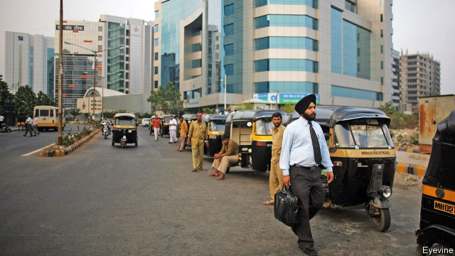

###### On the way to Wall Street

# Core elements of the global banking industry are moving to India 

 

> print-edition iconPrint edition | Finance and economics | Aug 10th 2019 

FINANCIAL CENTRES, like delicate plants, thrive in the right conditions. Those include a vibrant private sector, banks that direct capital based on the prospect for profit, analysts with direct access to companies and investors, openness to foreign people and institutions, and business-friendly, consistent laws. For good measure, throw in the cultural amenities that attract the sorts of employees who could choose to live anywhere. 

India is not such a place. Its laws are many and perplexing; its domestic markets, inefficient and politicised. Though saving is unrewarding, capital is still costly for entrepreneurs. International firms are mostly limited to cross-border activities. It often scores badly on quality of life. 

So it is hardly surprising that although tiny Hong Kong and Singapore are globally renowned centres of finance, Mumbai, India’s financial capital, features low on most rankings. But the country is nonetheless becoming an essential hub for international banks. India is often their second-largest place of employment after their home country, and becoming ever more important for their innovation efforts. 

India has long received other countries’ outsourced jobs. Some of those are unsophisticated, such as answering phones or processing forms. Many, however, rely on Indian universities’ remarkable ability to turn out engineers in great numbers, and computing firms’ ability to use them to solve complex problems. Such tasks may be dismissed as “back-office”. But they are at the heart of modern finance. 

In recent years banks have become global networks that link apps on smartphones, workstations used for sales, and sophisticated programs used to manage compliance and allocate capital. Systems that once merely updated balances now determine financial-product marketing—whom to send offers to, when to increase credit limits and when to adjust charges. For banks all over the world, many such tasks are now done in India. 

Even tasks that would seem to require the personal touch—a trusted adviser pitching a deal to the boss of a client firm, say—may rely on a fact-sheet compiled by an Indian research team overnight. The only things that cannot be done in India are client meetings, says Tuhin Parikh, a senior executive at Blackstone. Since 2014 the buy-out firm has nearly quadrupled the amount of property it leases in India to international financial firms, from 690,000 square feet (64,000 square metres) to 2.7m. 

India’s growing prowess in finance contrasts with its weakness in manufacturing. That is despite constant government intervention, most recently through the “Make in India” campaign launched in 2014 by the prime minister, Narendra Modi. The main difference is that financial firms, unlike manufacturers, are able to avoid many of India’s impediments: a maze of permissions and tariffs that control production, laws supposed to protect low-wage workers that instead discourage hiring, and wretched transport and communications networks. The towers that house international financial firms have dedicated phone and high-speed internet connections, generators to provide backup power and global standards of fire safety. 

Goldman Sachs’s new campus in Bangalore cost $250m. Once inside, a visitor feels he has been transported to the company’s New York headquarters (the same architect designed both). Both have similar amenities, such as subsidised fitness and child-care facilities, as well as a medical office. The number of people Goldman employs in Bangalore has risen from 291 in 2004 to 5,000. And India itself now provides expats, with more than 700 Indians on transfers to the firm’s offices elsewhere. 

In the past few years UBS has opened three new centres in India. The most recent, in the western city of Pune, is in a building shared by Credit Suisse and Alliance and Northern Trust, a stone’s throw from others occupied by Barclays and Citi. Between Mumbai and Pune UBS now has 4,000 employees. A sophisticated recruiting effort looks beyond recent graduates to tap émigrés who might be tempted back home by the right opportunity. 

Among the recent hires are a group of women returning to work after years away to care for children or ageing parents. Their careers have included stints at banks, rating agencies and a global pharmaceutical company, with expertise in risk analysis, quality control and product management. UBS’s research department hires staff with expertise in cloud computing, statistics, machine learning and automation. They have contributed to recent reports using, for example, web-scraping tools to understand trends in the pricing of air-conditioning, geospatial technology to map bank branches and population density, and analysis of corporate filings to map cross-shareholdings of corporations and uncover their vulnerability to a credit crunch. 

UBS is perhaps unusually committed to innovation in India. But any large bank with operations in the country is making significant efforts in similar ways. With hindsight, given its prowess in computer engineering, all this will look obvious. But bankers say they have been startled by how fast India, notwithstanding its local challenges, has become an intellectual force that is now shaping their global futures. ■ 

