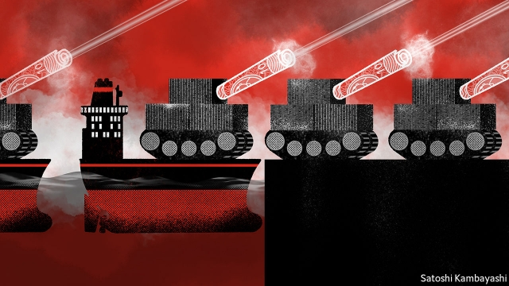
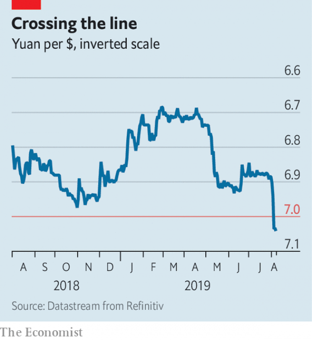

###### The guns of August

# The trade war escalates, and the fog of war descends 

 

> print-edition iconPrint edition | Finance and economics | Aug 8th 2019 

CARL VON CLAUSEWITZ, the Prussian military theorist, never wrote about currency wars. But some policymakers see them in his terms: as the continuation of trade politics by other means. That, at least, is how the Trump administration views China’s decision on August 5th to let its currency weaken past seven yuan to the dollar for the first time since 2008. Though arbitrary, that threshold has assumed huge symbolic importance among traders, economic officials and fund managers (see Buttonwood). They were left stunned. 

America’s Treasury quickly branded China a “currency manipulator”, a charge it has not levelled against any country for 25 years. China, in the Americans’ view, was cheapening its currency to gain an unfair edge in retaliation for President Donald Trump’s surprise announcement four days earlier that he would impose new tariffs of 10% on roughly $300bn of Chinese goods. 

This marked the end of investors’ hopes for a peaceful summer. At the end of July the Federal Reserve had cut interest rates to guard against a slowdown in America’s respectable growth rate, and trade tensions had “returned to a simmer”, as Jerome Powell, the Fed’s chair, noted with satisfaction. But after the yuan’s move America’s stockmarket suffered its worst day this year. Emerging-market currencies, including the Brazilian real, Indian rupee and South African rand, fell. The price of Brent crude oil tumbled below $60 a barrel and safe havens, such as gold, rallied. The same search for safety pushed American ten-year government bond yields to 1.7%, as investors bet that the Fed would be forced to slash interest rates further to prevent a recession. The Reserve Bank of New Zealand cut its benchmark interest rate by twice as much as expected, citing “heightened uncertainty” and “historically low” global bond yields. The Australian dollar fell to its lowest level in a decade. 

In matters of war and peace, countries must prepare for the worst. But precautions can look like provocations. In allowing the yuan to fall, China signalled it is prepared for a protracted trade war. It let the yuan weaken in response to the threat of tariffs much as a floating currency would. Otherwise it would have needed to defend an arbitrary line against the dollar every time America turned belligerent. Its move nonetheless makes further belligerence more probable. Mr Trump is now unlikely to change his mind about the new tariffs before they kick in on September 1st. 

 

Both sides blame the other for starting the fight. China has raised tariffs only in response to America’s. But America sees its combative economic diplomacy as a belated response to decades of intellectual-property theft and other misdeeds. Each side’s attempt to get even looks to the other like one-upmanship. China views a weaker yuan as a reasonable response to Mr Trump’s trade duties; Mr Trump, according to the Wall Street Journal, sees those tariffs as retaliation for China failing to commit to buy more American farm goods. 

The irony is that Chinese purchases of American soyabeans and pork were already rising, and the government was offering buyers exemptions from some tariffs. But after Mr Trump’s new tariff threat it has reportedly told state-owned companies not to buy American farm goods after all. Thus Mr Trump’s tariffs may have caused the decision they were designed to punish. 

Whatever the cause of the new levies, what might be their effect? Some of America’s existing tariffs (of 25% on roughly $250bn-worth of merchandise) had been imposed on Chinese goods that American importers can buy elsewhere. That minimised the harm to American buyers and maximised the harm to China’s exporters, which lost business to close rivals elsewhere. Indeed, according to Goldman Sachs, other Asian countries have filled around half of the gap created by the previous round of tariffs. 

The next round of tariffs will hit goods for which China has fewer competitors. That should make it harder for American buyers to switch suppliers. Nonetheless the new tariffs’ direct impact could reduce China’s growth by at least 0.3 percentage points in 2020, according to UBS, to below 6% for the first time since 1990. 

To support a slowing economy, China’s government has already cut taxes, increased infrastructure spending and relented in its campaign to restrain credit growth. But it is reluctant to boost the property market, which helped pull the economy out of previous slowdowns, points out Andrew Batson of Gavekal, a research firm. House prices have risen mercilessly and developers have accumulated worrying levels of debt. China, in short, wants to keep growth stable, stand up to America in the trade war and constrain excesses in the housing market. It is becoming harder to do all those things at once. 

The damage to America’s economy is less tangible. A survey by the Federal Reserve Bank of Atlanta suggested that tariffs and trade-war uncertainty had hurt private investment by 1.2% (and manufacturing investment by over 4%). The unease has also made it harder for the Fed both to preserve stable growth and to raise interest rates to more normal levels. That will give it less room to act if the economy flounders for other reasons. 

In a tweet, Mr Trump called on the Fed to respond to China’s weakening currency. Although the dollar is technically the responsibility of America’s Treasury, the Fed’s decisions have a profound influence over its value. It does not take orders from the president and treats the exchange rate with benign neglect. But if the uncertainties of the trade war inflict enough harm on confidence and spending, it might cut interest rates anyway. The futures market prices in a roughly 40% chance of at least 0.75 percentage points of easing by the year’s end. The fog of war can be as damaging as war itself. 

The trade fight has reverberated globally. America’s Treasury had already expanded the list of countries it is monitoring for signs of currency manipulation. None of the countries listed met all three of the Treasury’s criteria (a large bilateral surplus with America, a material overall surplus and persistent currency intervention by the central bank). But then, neither did China. The definition of manipulation is, it seems, highly manipulable. 

One of the currencies most affected has been Japan’s yen. A haven in troubled times, it rose sharply after Mr Trump’s surprise announcement. A strong yen makes it harder for Japan’s central bank to revive inflation, especially as its interest rates already lie below zero. Although Japan has not intervened directly in the currency markets since 2011, its officials are watching the yen’s rise with alarm. If the currency strengthens closer to the psychological threshold of 100 to the dollar, Japan’s authorities might feel compelled to act. Currency wars can also be the continuation of monetary policy by other means. 

Nor has Europe escaped. Industrial production in Germany fell by 5.2% in the year to June. “Foreign macro shocks” account for about two-thirds of Germany’s slowdown since 2017, according to Goldman Sachs. European banks, including ABN AMRO, Commerzbank and UniCredit, this week warned of squeezed interest margins, rising provisions or flagging revenues. In a recent economic bulletin, the European Central Bank worried that trade uncertainty had delayed global investment, damaging European exports of manufacturing, machinery and transport equipment. In a globalised economy, everything is a continuation of everything else.■ 

