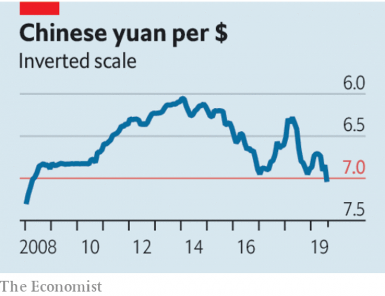

###### US-China trade

# Dangerous miscalculations 

 

> print-edition iconPrint edition | Leaders | Aug 8th 2019 

SINCE THE trade war began in 2018 the damage done to the global economy has been surprisingly slight. America has grown healthily and the rest of the world has muddled along. But this week the picture darkened as the confrontation between America and China escalated, with more tariffs threatened and a bitter row erupting over China’s exchange rate. Investors fear the dispute will trigger a recession, and there are ominous signs in the markets—share prices fell and government-bond yields sank to near-record lows. To avoid a downturn, both sides need to compromise. But for that to happen President Donald Trump and his advisers must rethink their strategy. If the realisation has not dawned yet, it soon should: America cannot have a cheap currency, a trade conflict and a thriving economy. 

The latest spike in tensions began on August 1st, when the White House threatened to impose a further round of duties on $300bn of Chinese exports by the start of September. China responded four days later by telling its state-run companies to stop buying American agricultural goods. On the same day it let its heavily managed currency pass through a rate of seven against the dollar, a threshold which may seem arbitrary but is symbolically important (see article). 

That lit a fuse beneath the Oval Office. Mr Trump has long claimed that other countries, including China, keep their currencies artificially cheap to boost their exports, hurting America. He has been griping about the strong dollar for months. In June he accused Mario Draghi, the head of the European Central Bank, of unfairly weakening the euro by hinting at rate cuts. Hours after the yuan dropped, America’s Treasury designated China a “currency manipulator” and promised to eliminate its “unfair competitive advantage”. As the hostilities rose, markets swooned, with ten-year bond yields in America reaching 1.71%, as investors judged that the Federal Reserve will slash interest rates to try to keep the expansion alive (see article). 

 

There is no denying that China has manipulated its exchange rate in the past. But today a different dynamic is playing out around the world. Mr Trump wants a booming economy, protected by tariffs and boosted by a cheap dollar, and when he doesn’t get them he lashes out. But economic reality makes these three objectives hard to reconcile. Tariffs hurt foreign exporters and dampen growth beyond America’s borders; weaker growth in turn leads to weaker currencies, as business becomes cautious and central banks ease policy in response. The effect is particularly pronounced when America is growing faster than other rich countries, as it has recently. The dollar’s enduring strength is a result, in part, of Mr Trump’s policies, not of a global conspiracy. 

Unless this fact sinks in soon, real harm will be done to the global economy. Faced with the uncertainty created by a vicious superpower brawl, firms in America and elsewhere are cutting investment, hurting growth further. Lower interest rates are making Europe’s rickety banks even more fragile. China could face a destabilising flood of money trying to leave its borders, as happened in 2015. And further escalation is possible as both sides reach for economic weapons that were considered unthinkable a few years ago. America could intervene to weaken the dollar, undermining its reputation for unfettered capital markets. China or America could impose sanctions on more of each other’s multinational firms, in the same way that America has blacklisted Huawei, or suspend the licences of banks that operate in both countries, causing havoc. 

As it pursues an ever more reckless trade confrontation, the White House may imagine that the Federal Reserve can ride to the rescue by cutting rates again. But that misunderstands the depth of unease now felt in factories, boardrooms and trading floors around the world. In September talks between America and China are set to resume. It is time for a settlement. The world economy cannot stand much more of this.■ 

