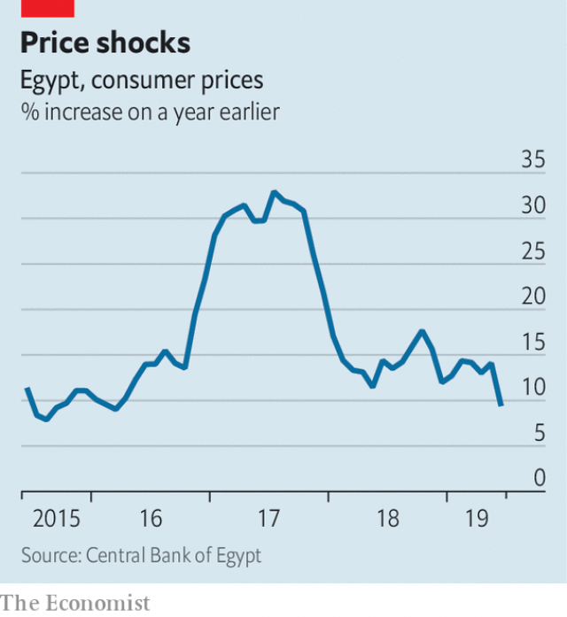

###### Poor on the Nile

# Egypt is reforming its economy, but poverty is rising 

 

> print-edition iconPrint edition | Middle East and Africa | Aug 10th 2019 

EXCEPT FOR the glow of a mobile phone behind the watermelons, the fruit-and-vegetable shop on a busy Cairo street looks deserted. The owner says his wares are 25% more expensive than last summer. As prices rise, buyers skimp: regulars who used to buy a kilogram of fruit now settle for half. He keeps the lights off between shoppers to save a few pounds. There are no lights either at the butcher’s next door, who reckons revenues are down by 20%. “I sell a lot of bones for soup,” he says. 

Last year Egypt vowed to halve poverty by 2020 and eliminate it by 2030. It is going in the wrong direction. On July 29th the national statistics agency released a long-delayed report on household finances. It found that 33% of Egypt’s 99m people were classified as poor last year, up from 28% in 2015. Even that dismal finding may not be dismal enough. The government has fixed the official poverty line at just 736 pounds ($45) a month, a figure that many economists say is too low. The World Bank said in April that 60% of Egyptians were “either poor or vulnerable”. 

The numbers are a stinging assessment of the economic reforms overseen by the president, Abdel-Fattah al-Sisi. Backed by the IMF, which approved a $12bn loan in 2016, his government cut fuel subsidies, let the currency depreciate and imposed a 14% value-added tax. These gave Egypt a primary surplus and cut its deficit to 8.3% of GDP, from 12.5% three years ago. 

But macroeconomic gains came at the expense of Egyptians themselves. Cuts to fuel subsidies have pushed up transport costs. For an Egyptian on the official poverty line, a short daily trip on Cairo’s metro would now consume 25% of their monthly income. Average household expenditures have increased by 43% since 2015. Income rose by just 33% during the same period, while household debt to banks jumped by 58%. Adjusted for inflation, which peaked at 33% in 2017 (see chart), Egyptians are earning less than they did three years ago. 

 

Though inflation has cooled, the IMF expects it to remain in double digits until at least 2021. The poorest Egyptians, who spend up to 48% of their income to eat, are hardest hit. Meat is an unaffordable luxury: a kilo of beef costs 9% of an average week’s pay. Even a humble plate of koshari, the mixture of lentils, chickpeas, rice and pasta that is a staple lunch for many, is becoming expensive. A small plate used to cost three pounds. Now restaurants charge at least five, and often more. 

Add to that a government determined to squeeze every pound out of its citizens. The price of almost every service, from driving licences to gun permits, has gone up. Public-school fees have jumped by 20-50%. Taxi drivers at the airport grouse about new charges: 2,000 pounds a month for a permit, plus parking fees that have quadrupled. Their passengers are being squeezed too, with a new $25 departure tax. For businesses, there is a proposed 0.25% levy on revenue that would be used to fund a new national health-care scheme. 

Many of these changes are long overdue. (Fuel subsidies were regressive, inefficient and unaffordable; hospitals need investment.) But Mr Sisi’s government seems oblivious to their impact on the poor. It points to the expanding economy—a 5.6% rise in GDP last year gave Egypt the fastest growth in the Middle East. But the jump is mostly due to a boom in oil and gas. Other sectors look stagnant. Though jobs are being created, many are in low-wage or informal sectors. 

Subsidies were the heart of Egypt’s social safety-net. Nothing has adequately replaced them. The main cash-transfer schemes for the poor, Takaful and Karama, cover an estimated 9.4m people, less than 10% of the population. A monthly payment to families with children barely covers a tin of baby formula. Ration cards give access to cut-rate staples, but no one can live on cooking oil and rice alone. 

Faced with bad news, the government has done what it does best: blame the messenger. The poverty report should have been released in February. It was delayed twice, with the authors told to revise their findings. Mr Sisi needs to move beyond fiscal reforms by cutting red tape, removing barriers to trade, and pushing the army out of business. Unless he does this, the only way for him to meet his goals on poverty will be to define it out of existence. ■ 

