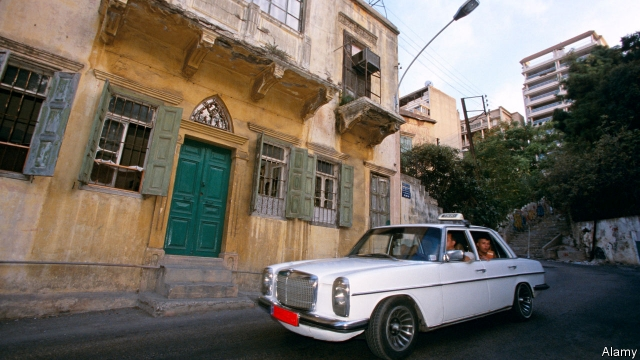

###### At your service

# How Beirut’s shared taxis cope with Uber 

 

> print-edition iconPrint edition | Middle East and Africa | Aug 10th 2019 

TO OUTSIDERS, BEIRUT’S taxi-hailing rituals can seem baffling. A flurry of honks announces the arrival of a driver, who peers out of his window with eyebrows raised. Hesitate a moment too long—as the uninitiated often do—and he’ll speed off, leaving the would-be passenger breathing exhaust fumes and wondering what went wrong. But beneath this brusque treatment lies a rich set of norms and customs that have helped the shared taxis, known as “service” taxis (or “servees”), survive the incursion of Uber into Lebanon’s capital. 

The service taxi system relies on split-second individual negotiations, rather than prices imposed by meters, regulations or ride-sharing software. When a driver spots a potential passenger, he slows down until the passenger names a destination. If the driver agrees, the ride costs a modest 2,000 Lebanese pounds ($1.33), usually less than what Uber charges. He may also ask for twice the fare or, for an out-of-the-way trip, suggest that the passenger buys all the seats for 10,000 pounds. 

This system allows drivers and passengers to reach agreements based on factors such as traffic conditions and whether the route is likely to provide more passengers. “You have clear, true market economics,” says Ziad Nakat of the World Bank. “It’s not regulated or constrained—just supply and demand, based on what you’re willing to sell and what I’m willing to buy.” Both parties appear happy with the system, although it does make Beirut’s terrible traffic even worse, as drivers slow down to haggle. 

Many drivers shun Uber, fearing the software will strand them on traffic-heavy routes or penalise them for declining too many rides. Others work with Uber, but act as a service taxi when they think their local knowledge will give them an edge over Uber’s algorithm. (Uber cars and service taxis have the same red licence-plates.) Muhammad, an Uber driver, turns the app off on Sundays, when certain high-demand routes earn him nearly double. “It depends on if it’s good for me,” he says. 

The residents of Beirut came to rely on service taxis after trams and railways were destroyed during the 15-year civil war that ended in 1990. Service taxis are lightly regulated, but because they rely mainly on collective norms they endured even as the country’s dysfunctional politics hindered the reintroduction of public transport. In a city divided by sect and class, they also lead to unexpected encounters. Your correspondent has heard drivers recite traditional Arab poetry and a Hizbullah fighter recount a trip to Syria to fight ISIS. 

The system does have its downsides. Every ride is a gamble. Some drivers deviate from planned routes in search of extra fares, making commuting times unpredictable. (The definition of hell, some joke, is to be in an empty service taxi, behind a full one.) Female passengers often opt for Uber to avoid harassment. Marwan Fayyad, the head of the local taxi-driver syndicate, laments that poor regulation has allowed forged licence plates and unlicensed drivers to proliferate, making it harder for registered service drivers to make ends meet. 

Still, a little chaos will have to remain—in many ways, the lack of regulation is the central appeal of service taxis. “As a service driver, you’re free,” says one who refuses to use Uber. “No one is in charge of you—you’re in charge.”■ 

