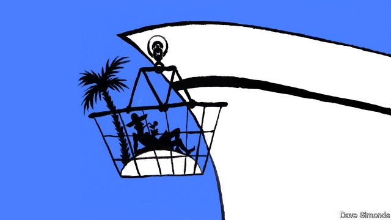

###### Island shopping

# Cruise-line companies are building private Caribbean play zones 

 

> print-edition iconPrint edition | The Americas | Aug 10th 2019 

THIRTY MINUTES west from Cap-Haïtien, a city in the north of Haiti, tawny sand beaches fringed with coconut palms are blocked by a high barbed-wire fence. It looks like a prison, except that inside are a 800-metre zip line, floating bouncy castles and a line of several hundred jetskis. Steel-drum music pumps from a 225,000-tonne ship rising 20 storeys from the turquoise sea. 

This is Labadee, a beach run by Royal Caribbean. Its name is a riff on Labadie, the name of the typically poor Haitian village next door. Though the resort is actually on the second-largest island in the Caribbean, the cruise giant markets it as a “private destination”. And in a sense they are not entirely wrong. Since its inauguration in 1986, passengers who come ashore have not been subject to customs or immigration controls. Extras, such as the signature “Labadoozie” cocktail, are paid for in US dollars, never the Haitian gourde. Haitians not employed by Royal Caribbean cannot enter. 

Caribbean countries striking deals with firms to open exclusive resorts (with or without customs checks) are “a growing phenomenon”, says Jim Walker, a lawyer based in Miami who deals with cruise liners. In 2015, Carnival opened the $85m Amber Cove in the Dominican Republic; this year, Royal Caribbean will open CocoCay in the Bahamas after a $250m renovation. A third of the 30m people who will cruise in 2019 will go to the Caribbean. 

For cruise companies, the benefits are clear. Customers—and their money—are kept in one place. And the experience can be tailored to fit nervous travellers. Dillon Mangs, an expatriate resident of Labadie whom Royal Caribbean contracts to run shore excursions, says he tries to showcase Haiti’s culture without dampening holidaymakers’ spirits by exposing them to too much reality. One excursion is to a mock Haitian mountain village, complete with a Vodou show. 

Is it a problem that cruise companies have such privileges? Some worry that the deals firms strike with governments are lopsided. To keep cruisers on side, Caribbean countries are “basically giving away parcels of land”, says Ross Klein, of the Memorial University of Newfoundland. Governments which demand too much find the ships go elsewhere. 

But for the troubled Haitian government, the Royal Caribbean deal does at least generate some cash. Each passenger, of whom there are over 700,000 a year, pays the state a $12 surcharge. The company provides jobs, and has also contributed to a school. As a boy, Rodman Decius, who lives in Labadie, attended the École Nouvelle; now he works as first mate on a yacht chartered by Royal Caribbean. He is pleased with the job and does not mind clueless guests. “If they ask questions, it’s nice for me to tell them about my culture,” he says. “But it doesn’t bother me if they don’t.”■ 

