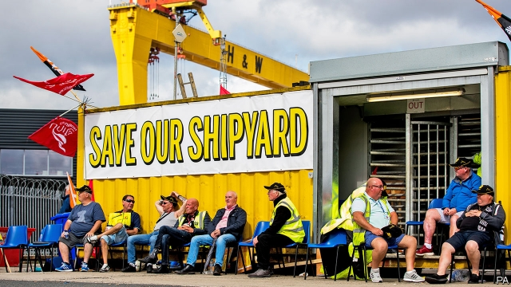

###### Staring into the abyss

# Business this week 

> Aug 10th 2019 

America officially categorised China as a currency manipulator for the first time in 25 years, after the yuan weakened past the psychologically significant mark of seven to the dollar, the lowest point for the Chinese currency since the financial crisis. The yuan trades narrowly in China around an exchange rate set by the central bank. It dismissed the idea that the yuan had been manipulated, submitting that its depreciation was caused instead by “shifts in market dynamics”, which include “escalating trade frictions”. See article.  

Those trade frictions had indeed escalated when Donald Trump earlier announced 10% tariffs on an additional $300bn-worth of Chinese goods in the two countries’ trade war. Mr Trump said he was punishing China for not keeping its promise to buy more American agricultural goods, among other things. 

Stockmarkets had a rocky week, with the S&P 500, Dow Jones Industrial Average and NASDAQ indices recording their worst trading day of the year so far. Most Asian currencies tumbled following the yuan’s depreciation. But the yen, considered to be a haven in uncertain times, soared against the dollar. The yields on government bonds, another safe bet, fell as investors ploughed into the market. 

Investors were also unnerved by a wave of larger-than-expected interest-rate cuts. India’s central bank shaved 0.35 of a percentage point off its main rate, to 5.4%; New Zealand’s slashed its benchmark rate from 1.5% to 1%; and Thailand’s first cut in four years left its main rate at 1.5%. All three were pessimistic about the prospects for growth. 

A trade dispute caused sales of cars made in Japan to plunge in South Korea last month. Samsung, South Korea’s biggest maker of smartphones and memory chips, said it was searching for substitute suppliers of some essential chemicals that Japan has tightened its grip on, which South Korea calls an embargo. This week Japan approved its first shipment of high-tech material to South Korea in a month. The row was sparked by a political spat. 

The EU selected Kristalina Georgieva as its candidate to head the IMF, but only after the rancorous exercise concluded with some telephone diplomacy. Ms Georgieva is currently the second-highest official at the World Bank. Under an informal convention, Europe gets to pick the managing director of the IMF (and America the president of the World Bank), so Ms Georgieva is favoured to get the job in October, when the IMF will choose its leader. But it must first change a rule that says a new managing director must be under 65. Ms Georgieva turns 66 on August 13th. 

John Flint’s decision to step down as chief executive of HSBC after just 18 months in the job took markets by surprise. His resignation was made “by mutual agreement with the board”, which reportedly lost confidence in Mr Flint’s ability to steer the bank through increasingly choppy waters stirred by trade tensions between America and China. Most of HSBC’s profit comes from Asia. The bank is expected to take its time choosing a successor. See article.  

A report prepared for the Intergovernmental Panel on Climate Change suggested that a move away from meat and towards plant-based diets could help fight global warming, but it pulled back from recommending that people become vegetarians. Companies selling plant-based products have seen their share prices soar this year. 

The latest takeover in the consolidating payments industry saw Mastercard agreeing to buy Nets, a Danish real-time payments provider, for $3.2bn. It is Mastercard’s biggest acquisition to date. 

Vivendi, a French media company, said it was considering selling a stake of at least 10% of its Universal Music business to Tencent, a Chinese technology conglomerate, possibly raising that to 20% at a later date. If completed, a deal might allow Tencent to combine its expertise in streaming with Universal’s vast catalogue of artists, which include Abba, the Beatles, Drake, Elton John and Taylor Swift. 

 

The Harland and Wolff shipyard in Belfast entered administration, marking the probable end of a business that built the Titanic and other famous vessels. The yard once employed 15,000 workers, but now just 122 work on repairs. It has not built a ship since 2003. 

Barneys New York, a luxury department-store chain that opened shop in 1923, filed for bankruptcy protection and said it would close most of its stores. The company is restructuring its debt and expects to keep seven stores open, including its flagship premises in Manhattan, made famous by “Sex and the City”. Its insolvency proves that the upheaval in retailing is not confined to suburban shopping malls. 

