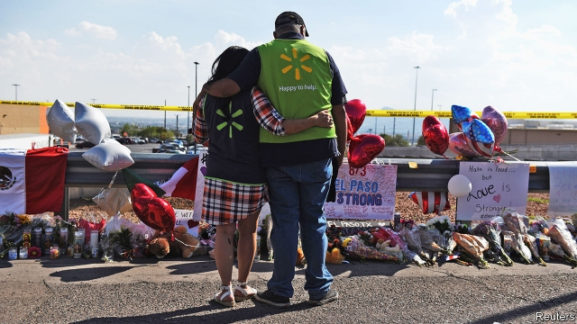
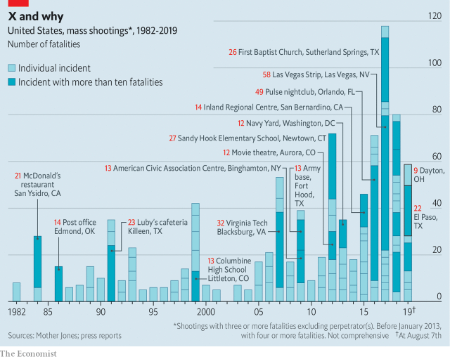

###### The definition of insanity

# America grapples with a lethal mix of terrorism and lax gun laws 

 

> print-edition iconPrint edition | United States | Aug 10th 2019 

THEY LOOKED like something out of Donald Trump’s fever dream: a bunch of burly, bearded, tattooed Latinos massed outside a blood bank wielding metal objects. But the objects were spoons and spatulas, and the men were Christians on a mission. Soon after a gunman killed nearly two dozen people at a Walmart, Pastor Anthony Torres and members of his flock stocked their mobile kitchen and drove down from Alamogordo, New Mexico. In the two days that followed they served hundreds of meals to El Pasoans who donated badly needed blood to local hospitals. Asked why he brought nearly a dozen people, a mobile kitchen and hundreds of dollars-worth of food to another city to help people he had never met, Mr Torres just shrugs: “We felt we had to be here.” 

The El Paso massacre was the deadliest of three in less than a week—all perpetrated by young men using legally purchased semi-automatic weapons. The death toll, including two shooters, stood at 36: 22 in El Paso, four at a festival in Gilroy, California and ten in Dayton, Ohio, with dozens left injured. America has grown accustomed to such events. There have been 31 shootings with three or more deaths in 2019. On average, according to a research outfit called the Gun Violence Archive, this year has seen one shooting in which four or more people were killed or injured every day. 

Two of these attacks—in Gilroy and El Paso—are being investigated as domestic terrorism, raising questions about how police and politicians confront the threat from white-supremacist terror. On July 23rd Christopher Wray, the FBI director, said his agency had made around 100 domestic-terror arrests since October, most of them related to white supremacists. Yet even though, according to the Anti-Defamation League, an NGO, right-wing extremists were responsible for 70% of killings apparently motivated by some extremist ideology in America between 2009 and 2018, the counterterrorism apparatus remains geared more towards catching foreign terrorists than domestic ones. 

That stems partly from a legal distinction. Providing money or personnel to a designated foreign-terrorist group such as al-Qaeda or ISIS is illegal. No such statute exists for domestic terrorism, and in any case white-supremacist attacks are carried out by individuals who buy their own guns and radicalise themselves online. Initiating a terrorism investigation based on opinions posted on web forums gets into murky First Amendment waters. 

But the imbalance also stems from priorities set at the top. Former counterterrorism analysts say that the government does not devote nearly as much intellectual energy to understanding the ideology of domestic white supremacists, and mapping out paths from ideology to action, as it does to jihadist terrorism—even though, as Clint Watts, a former FBI special agent who worked on terrorism, notes, the two ideologies are structurally similar. Both argue that they—Muslims in one case, white people in another—are superior, and need their own separate state ruled by their own people, and are justified in committing acts of violence in their people’s name. 

Despite that passing similarity, the path to radicalisation seems different. Jihadist groups recruited through mainstream platforms such as Facebook, Twitter and YouTube, where they comprised a negligible share of these firms’ revenue and users. That made it easy for companies and governments to kick jihadists off these sites. White-nationalist extremists use smaller platforms that have no interest in joining the mainstream. Sometimes their service providers step in: Cloudflare, for instance, withdrew its web-security protections from 8chan, a web forum popular with the far right. These sites then pop up elsewhere, hosted in an obscure jurisdiction. 

 

Shortly before he began his attack, Patrick Crusius, the El Paso shooter, appears to have posted a manifesto on 8chan. He wrote that his attack was “a response to the Hispanic invasion of Texas”—a state that until 1836 was part of Mexico. He railed against immigration and environmental damage, and advocated “decreas[ing] the number of people in America using resources. If we can just get rid of enough people, then our way of life can become sustainable.” Towards that end, he travelled from the suburb of Dallas where he was brought up to El Paso, a majority-Hispanic border city, and opened fire in a store packed with back-to-school shoppers from Mexico. One survivor said he specifically targeted people he thought were Hispanic. 

“The Hispanic community,” he wrote, “was not my target until I read The Great Replacement.” This refers to a conspiracy theory that blames feckless Western elites for “replacing” people of European ancestry with non-white immigrants. “The Great Replacement” was the title of a book by a French polemicist. Brenton Tarrant, an Australian man who earlier this year murdered 51 people in two mosques in New Zealand, used it as the title of his own manifesto, which Mr Crusius endorsed. 

This is an updated version of an older conspiracy theory known as white genocide, which propounds that the world’s white population is being deliberately shrunk and diluted through mass immigration, low fertility rates, multiculturalism and miscegenation (Mr Crusius also inveighed against “race mixing”). Unsurprisingly, many on the far right believe this to be a Jewish plot. 

These beliefs, notes Oren Segal of the Anti-Defamation League, “are not just on these fringe internet forums. If anyone operating there turned on Fox News, they would hear similar sentiments.” Tucker Carlson, the second-most-popular host on cable news, has said that Democrats want “demographic replacement” through “a flood of illegals”. Laura Ingraham, another host, has argued that Democrats “want to replace you, the American voters, with newly amnestied citizens and an ever-increasing number of chain migrants.” 

Prominent politicians have said the same thing. Steve King, a congressman from Iowa, infamously wrote that “we can’t restore our civilisation with somebody else’s babies.” On the House floor Ted Yoho and Louie Gohmert, both Republican congressmen, have compared immigrants to invaders. During a trip to Europe in 2018, Donald Trump said that immigration has “changed the fabric of Europe”, and told a British tabloid, “I think you are losing your culture. Look around.” More recently, his Facebook campaign ads have warned, “We have an INVASION…It’s CRITICAL that we STOP THE INVASION.” Take this literally and violence becomes a defensive measure. 

Correlation is not causation, but FBI data show a recent uptick in reported hate crimes. Men who killed Jews in synagogues in California and Pittsburgh blamed Jews for immigrant “invaders” and the “genocide of the european race”. Despite the president’s occasional disavowals, these people really like him. The Christchurch shooter called Mr Trump “a symbol of renewed white identity and common purpose”. One researcher who attends extremist rallies (in disguise) reports “unanimous support for Trump…These folks rallied around him. They saw large parts of their messaging getting into the mainstream.” 

To his credit, in a speech on August 5th Mr Trump denounced “racism, bigotry and white supremacy”. He also advocated making it easier to commit the mentally ill to hospital, “stop[ping] the glorification of violence in our society” and develop “tools that can detect mass-shooters before they strike”. Missing from the list was a commitment to moderate his own speech, or anything that would make it substantially harder for angry young men to obtain semi-automatic weapons.■ 

-- 

 单词注释:

1.insanity[in'sæniti]:n. 疯狂, 愚顽, 精神错乱 [医] 精神病 

2.grapple[græpl]:v. 抓住, 掌握 n. 抓住, 系紧, 掌握, 与...扭打 

3.lethal['li:θәl]:a. 致命的 n. 致死因子 

4.terrorism['terәrizm]:n. 恐怖主义, 恐怖统治, 恐怖状态 [法] 胁迫, 暴政, 恐怖政治 

5.lax[læks]:a. 松的, 不严格的, 腹泻的, 松弛的 n. 腹泻, 松元音 

6.Aug[]:abbr. 八月（August） 

7.burly['bә:li]:a. 结实的, 粗壮的, 率直的 

8.Latino[læ'ti:nәu, lә-]:n. 拉丁美洲人 

9.wield[wi:ld]:vt. 挥舞, 运用 

10.spatula['spætʃәlә]:n. 刮刀, 压舌片, 匙突 [医] 药刀, 软膏刀; 铲; 压舌板 

11.gunman['gʌnmәn]:n. 枪手, 持枪的歹徒, 制造枪械者 [法] 持枪歹徒, 持枪抢劫或杀人者, 枪炮工人 

12.walmart['wɔlma:t]: 沃尔玛（世界连锁零售企业） 

13.pastor['pæstә]:n. 牧师 

14.anthony['æntәni]:n. 安东尼（人名） 

15.Torre[]:n. (Torre)人名；(英、法)托尔；(德、西、意、葡、塞)托雷 托尔 托雷 

16.Alamogordo[]:阿拉莫戈多 

17.el[el]:abbr. 预期损失（Expected Loss） 

18.donate['dәuneit]:v. 捐赠 

19.paso[]:abbr. 泛美体育组织（Pan American Sports Organization） 

20.massacre['mæsәkә]:n. 大屠杀 vt. 大屠杀, 残杀 

21.les[lei]:abbr. 发射脱离系统（Launch Escape System） 

22.perpetrate['pә:pitreit]:vt. 做(恶), 犯(罪), 胡说, 恶劣地做 [法] 犯, 作, 行 

23.legally['li:gәli]:adv. 法律上, 合法地 [法] 法律上, 合法地, 法定地 

24.toll[tәul]:n. 通行费, 代价, 钟声 vt. 征收, 敲钟, 鸣钟, 勾引, 引诱 vi. 征税, 鸣钟 

25.shooter['ʃu:tә]:n. 射手, 狩猎者, 手枪 

26.Gilroy[]:n. 吉尔罗伊（美国加利福尼亚州城市）；吉尔罗伊（人名） n. (Gilroy)人名；(英)吉尔罗伊 

27.California[.kæli'fɒ:njә]:n. 加利福尼亚 

28.dayton['deitən]:n. 代顿（美国俄亥俄州西南部城市） 

29.Ohio[әu'haiәu]:n. 俄亥俄 

30.outfit['autfit]:n. 用具, 配备, 机构 vt. 配备, 供应 vi. 得到装备 

31.archive['ɑ:kaiv]:vt. 把...存档 n. 档案馆, 档案文件 [计] 挡案库, 存档 

32.confront[kәn'frʌnt]:vt. 使面对, 对抗, 遭遇, 使对质, 比较 [法] 对证, 使对质, 比较 

33.christopher['kristәfә]:n. 克里斯多夫（男子名） 

34.Wray[]:雷（人名） 

35.FBI[]:美国联邦调查局 [经] 美国联邦调查局 

36.supremacist[sә'premәsist, sju-]:n. 至上主义者 

37.ngo[]:abbr. 民间组织；非政府组织（Non-Governmental Organization） 

38.extremist[iks'tri:mist]:[经] 偏激份子 

39.killing['kiliŋ]:n. 谋杀, 杀戮 a. 杀害的, 疲惫的, 迷人的 

40.apparently[ә'pærәntli]:adv. 表面上, 清楚地, 显然地 

41.ideology[.aidi'ɒlәdʒi]:n. 思想体系, 意识形态, 观念学, 空论 [医] 观念学, 观念形态 

42.counterterrorism['kaʊntəˌterərɪzəm]:n. 以恐怖反恐怖主义, 报复性恐怖主义 

43.terrorist['terәrist]:n. 恐怖分子 [法] 恐怖份子, 恐怖主义 

44.designate['dezigneit]:vt. 指定, 指明, 称呼 a. 已选出而未上任的 

45.isi[]:abbr. 工业标准项目（Industry Standard Item）；钢铁学会（Iron and Steel Institute）；印度标准学会（Indian Standards Institution） 

46.radicalise['rædikəlaiz]:vt. 使激进（等于radicalize） vi. 变得激进（等于radicalize） 

47.online[]:[计] 联机 

48.initiate[i'niʃieit]:n. 入会, 开始 a. 新加入的 vt. 开始, 传授基本知识给 

49.forum['fɒ:rәm]:n. 论坛, 公开讨论的广场, 法庭, 讨论会 [法] 讨论会, 专题讨论, 公共论坛 

50.murky['mә:ki]:a. 黝暗的, 阴沉的, 朦胧的 

51.amendment[ә'mendmәnt]:n. 修订, 改善, 改良, 改正 [化] 调理剂; 修正 

52.imbalance[im'bælәns]:n. 不平衡, 不均衡 [医] 不平衡, 失调 

53.analyst['ænәlist]:n. 分析者, 精神分析学家 [化] 分析员; 化验员 

54.jihadist[]:n. 伊斯兰圣战士 

55.clint[klint]:n. 石芽；石灰岩岩脊；岩沟 

56.watt[wɒt]:n. 瓦(特) [化] 瓦; 瓦特 

57.structurally[]:[计] 结构地 

58.similarity[.simi'læriti]:n. 类似, 类似处 [法] 类似, 相似, 类似事例 

59.radicalisation[]:[网络] 激进化 

60.jihadist[]:n. 伊斯兰圣战士 

61.mainstream['meinstri:m]:n. 主流 

62.facebook[]:n. 脸谱网 

63.twitter['twitә]:n. 啁啾, 唧唧喳喳声 vi. 啭, 啁啾, 颤抖 vt. 嘁嘁喳喳地讲, 抖动 

64.youtube[]:n. 视频网站（可以让用户免费上传、观赏、分享视频短片的热门视频共享网站） 

65.negligible['neglidʒәbl]:a. 可以忽略的, 不足取的, 无用的 [医] 可不计的, 可忽视的 

66.provider[prә'vaidә]:n. 供应者, 供养人, 伙食承办人 [计] 提供器 

67.CloudFlare[]:[网络] 云端的服务；功能很强大的免；云闪 

68.jurisdiction[.dʒuәris'dikʃәn]:n. 司法权, 审判权, 管辖权 [经] 法律管辖权, 审判权 

69.patrick['pætrik]:n. 帕特里克（男子名） 

70.crusius[]:[网络] 克鲁斯乌斯 

71.manifesto[.mæni'festәu]:n. 宣言, 声明 

72.Hispanic[his'pænik]:a. 西班牙的 

73.environmental[in.vaiәrәn'mentәl]:a. 周围的, 环境的 [经] 环境的, 环保的 

74.sustainable[sә'steinәbl]:a. 足可支撑的, 养得起的, 可以忍受的 

75.dallas['dælәs]:n. 达拉斯（美国城市） 

76.shopper['ʃɒpә]:n. 购物者 [经] 顾客, 购物的人 

77.survivor[sә'vaivә]:n. 生还者, 幸存者 [法] 生还者, 生存者, 辛存者 

78.specifically[spi'sifikli]:adv. 特定地, 明确地, 按特性 

79.replacement[ri'pleismәnt]:n. 归还, 更换, 代替者 [医] 复位, 置换 

80.conspiracy[kәn'spirәsi]:n. 同谋, 阴谋, 阴谋集团 [法] 阴谋, 通谋, 共谋 

81.feckless['feklis]:a. 无效的, 无能的, 不负责任的 

82.elite[ei'li:t]:n. 精华, 精锐, 中坚分子 

83.ancestry['ænsestri]:n. 祖先, 世系, 名门出身 

84.polemicist[pɒ'lemisist]:n. 辩论家 

85.Brenton[]:布伦顿（人名） 

86.Tarrant[]:n. (Tarrant)人名；(英)塔兰特 

87.mosque[mɒsk]:n. 清真寺 

88.zealand['zi:lәnd]:n. 西兰岛（丹麦最大的岛） 

89.endorse[in'dɒ:s]:vt. 支持, 赞同, 背书于, 签署 [经] 赞成, 背书 

90.update[ʌp'deit]:vt. 更新, 使现代化 n. 更新 [计] 更新 

91.genocide['dʒenәu,said]:n. 种族灭绝, 灭绝整个种族的大屠杀 [医] 种族灭绝(侵略军队加害居民的罪行) 

92.propound[prә'paund]:vt. 提出供考虑 [法] 提出建议, 提出供考虑, 提出 

93.dilute[dai'lju:t]:vt. 冲淡, 稀释 a. 淡的, 稀释的 

94.fertility[fә'tiliti]:n. 肥沃, 丰饶, 生产力 [医] 生育力 

95.multiculturalism[ˌmʌltiˈkʌltʃərəlɪzəm]:n. 多元文化 

96.miscegenation[.misidʒi'neiʃәn]:n. 种族通婚 [医] 种族[间]通婚 

97.inveigh[in'vei]:vi. 痛骂, 漫骂, 臭骂 

98.unsurprisingly[]:adv. 不出所料的；不出奇的；意料中的 

99.oren[]:奥伦 

100.Segal[]:n. 西格尔（人名） 

101.fringe[frindʒ]:n. 边缘, 端, 流苏, 穗, 初步 vt. 加穗于, 加饰边于 a. 边缘的, 附加的 

102.sentiment['sentimәnt]:n. 感情, 感伤, 情操, 情绪, 感想, 意见 [医] 情感, 情操 

103.tucker['tʌkә]:n. 打横褶的人, 打褶装置 vt. 使疲倦, 使筋疲力尽 

104.Carlson[]:n. 卡尔森（公司名）；卡尔松（姓氏） 

105.democrat['demәkræt]:n. 民主人士, 民主主义者, 民主党党员 [经] 民主党 

106.demographic[.demә'græfik]:a. 人口统计的 [法] 人口统计的, 人口学的 

107.replacement[ri'pleismәnt]:n. 归还, 更换, 代替者 [医] 复位, 置换 

108.laura['lɔ:rә]:n. 劳拉（女子名） 

109.ingraham[]: [人名] 英格拉哈姆; [地名] [美国] 英格勒厄姆 

110.voter['vәutә]:n. 选民, 投票人 [法] 选民, 选举人, 投票人 

111.amnesty['æmnisti]:n. 大赦, 赦免 

112.migrant['maigrәnt]:n. 候鸟, 移居者 [法] 移居者 

113.steve[]:n. 史蒂夫（男子名） 

114.congressman['kɒŋgresmәn]:n. 国会议员, 众议院议员 [法] 国会议会 

115.Iowa['aiәwә]:n. 衣阿华州 

116.infamously[]:adv. 不名誉地 

117.civilisation[,sivilai'zeiʃən;-li'z-]:n. 文明, 文明世界, 文化, 开化, 教化 

118.ted[ted]:vt. 翻晒 

119.yoho[]:int. 【航】唷嗬 [网络] 鹤；幽鹤；有货 

120.louie['lu(:)i]:路易（男子名, Louis的异体） 

121.invader[in'veidә]:n. 侵略者 [化] 侵入物 

122.tabloid['tæblɒid]:n. 小报, 小型画报, 药片, 文摘 a. 轰动性的, 扼要的, 缩略的, 小报式的 

123.literally['litәrәli]:adv. 逐字地, 按照字面上地, 不夸张地 

124.defensive[di'fensiv]:a. 防卫的, 防备用的, 自卫的 n. 守势, 防卫姿势, 防卫物 

125.correlation[.kɒrә'leiʃәn]:n. 相互关系, 相关, 关联 [医] 相关, 联系 

126.causation[kɒ:'zeiʃәn]:n. 因果关系, 原因 [法] 因果律, 原因作用, 因果关系 

127.datum['deitәm]:n. 论据, 材料, 资料, 已知数 [医] 材料, 资料, 论据 

128.uptick['ʌptik]:[商](股票)报升(成交价格比上一个交易高的成交或价格) 

129.Jew[dʒu:]:n. 犹太人, 守财奴, 犹太教信徒 vt. 欺骗, 杀价 

130.synagogue['sinәgɒg]:n. 犹太人集会, 犹太教会堂, 犹太教 

131.Pittsburgh['pitsbә:g]:n. 匹兹堡 

132.disavowal[.disә'vauәl]:n. 否认, 否定, 拒绝 [法] 拒绝承担责任, 抵赖, 否认 

133.Christchurch['kraist-tʃә:tʃ]:n. 克赖斯特彻奇 

134.rally['ræli]:n. 重振旗鼓, 集合, 群众集会, 跌停回升 v. 重整旗鼓, 集合, 恢复精神, 团结, 挖苦, 嘲笑 

135.unanimous[ju:'nænimәs]:a. 意见一致的, 无异议的 

136.denounce[di'nauns]:vt. 告发, 抨击, 谴责 [法] 谴责, 斥责, 告发 

137.racism['reisizm]:n. 种族主义, 种族偏见 [法] 种族主义, 种族歧视, 种族歧视主张 

138.bigotry['bigәtri]:n. 盲从, 偏见, 偏执的行为(或态度) 

139.supremacy[sju'premәsi]:n. 至高无上, 霸权地位, 优势, 至上 [法] 至高权力, 无上权力, 霸权 

140.glorification[.glɒ:rifi'keiʃәn]:n. 美化了的东西 

141.substantially[sәb'stænʃәli]:adv. 实质上, 本质上, 大体上 

