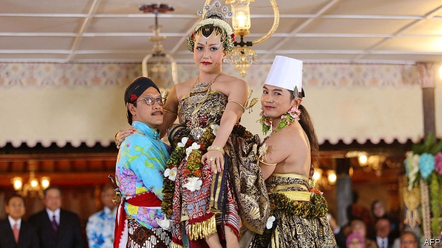

###### Raisin a sultana

# A Javanese sultan wants his daughter to succeed him. His people object 

 

> print-edition iconPrint edition | Asia | Aug 17th 2019 

THE MORNING sun was fierce but the crowd pressed against the gates of the palace did not seem to mind. They were eagerly waiting for the ceremony to start. Three times a year, the sultan of Yogyakarta, an ancient Javanese city, blesses his people with offerings of food in a ritual that mixes Hindu symbolism with Islamic beliefs. Escorted by a military parade, servants shouldering gargantuan bouquets of beans, chillies and rice crackers process to the mosque, where the offerings are handed out. Just as the ceremony ended on August 12th, the throng attacked the mounds of food. Rituals like this are the lifeblood of Yogyakarta. But the customs of this city are under attack—by the sultan himself. 

For centuries Yogyakarta has been the repository of Javanese culture, and the sultan its custodian. But Hamengkubuwono X has broken with tradition in one important way. Since the founding of the sultanate in 1755, the monarch has been a man. The sultan leads Muslims in prayer every Friday, and celebrates his marriage to the mystical Queen of the South Sea every year. Only a man can perform these duties. But the sultan has no sons. In 2015 the 73-year-old named his eldest daughter as his successor. That was hugely controversial. It had been expected that he would anoint a brother. Since then, debate over the issue has intensified. 

The sultan’s choice matters. He is no mere symbol. In 1945 Sukarno, Indonesia’s first president, appointed Sultan Hamengkubuwono IX as Yogyakarta’s governor for life in reward for fighting on the side of the new republic. In 2012 the national legislature passed a law permitting the sultan to “inherit” the governorship, and reclaim land that had traditionally belonged to the sultanate. Bayu Dardias Kurniadi of Australian National University reckons the sultan owns nearly 10% of Yogyakarta’s land. Najib Azca of Universitas Gadjah Mada in Yogyakarta says the sultan is so powerful he is “almost like an absolute monarch”. 

The prospect of a sultana troubles many ordinary Yogyakartans. Muslims say that she would sever the bond between the sultanate and the Muslim community because a woman cannot lead Friday prayers. Some believe that the sultan has been citing the need for sexual equality only as a pretext to maintain his nuclear family’s power. Others simply worry that he is flouting tradition. Sitting by the mosque, Dion Ellot, a student, says he is torn. “The princess is a woman but she can still be a good leader. On the other hand, Javanese culture says it should be a man.” His female friend Nevada Indriawati is more certain: “Tradition says it should be a man.” 

-- 

 单词注释:

1.raisin['reizn]:n. 葡萄干 

2.sultana[sʌl'tɑ:nә]:n. 无核小葡萄干 

3.Javanese[.dʒævә'ni:z]:a. 爪哇的, 爪哇人的, 爪哇语的 n. 爪哇人, 爪哇岛人, 爪哇语 

4.sultan['sʌltn]:n. 苏丹(某些伊斯兰国家统治者的称号) 

5.Aug[]:abbr. 八月（August） 

6.eagerly[]:adv. 渴望, 热衷于, 热切 

7.yogyakarta[]: [地名] [印度尼西亚] 日惹 

8.offering['ɒfәriŋ]:n. 提供, 奉献物, 牲礼, 上市的股票(或证券等) [经] 出售物 

9.ritual['ritʃuәl]:n. 仪式, 典礼, 宗教仪式 a. 仪式的, 依仪式进行的 

10.Hindu['hindu:]:a. 印度教教徒的 n. 印度教教徒 

11.symbolism['simbәlizm]:n. 象征主义, 符号论 [医] 象征主义 

12.Islamic[iz'læmik]:a. 伊斯兰教的, 穆斯林的 

13.escort['eskɒ:t]:n. 护送者, 护卫者, 护航舰 vt. 护卫, 护送 

14.gargantuan[gɑ:'gæntʃuәn]:a. 巨大的, 庞大的 

15.bouquet[bu'kei]:n. 花束 [医] 丛, 酒香, 末梢分极 

16.chilly['tʃili]:a. 寒冷的, 冷淡的, 不友好的 [建] 番椒, 冷 

17.cracker['krækә]:n. 饼干, 爆竹 [计] 破袭者 

18.mosque[mɒsk]:n. 清真寺 

19.mound[maund]:n. 土墩, 堤, 小山 vt. 筑堤, 用土堆防卫 vi. 积成堆 

20.lifeblood['laifblʌd]:n. 鲜血, 血, 生机的根源 

21.repository[ri'pɔzitәri]:n. 贮藏所, 贮物器, 仓库, 博物馆, 店铺, 陈列室, 资源丰富地区, 墓地, 亲信, 知己 [经] 仓库, 栈房, 贮藏所 

22.custodian[kʌ'stәudjәn]:n. 管理人, 保管人, 监护人 [经] 保管人, 管理人 

23.x[eks]:n. 未知数 [计] 交换, 变址, 索引, 传输 

24.sultanate['sʌltәnit]:n. 苏丹的职务, 苏丹统治的领土 

25.monarch['mɒnәk]:n. 帝王, 统治者, 元首 [医] 单原型(植) 

26.Muslim['mjzlim; (?@) 'mʌzlem]:n. 伊斯兰教, 伊斯兰教教徒 

27.mystical['mistikl]:a. 神秘的, 奥秘的 

28.eldest['eldist]:a. 最年长的, 排行中第一的 n. 最年长者, 排行中第一者 

29.successor[sәk'sesә]:n. 继承者, 接任者 [计] 后继 

30.hugely['hju:dʒli]:adv. 巨大地, 非常地 

31.anoint[ә'nɒint]:vt. 涂油, 施以涂油礼 [医] 涂油膏 

32.intensify[in'tensifai]:vt. 加强 vi. 强化 

33.Sukarno[]:n. (Sukarno)人名；(印尼)苏加诺 苏加诺 

34.sultan['sʌltn]:n. 苏丹(某些伊斯兰国家统治者的称号) 

35.ix[]:abbr. 离子交换（Ion Exchange） 

36.legislature['ledʒisleitʃә]:n. 立法机关, 议会, 立法院 [法] 立法机构, 立法机关 

37.governorship['^ʌvənәʃip]:n. 统治者的职位/任期 

38.reclaim[ri'kleim]:vt. 开垦, 改造, 感化, 纠正, 回收 vi. 喊叫, 抗议 

39.traditionally[]:adv. 传统上；传说上；习惯上 

40.Bayu[]:巴渝 

41.reckon['rekәn]:vt. 计算, 总计, 估计, 认为, 猜想 vi. 数, 计算, 估计, 依赖, 料想 

42.najib[]:n. 纳吉彼; 纳吉布; 纳吉（人名） 

43.universita[]:[网络] 白色；比萨大学；大学站 

44.mada[]:abbr. 多路存取分立地址系统（]Multiple -Access Discrete Address System） 

45.sever['sevә]:vt. 切断, 脱离, 分开, 使分离, 断绝, 中断 vi. 断, 裂开 

46.Muslim['mjzlim; (?@) 'mʌzlem]:n. 伊斯兰教, 伊斯兰教教徒 

47.cannot['kænɒt]:aux. 无法, 不能 

48.cite[sait]:vt. 引用, 引证, 表彰 [建] 引证, 指引 

49.pretext['pri:tekst]:n. 借口, 托词 v. 以...为借口 

50.flout[flaut]:vt. 嘲笑, 愚弄 vi. 表示轻蔑 n. 嘲笑, 愚弄, 轻视 

51.dion['daiәn]:n. 聚脂 

52.Nevada[ni'vædә]:n. 内华达 

