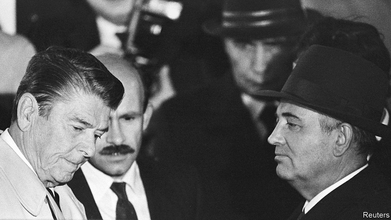

###### Dancing on ice

# Reagan and Gorbachev’s tantalising nuclear talks in Reykjavik 

 

> print-edition iconPrint edition | Books and arts | Aug 17th 2019 

An Impossible Dream: Reagan, Gorbachev, and a World Without the Bomb. By Guillaume Serina. Pegasus Books; 256 pages; $25.95. Biteback Publishing; £12.99. 

A WORLD WITHOUT nuclear weapons still seems far-fetched. But in October 1986 it was closer than many realised. In his book, Guillaume Serina tells the tantalising story of the Reykjavik summit between the Soviet and American leaders, Mikhail Gorbachev and Ronald Reagan, who came within a whisker of a ten-year deal to eliminate both countries’ arsenals. 

Agreement was desirable yet impossible. Both sides were aware that they had far more nuclear warheads and missiles than they needed. The Soviet side also knew that the cost of maintaining nuclear weapons was crippling the economy. Less fully appreciated was the fragility of the balance of terror, which was at risk less from warmongering than from misunderstandings, glitches or accidents. On several occasions during the cold war, only thin threads of luck and good judgment averted the apocalypse. But agreement meant crossing ice-sheets of mistrust. And on the American side, Reagan’s fixation on the Strategic Defence Initiative, or Star Wars—space-based missile-busting lasers—proved an insuperable obstacle. 

The Soviets offered the United States a big concession: to let it continue with “laboratory” testing of this new scheme. The definition of that proviso could have been stretched to meet all practical requirements (33 years later, the Star Wars technology is nowhere near useful deployment). But Reagan had set his heart on a futuristic system that would make his country safe for ever, and did not want to return home seeming to have given it away. As Roald Sagdeev, a Soviet nuclear expert, puts it: “The Americans oversold the Strategic Defence Initiative, and the Russians overbought it.” 

Mr Serina’s account, first published in French three years ago, draws on declassified archives and interviews with witnesses to paint a vivid and valuable picture of the two-day meeting in the Icelandic capital, despite the occasional redundant flourish and some unfamiliarity with the technology he mentions. He is a leading French correspondent dealing with the United States, not the Soviet Union, which sometimes shows. Moreover he blithely assumes the anti-nuclear case is self-evident, and is prone to unthinking moral equivalence between the communist empire and the free world. Dialogue indeed helps clarify disagreements and build trust. All the same, Reagan’s views of a malevolent Kremlin were well-founded. 

If, just if, the summit could have gone on one more day…that might have given the two leaders time to build their burgeoning rapport and overrule sceptics in their delegations. Mr Gorbachev, accompanied by his wife Raisa, was willing to give the talks another 24 hours. Lonesome and exhausted, Reagan was not. “How might the world have changed if Nancy had come along for the ride?” asks Mr Serina. 

Probably not a lot, in truth. The two big superpowers would hardly scrap their nuclear arsenals without the Chinese, Indians, Israelis and others doing the same—and how would that be verified? Still, despite the false start in Reykjavik, the negotiations continued, with the elimination of intermediate-range nuclear weapons in Europe and deep, verified cuts in the strategic arsenals on both sides. Happy days, by contemporary standards. ■ 
<<<<<<< HEAD

-- 

 单词注释:

1.reagan[]:n. 里根（姓氏） 

2.tantalise['tæntәlaiz]:vt. 诱发无法实现的希望, 使干着急, 惹弄, 逗惹, 逗弄 

3.reykjavik['reikjә,vi:k]:n. 雷克雅维克（冰岛首都） 

4.Aug[]:abbr. 八月（August） 

5.Gorbachev[]:[经] 戈尔巴乔夫 

6.Guillaume[,^i:'jәum]:纪尧姆(①姓氏 ②Charles Edouard, 1861-1938, 生于瑞士的法国物理学家, 曾获1920年诺贝尔物理学奖) 

7.serina[]:n. 【女名】女子名 [网络] 芹那；瑟琳娜；于文蕙 

8.pegasus['pe^әsәs]:n. 诗兴, 诗才 

9.Biteback[]:na. (咬住嘴唇)不说出来 [网络] 咬回；咬回去；反咬 

10.Mikhail[]:米哈伊尔（人名） 

11.ronald['rɔnәld]:n. 罗纳德（男子名） 

12.whisker['hwiskә]:n. 腮须, 胡须, 一丝儿 [化] 晶须 

13.arsenal['ɑ:snәl]:n. 兵工厂, 军械库 [机] 兵工厂 

14.warhead['wɒ:hed]:n. 弹头 

15.les[lei]:abbr. 发射脱离系统（Launch Escape System） 

16.fully['fuli]:adv. 十分地, 完全地, 充分地 

17.fragility[frә'dʒiliti]:n. 脆弱, 虚弱 [化] 易碎性 

18.warmonger['wɒ:.mʌŋgә]:n. 战争贩子 [法] 战争贩子 

19.misunderstanding[.misʌndә'stændiŋ]:n. 误会, 误解 [法] 误解, 误会, 不和 

20.glitch[^litʃ]:[计] 假信号 

21.judgment['dʒʌdʒmәnt]:n. 裁判, 宣告, 判决书 [医] 判断 

22.avert[ә'vә:t]:vt. 转开, 避免, 防止 

23.apocalypse[ә'pɒkәlips]:n. 启示, 天启 

24.mistrust[.mis'trʌst]:n. 不信任, 疑惑 v. 不信任, 疑惑 

25.fixation[fik'seiʃәn]:n. 定置, 固定, 定色 [医] 固定; 固定法, 固定术; 定影 

26.insuperable[in'sju:pәrәbl]:a. 不能制胜的, 不能克服的 

27.proviso[prә'vaizәu]:n. 附文, 附带条件, 限制性条款 [经] 合同中的限制条款, 条件 

28.deployment[]:[计] 展开 

29.futuristic[.fju:tʃә'ristik]:a. 未来派的 

30.Roald[]:n. (Roald)人名；(俄、瑞典)罗阿尔德；(挪)罗阿尔 

31.sagdeev[]:[网络] 格地夫；沙格笛夫；沙卡洛夫 

32.oversell[.әuvә'sel]:vt. 销售过多, 卖空, 过分吹嘘 vi. 卖空, 吹嘘过分 

33.overbought[,әuvә'bɔ:t]:overbuy的过去式和过去分词 [经] 过多地买进, 买空 

34.declassify[di:'klæsifai]:vt. (文件)解密, 从机密表删除 

35.archive['ɑ:kaiv]:vt. 把...存档 n. 档案馆, 档案文件 [计] 挡案库, 存档 

36.Icelandic[.ais'lændik]:a. 冰岛的, 冰岛人的, 冰岛语的 n. 冰岛语 

37.redundant[ri'dʌndәnt]:a. 多余的, 过多的, 冗长的 [医] 过多的, 多余的 

38.unfamiliarity[]:n. 陌生 

39.blithely[]:adv. 欢乐的, 轻率的, 无忧无虑的, 愉快的 

40.prone[prәun]:a. 俯伏的, 面向下的, 有...倾向的 [医] 旋前的, 伏的, 俯的 

41.unthinking[.ʌn'θiŋkiŋ]:a. 欠考虑的, 不留心的, 无思考能力的 

42.equivalence[i'kwivәlәns]:n. 同等, 等价, 等值 [计] 等价 

43.malevolent[mә'levәlәnt]:a. 有恶意的, 坏心肠的 

44.Kremlin['kremlin]:n. 克里姆林宫 [经] 克里姆林宫 

45.burgeoning[]:[计] 急速增长的 

46.rapport[ræ'pɒ:]:n. 关系, 融洽, 一致 [医] 关系, 协调(病人与医师间), 感通(唯心的灵交术时) 

47.overrule[.әuvә'ru:l]:vt. 统治, 威压, 打败, 驳回 [法] 否决, 驳回, 批驳 

48.sceptic['skeptik]:n. 怀疑论者 

49.raisa[]: [人名] 赖莎 

50.lonesome['lәunsәm]:a. 寂寞的 

51.nancy['nænsi]:n. 女性化的男人 a. 女性化的, 同性恋的 

52.superpower[.sju:pә'pauә]:n. 超级强权, 超级大国 [经] 超级大国 

53.scrap[skræp]:n. 碎片, 残余物, 些微, 片断, 铁屑, 吵架 vt. 扔弃, 敲碎, 拆毁 vi. 互相殴打 a. 零碎拼凑成的, 废弃的 

54.Israeli[iz'reili]:a. 以色列的, 以色列人(语)的 n. 以色列人 

55.negotiation[ni.gәuʃi'eiʃәn]:n. 谈判, 磋商, 交涉 [经] 谈判, 协商 
=======
>>>>>>> 50f1fbac684ef65c788c2c3b1cb359dd2a904378

