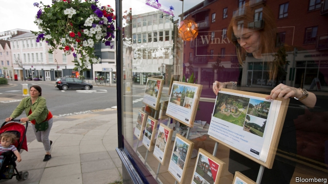

###### Housing and politics

# A rebellion against house-building spells trouble for the Tories 

 

> print-edition iconPrint edition | Britain | Aug 17th 2019 

BOTH PARTIES were formed at the start of the year. Both parties are led by ex-City boys. Both parties gave the Conservatives a battering at an election in May. The Residents for Guildford and Villages (R4GV) may attract less attention than the Brexit Party—but they could still cause the Conservatives a problem. 

A backlash against proposals to build up to 14,600 new houses in and around Guildford, a commuter town in Surrey, led to the Tories slumping from 34 of 48 councillors in the previous local election to just nine this year. By contrast, the upstart R4GV, registered only two months before, went from no seats to 15. “It’s Faragesque,” says Joss Bigmore, a banker turned R4GV politico. 

This was no isolated hit. The Conservatives suffered across the south-east. In nearby Tandridge, where a plan to build 4,000 homes on protected green-belt land was angrily attacked by locals, the Tories lost control of the council, with voters drifting to residents’ groups and independents. In Essex, Residents for Uttlesford, which was founded partly to oppose the local council’s controversial planning schemes, gained 17 seats. The Conservatives lost 19. 

Housing is an existential problem for the Tories. As a rough rule, people who own their homes are more likely to be Conservative (in the general election of 2017, 55% of owner-occupiers voted Tory, while 54% of private renters voted Labour). So the falling rate of homeownership—now, at 64%, back to its level in the mid-1980s—is ominous for the party. No wonder, then, that the housing department says it is “unashamedly and relentlessly” focused on boosting this figure. 

Yet more building can lead to a backlash, as Tory councillors in Guildford and beyond can attest. It represents a Conservative catch-22: the party must build houses to attract new voters, but cannot do so without annoying their current backers. 

Guildford demonstrates why. Even if every site in the local housing plan were built on, the area would still be green and pleasant. Green-belt land would fall from making up 89% of the borough to 86.4%. A disused airfield, which is classed as green-belt despite being a big slab of concrete, is one of the sites earmarked for housing. “Areas of outstanding natural beauty”—the picture-postcard parts—would be almost entirely untouched. If the local council did not impose its own plan, then the government would foist one on the area with even less input from locals, says Paul Spooner, the former Tory leader of Guildford council. Yet this defence fell on deaf ears. Mr Spooner was hoofed out in May, replaced by Liberal Democrat leadership. 

R4GV insists it is not a party of NIMBYs. Given that Guildford is choked by green belt, some building on surrounding fields is inevitable, admits Mr Bigmore. Opposition to the housing plan—which ran to some 750-pages, along with piles of supporting documents—was based on its process and execution rather than its objectives. The scheme had been rammed through an extraordinary meeting of the council, just a week before the election. 

Under the current planning system, there is little scope for winning round housing sceptics. The benefits of development seep out of the area: extra tax revenue generated by new residents tends to flow to central government rather than to the local authority. “Local government bears the political risk, without seeing much reward,” says Anthony Breach of the Centre for Cities, a think-tank. With a target for house-building imposed on the council by the government, villagers and townies end up pitted against each other, trying to shove development elsewhere. 

For now, the political damage is quarantined at a local level. Each of the Conservatives’ 11 MPs in Surrey sits on a fat majority. But councillors draw a parallel with austerity, where the government outsourced the blame for cuts by forcing local councils to decide what to axe. When it comes to housing, Tory MPs will hope the firewall between local politics and Westminster holds for longer. ■ 

