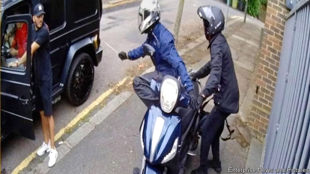

###### Of goons and Gooners

# Attacks on Arsenal players shed light on Britain’s diverse underworld 

 

> print-edition iconPrint edition | Britain | Aug 17th 2019 

YOU DON’T mess with Sead Kolasinac. Fans of Arsenal Football Club call their beefy left-back “the tank”. Last month he proved that he is also a formidable opponent off the pitch. When he and his teammate Mesut Ozil were set upon by knife-wielding robbers a few miles west of their north London stadium, he leapt out of Mr Ozil’s car and fought back. After dusting himself off, he posted a triumphant Instagram picture of the two grinning players, looking distinctly unruffled. “Think we’re fine,” he wrote. 

That was before the replay. Both players skipped the opening match of the season on August 11th following what a club spokesperson euphemistically termed “further security incidents”. Two men were charged with public-order offences after a row with bodyguards at Mr Ozil’s home. Tabloids speculated that the footballers had unwittingly become embroiled in a feud between two rival gangs. The thinking goes that an east European gang warned against any further attacks on the players, which only encouraged the other mob. 

The theory is not as outlandish as it sounds. Threatening the players could be interpreted by a north London gang as a high-profile incursion on their patch. Others reckon ethnicity is in play. Both players are Germans with roots elsewhere: Mr Ozil has Turkish heritage, Mr Kolasinac plays for the Bosnia and Herzegovina team. Tony Saggers, a former anti-drugs wallah at the National Crime Agency (NCA), an impoverished answer to America’s FBI, says foreign crooks can see footballers as ambassadors for their country and thus untouchable. 

Either way, the episode has shone a light on the diversity of Britain’s underworld. In 2017 the NCA calculated that citizens of at least 134 different countries were involved in organised crime. Britons made up the majority, but there were several hundred Romanian, Pakistani, Polish and Albanian gangsters on its books, too. About 900 Albanians are behind bars, topping the league table of imprisoned foreigners. 

Crooks of the same nationality often stick together. A shared language and culture can be important in forging trust when setting up a criminal network, says Anna Sergi of Essex University. They also benefit from a ready-made international network through connections in their home country and diaspora. 

Geography often plays a big part in the types of crime such groups specialise in, says Mr Saggers. For instance, Turkish and Pakistani gangsters are overrepresented in Britain’s heroin trade, thanks to the countries’ proximity to Afghanistan, where most opium is grown. People-traffickers are most often Albanian, Romanian, Vietnamese and Chinese as well as British, since they have ready access to people keen for work. Their victims are forced to pick pockets, steal from shops or farm cannabis in Britain. 

Yet gangs united by ethnicity tend to specialise in low-level crime, points out Ms Sergi. The more lucrative or sophisticated the crime, the more necessary it is to recruit locals who can readily launder money through legitimate businesses or corrupt officials. In fact, she says, acquisitive crime such as the attempted robbery of the Arsenal players tends to be the domain of the most recently arrived crooks, who need cash to start up their network. Messrs Ozil and Kolasinac ought to take some comfort, then. They are probably not up against crime’s premier league. ■ 

