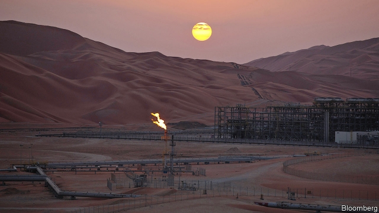

###### Tap dance

# Saudi Aramco debuts in an earnings call 

 

> print-edition iconPrint edition | Business | Aug 17th 2019 

THE EARNINGS call lasted about half an hour and was, by conventional measures, underwhelming. Saudi Aramco, the world’s most profitable company, gave no guidance on capital spending. Its finance chief, Khalid al-Dabbagh, said (cryptically) that dividends must be “affordable”. He did not disclose where or when it might list its shares. The oil giant’s first such interaction with public investors on August 12th was still revealing. It showcased the firm’s evolution—and the forces that may impede it. 

National oil companies face a hazy future. American shale output is booming and long-term demand for fossil fuels looks less certain as concerns about climate change mount. Still, Aramco enjoys a privileged position, as its results for the first half of the year demonstrate. It produced an average of 10m barrels of crude a day, plus another 3m or so barrels of oil equivalent from natural gas. Its $46.9bn in net income eclipsed that of its five biggest listed rivals—ExxonMobil, Shell, Chevron, BP and Total—combined (see chart). 

 

The numbers add new detail to the formidable portrait painted by Aramco’s first international bond prospectus in April. The $12bn issue’s success has revived plans to list 5% of Aramco’s shares. Muhammad bin Salman, Saudi Arabia’s crown prince, declared in 2016 that an initial public offering would value the company at more than $2trn, raising $100bn to invest in other sectors. It may come as soon as next year. 

That is where the earnings call comes in. It was less an exchange of information than an awkward dress rehearsal—a chance for investors to familiarise themselves with Aramco and vice versa. Mr al-Dabbagh conjured an image of dominance today and outlined plans to extend it tomorrow. The firm is expanding its trading arm and striking deals to secure demand for its crude and diversify its revenue. Like others in the industry, it expects appetite for petrochemicals to jump. In March Aramco said it would buy 70% of SABIC, a petrochemical giant, from Saudi Arabia’s public investment fund for $69bn. On August 12th Reliance Industries, an Indian conglomerate, said that Aramco would pay $15bn or so for a 20% stake in its refining-and-petrochemicals business. The Saudi firm will supply Reliance with up to 500,000 barrels a day of crude, helping to lock in a long-term customer. It has struck deals in China, Malaysia and South Korea. 

Aramco could yet trip up. Some downstream projects may take years to materialise, notes Alan Gelder of Wood Mackenzie, an energy-research firm. It boasts of “99.9%” reliability of its supply, but tensions with Iran threaten exports through the Strait of Hormuz. Expanding a pipeline to the Red Sea will help only a bit. The Saudi kingdom is hungry for revenue; dividends in the first six months of 2019 were 22% larger than free cashflow because Aramco paid a “special dividend” of $20bn on top of an ordinary one of $26.4bn (the company invoked the “exceptionally strong financial performance” of 2018). 

Most important, the oil price is sinking. It pulled Aramco’s net income in the first half of 2019 down by 12% compared with last year. To support prices, Saudi Arabia has brokered production cuts by the OPEC cartel of oil-producers and slashed its output by 7% from December to June. If rising fears of a global economic slowdown keep oil markets depressed, a listing may be delayed. Again. ■ 
<<<<<<< HEAD

-- 

 单词注释:

1.saudi['sajdi]:a. 沙乌地阿拉伯（人或语）的 

2.aramco[]:abbr. 沙特阿美石油公司（Arabian-American Oil Company） 

3.debut['deibju:]:n. 初次登台, 开张 v. 初次登台 

4.earning['ә:niŋ]:n. 收入（earn的现在分词） 

5.Aug[]:abbr. 八月（August） 

6.underwhelm[,ʌndә'hwelm]:vt. 未留下深刻印象 

7.Khalid[]:n. 哈利德（男子名） 

8.cryptically['kriptikəli]:adv. 隐秘地；意义含糊地 

9.dividend['dividend]:n. 被除数, 股利 [计] 被除数 

10.affordable[]:[计] 普及型 

11.investor[in'vestә]:n. 投资者 [经] 投资者 

12.showcase['ʃәukeis]:n. 陈列橱 [经] 商品陈列所, 货物陈列架 

13.impede[im'pi:d]:vt. 妨碍, 阻碍, 阻止 

14.hazy['heizi]:a. 朦胧的, 模糊的, 烟雾弥漫的 

15.shale[ʃeil]:n. 页岩 

16.fossil['fɒsәl]:n. 化石, 古物 a. 化石的, 陈腐的, 守旧的 

17.les[lei]:abbr. 发射脱离系统（Launch Escape System） 

18.eclipse[i'klips]:n. 日食, 月食, (地位名誉等的)消失 vt. 引起日食, 引起月食, 使黯然失色 

19.chevron['ʃevrәn]:n. V形袖章, 锯齿形花饰 [计] 人字形 

20.bp[]:[化] 碱基对 

21.formidable['fɒ:midәbl]:a. 巨大的, 优秀的, 可怕的, 艰难的 

22.prospectus[prәs'pektәs]:n. 创办计划书, (内容)说明书, 内容简介 [经] (募债)说明书 

23.revive[ri'vaiv]:vt. 使苏醒, 使复兴, 使振奋, 回想起, 重播 vi. 苏醒, 复活, 复兴, 恢复精神 

24.muhammad[]:n. 穆罕默德 

25.bin[bin]:n. (贮存谷物等的)容器, 箱子 [计] 二进制, 商业信息网 

26.Salman[]:n. 萨尔曼（男子名） 

27.sector['sektә]:n. 扇形, 部门, 部分, 函数尺, 象限仪, 段, 区段 vt. 把...分成扇形 [计] 扇面; 扇区; 段; 区段 

28.familiarise[fә'miljәraiz]:vt.<主英>=familiarize 

29.versa[]:a. 反的 

30.conjure['kʌndʒә]:vt. 念咒文召唤, 变戏法, 想象 vi. 变戏法, 施魔法 

31.dominance['dɔminәns]:n. 优势, 显性, 统治, 控制, 支配 [计] 控制, 扰势 

32.diversify[dai'vә:sifai]:vt. 使多样化, 使变化 

33.petrochemical[.petrәu'kemikәl]:a. 石化的, 石化制品的, 岩石化学的 n. 石化产品 

34.SABIC[]:[网络] 沙特基础工业公司(Saudi Basic Industries Corporation)；沙特基础工业(Saudi Basic Industries Corp)；沙特阿拉伯 

35.conglomerate[kәn'glɒmәrit]:a. 聚成球形的, 砾岩性的 n. 集成物, 混合体, 砾岩 v. (使)凝聚成团 

36.Malaysia[mә'leiziә]:n. 马来西亚 [经] 马来西亚 

37.Korea[kә'riә]:n. 朝鲜, 韩国 

38.downstream['daun'stri:m]:adv. 下游地 a. 下游的 

39.materialise[mә'tiәriәlaiz]:vi.vt. (使)物质化, (使)具体化, (使)追求物质利益, (使)显形, 成为事实, 实现 vi. 突然出现 

40.alan['ælәn]:n. 艾伦（男子名） 

41.gelder[]:n. 阉割者 

42.mackenzie[]:n. 麦肯齐河（又译“马更些河”, 加拿大西北部河流）；麦肯齐区（又译“马更些区”, 加拿大西北部的小区）；麦肯齐氏 

43.Iran[i'rɑ:n]:n. 伊朗 

44.Hormuz['hɔ:mәz,hɔ:'mu:z]:霍尔木兹海峡(在伊朗和阿拉伯半岛之间,连接波斯湾[即阿拉伯湾]和阿曼湾) 

45.cashflow['kæʃfləʊ]:vi. 现金流转 

46.invoke[in'vәuk]:vt. 祈求, 恳求, 实行, 援引, 引起 [计] 调用; 请求 

47.exceptionally[]:adv. 特殊地；异常地；例外地 

48.Arabia[ә'reibiә]:n. 阿拉伯半岛 

49.broker['brәukә]:n. 掮客, 经纪人 [经] 经纪人, 掮客 

50.OPEC['әjpek]:欧佩克(石油输出国家组织) 

51.cartel[kɑ:'tel]:n. 卡特尔, 企业联合, 俘虏交换条约, 决斗挑战书 [经] 同业联合, 联合贩卖, 卡特尔 

52.slash[slæʃ]:v. 猛砍, 乱砍 n. 猛砍, 乱砍, 删减 [计] 斜线 

53.slowdown['slәudaun]:n. 降低速度, 减速 
=======
>>>>>>> 50f1fbac684ef65c788c2c3b1cb359dd2a904378

