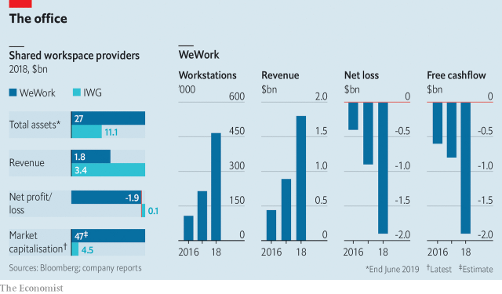

###### Risky business

# WeWork unveils its IPO prospectus 

 

> print-edition iconPrint edition | Business | Aug 15th 2019 

FAR FROM the soulless corporate offices of midtown Manhattan is a door in Greenwich Village wedged between a rowdy saloon and a burrito joint. The steady stream of hipsters and fashionistas passing in front of it is punctuated by professionals in “business casual” outfits with computer tote bags. Inside are stylish workspaces offering fruit-infused water and nitro coffee on tap. In one animated meeting, participants are sitting on beanbags and the floor. That would never happen at his firm’s conservative headquarters, says an executive at the technology giant that has leased this co-working space: “Younger workers want a more casual place to work, and WeWork helps us with recruitment and retention.” 

The We Company (WeWork’s parent), a nine-year-old privately held firm, is controversial. The company’s chic co-working spaces and its flamboyant boss, Adam Neumann, clearly inspire passion among many customers and workers. Japan’s SoftBank has invested over $10bn in the firm, boosting its valuation to $47bn. Equally passionate are its critics, who argue that the firm is worth nothing like that kind of money. They point to IWG, which offers shared offices under the Regus and Spaces brands worldwide and which has a market capitalisation of just $4.5bn (see chart). 

 

So what is WeWork really worth? At last, investors will get the chance to make up their own minds. On August 14th the company unveiled its financial prospectus, which is expected to lead to a public flotation next month. The disclosures paint a picture of a firm in transition from overhyped property startup to a maturing corporation with diverse clients. 

There are four main areas of concern about WeWork’s viability. The first, and most glaring, is its lack of profits. The firm argues that this is explained by its huge investments needed to secure economies of scale. It says that mature locations are profitable. Revenues doubled during the first half of 2019 to $1.5bn, from $764m during the same period in 2018. Net losses rose more modestly to $905m during the first half of this year, up from $723m (though one-off gains from related-party transactions partly explain this). 

The second concern is its obscene valuation. Happily, the firm is diversifying its funding sources. WeWork has reportedly arranged for some $6bn in credit facilities from ten banks, led by JPMorgan Chase, that are tied to the successful completion of its IPO. That gives Mr Neumann a strong incentive to swallow his pride and lower the asking price for its shares. 

The third concern is whether a recession will push the company to bankruptcy. This remains a risk, as the firm has taken on $47bn in lease payments but has only $4bn in committed future revenues from customers. Here, it has some hedges. Its leases are typically held in special-purpose entities specific to one property (so a blow-up insulates the parent firm). WeWork has entered into revenue-sharing leases with some landlords, which can offer countercyclical relief. Because it does its own construction, it can slow down the build-out of new offices as it did during London’s Brexit-induced downturn. 

More important, some 40% of its memberships are now held by big corporations, up from 20% a couple of years ago. These firms, which range from Amazon to HSBC, have deeper pockets and typically take out multi-year deals. Jeffrey Rayport of Harvard Business School argues that the firm’s combination of low cost, flexibility and thoughtfully curated culture is attractive to big firms: “We have not reinvented office space in 50 years, so WeWork is moving into white space,” he says. “It does make workers happier and more productive.” 

The final big worry is questionable corporate governance. WeWork will issue multiple classes of shares that give Mr Neumann control with a minority stake. He has a complex relationship with the firm because he leases space to it in buildings he owns, a practice it promises to end. His wife is a “strategic thought partner” and runs an unpromising education arm. Charles Elson, a governance expert at the University of Delaware, warns, “If you start with this culture, you can’t get rid of it.” 

Mr Neumann’s claim that his firm will “elevate the world’s consciousness” is plainly silly. Even so, it is wrong to equate WeWork with Regus. CBRE, a property-management firm, estimates that the flexible-work niche has experienced “meteoric growth” of 25% in America’s top ten markets in 2018, with similar figures in big cities worldwide. Mr Rayport believes that the firm’s business-model innovations have dramatically enlarged the total addressable market. Still, investing in WeWork remains an act of faith. ■ 

-- 

 单词注释:

1.risky['riski]:a. 危险的 

2.unveil[.ʌn'veil]:vt. 揭开, 揭幕, 除去...的面纱 vi. 显露, 除去面纱 

3.ipo[]:abbr. 首次公开募股（Initial Public Offerings）；初次公开发行（Initial Public Offering） 

4.prospectus[prәs'pektәs]:n. 创办计划书, (内容)说明书, 内容简介 [经] (募债)说明书 

5.Aug[]:abbr. 八月（August） 

6.soulless['sәullis]:a. 没有精神的, 没有灵魂的, 泄气的 

7.corporate['kɒ:pәrit]:a. 社团的, 合伙的, 公司的 [经] 团体的, 法人的, 社团的 

8.midtown['midtajn]:n. 商业区与住宅区之间的地区 

9.Manhattan[mæn'hætәn]:n. 曼哈顿 

10.Greenwich['grinidʒ]:n. 格林威治 

11.wedge[wedʒ]:n. 楔子, 楔形物, 起因, 导致分裂的东西 vt. 楔住, 挤进, 楔入 vi. 楔入, 挤进 

12.rowdy['raudi]:n. 好吵闹的人 a. 吵闹的 

13.saloon[sә'lu:n]:n. 大厅, 沙龙, 酒吧, 会客室 

14.burrito[bә'ritәu]:n. 墨西哥玉米煎饼 

15.hipster['hipstә]:n. 世面灵通的人 

16.fashionista[ˌfæʃnˈi:stə]:n. 非常时髦的人 

17.outfit['autfit]:n. 用具, 配备, 机构 vt. 配备, 供应 vi. 得到装备 

18.tote[tәut]:vt. 提, 负, 携带, 加, 合计 n. 负担, 携带 

19.stylish['stailiʃ]:a. 现代风格的, 流行的, 潇洒的 

20.workspace[]:[计] 工作区 

21.nitro['naitrәu]:n. 硝基 

22.animate['ænimeit]:vt. 使有生气, 赋予生命 a. 有生命的, 有生气的 

23.participant[pɑ:'tisipәnt]:n. 参加者, 参与者 a. 有份的, 参加的, 参与的 

24.beanbag['bi:nbæg]:n. 豆子袋(儿童投掷游戏用) 

25.headquarter[,hed'kwɔ:tә]:vt. 将...的总部设在 

26.lease[li:s]:n. 租约, 租期, 租 vt. 出租, 租出, 租得 

27.recruitment[ri'kru:tmәnt]:n. 新兵征召 [医] 募集[反应], 募集[现象](生理), 复聪(耳科) 

28.retention[ri'tenʃәn]:n. 保持, 留置, 保留, 保持力, 保留物, 记忆, 停滞, 固位 [计] 保贸, 保持 

29.privately[]:adv. 秘密地；私下地 

30.chic[ʃi:k]:n. 漂亮, 别致的款式 a. 漂亮的, 别致的 

31.flamboyant[flæm'bɒiәnt]:a. 火焰似的, 辉耀的, 华丽的 

32.Adam['ædәm]:n. 亚当 [计] 自动直接存取管理 

33.Neumann[]:[计] 诺伊曼 

34.softbank['sɒftbæŋk]: 日本最大的软件销售商 

35.valuation[.vælju'eiʃәn]:n. 评价, 估价, 价值判断 [经] 估价, 计价, 评价 

36.equally['i:kwәli]:adv. 相等地, 同样地, 平等地 

37.passionate['pæʃәnit]:a. 热情的, 热烈的, 易怒的, 热恋的 

38.iwg[]:abbr. Interface Working Group 接口工作组; International Working Group (NATO) 国际工作组（北大西洋公约组织）; interim working group 临时工作组; Imperial Wire Gauge 电线标准规格 

39.regus[]: 雷格斯 

40.capitalisation[,kæpitәlai'zeiʃən;-li'z-]:n. <主英>=capitalization 

41.investor[in'vestә]:n. 投资者 [经] 投资者 

42.flotation[flәu'teiʃәn]:[化] 浮; 浮游选矿 [医] 浮集(法), 浮选(法) 

43.disclosure[dis'klәuʒә]:n. 揭发, 泄露, 揭发(或暴露)的事实 [经] 揭示, 披露 

44.transition[træn'ziʃәn]:n. 转变, 转换, 变迁, 过渡时期, 临时转调 [化] 跃迁 

45.overhyped[]:a. 吹捧过度的; 吹嘘过度的 

46.startup[]:[计] 启动 

47.client['klaiәnt]:n. 客户, 顾客, 委托人 [计] 客户, 客户机, 客户机程序 

48.viability[.vaiә'biliti]:n. 生存能力, 发育能力 [医] [生]活[能]力, 生机 

49.modestly[]:adv. 适当地；谨慎地 

50.transaction[træn'sækʃәn]:n. 交易, 办理, 学报, 和解协议 [计] 事务处理 

51.obscene[ɒb'si:n]:a. 淫秽的, 猥亵的, 讨人厌的, 可憎的 [法] 猥亵的, 海洋的, 污秽的 

52.diversify[dai'vә:sifai]:vt. 使多样化, 使变化 

53.reportedly[ri'pɒ:tidli]:adv. 根据传说, 根据传闻, 据报道 

54.jpmorgan[]:[网络] 摩根大通；摩根大通银行；摩根大通公司 

55.completion[kәm'pli:ʃәn]:n. 完成 [经] 完井, 结束, 完工 

56.incentive[in'sentiv]:n. 动机 a. 激励的 

57.recession[ri'seʃәn]:n. 后退, 凹处, 衰退, 归还 [医] 退缩 

58.bankruptcy['bæŋkrәptsi]:n. 破产者 [经] 破产, 倒闭 

59.typically['tipikәli]:adv. 代表性地；作为特色地 

60.entity['entiti]:n. 实体, 实存物, 存在 [计] 实体 

61.insulate['insjuleit]:vt. 使绝缘, 隔离 [医] 绝缘 

62.countercyclical[,kajntә'saiklikәl]:a. [经]反周期的( 指与商业周期既定阶段发展方向相反的,如在商业周期高涨阶段采取通货紧缩政策,以防止通货膨胀等问题出现) 

63.downturn['dauntә:n]:n. (尤指经济方面的)衰退, 下降趋势 [电] 低迷时期 

64.membership['membәʃip]:n. 会员的资格, 全体会员, 会员数目 [法] 会员资格, 成员资格, 会籍 

65.amazon['æmәzɒn]:n. 亚马孙河 [医] 无乳腺者 

66.hsbc[]:abbr. 汇丰银行（Hong Kong and Shang Hai Banking Corporation） 

67.jeffrey['dʒefri]:n. 杰弗里（男子名, 等于Geoffrey） 

68.Harvard['hɑ:vәd]:n. 哈佛大学 

69.flexibility[.fleksi'biliti]:n. 弹性, 适应性 [计] 灵活性; 适应性 

70.thoughtfully[]:adv. 沉思地；体贴地, 亲切地 

71.curate['kjurit]:n. 助理牧师 

72.reinvent[.ri:in'vent]:vt. 重新使用；彻底改造；重复发明（在不知他人已发明的情况下） 

73.questionable['kwestʃәnәbl]:a. 可疑的 [法] 可疑的, 有问题的, 不可靠的 

74.governance['gʌvәnәns]:n. 统治, 统辖, 管理 [法] 统治, 管理, 支配 

75.unpromising['ʌn'prɔmisiŋ]:a. 没有希望的, 没有前途的, 结果未必良好的 

76.charle[]:n. 查理（男子名）；查理（姓氏） 

77.Elson[]:n. (Elson)人名；(俄)埃尔森；(英、葡)埃尔森 

78.Delaware['delәweә]:n. 特拉华(美国州名) 

79.elevate['eliveit]:vt. 举起, 提拔, 鼓舞 

80.plainly['pleinli]:adv. 清楚地, 明白地, 简单地, 朴素地, 直率地, 坦白地 

81.equate[i'kweit]:vt. 使相等, 视为平等 vi. 等同 

82.CBRE[]:[网络] 世邦魏理仕(CB Richard Ellis)；世邦魏理仕公司；世邦魏理仕集团 

83.niche[nitʃ]:n. 壁龛 vt. 放入壁龛, 安顿 

84.meteoric[.mi:ti'ɒrik]:a. 流星的, 疾速的, 大气的 

85.innovation[.inәu'veiʃәn]:n. 改革, 创新 [法] 创新, 改革, 刷新 

86.dramatically[drә'mætikli]:adv. 戏剧地, 引人注目地, 突然地 

87.addressable[ә'dresәbl]:a. 可寻址的 

