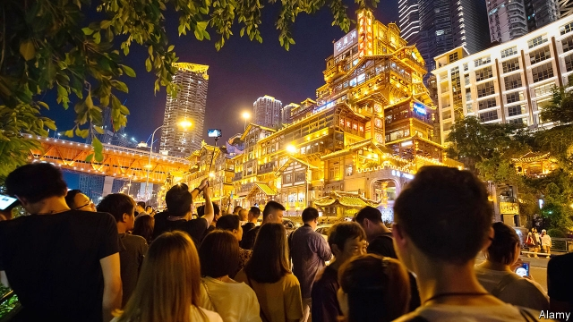

###### Daka destinations

# For some in China, the aim of travel is to create 15-second videos 

 

> print-edition iconPrint edition | China | Aug 17th 2019 

PERCHED ON CLIFFS above a river, Hongyadong is a stilt-house complex in mock-traditional style in the city of Chongqing. Its bars, restaurants and golden neon lights (pictured) have been a popular draw since it was built in 2006. Last year the number of visitors surged. 

The main reason, it seemed, was Hongyadong’s sudden popularity on a social-media app, Douyin, which is used for sharing photographs and 15-second videos. By the end of the year the waiting time to get in was three hours. For a while Hongyadong—a jolly enough place but hitherto on few people’s bucket lists—became the biggest attraction in China after the Forbidden City, says Mafengwo, a travel website. 

Social media have transformed tourism worldwide. Instead of having fun, some people now flock to remote strawberry farms or Icelandic fjords to take photos to impress their friends on Instagram. Foreign-operated social-media sites, including Instagram, are blocked in China. But domestic ones are hugely popular. Douyin, launched in 2016, has 230m monthly active users (its owner, ByteDance, has an uncensored version of the app for users outside China, called TikTok). Unlike users of Instagram, who mainly browse feeds of pictures posted by people they follow, Douyin’s fans commonly use the app to watch hot-trending videos posted by users they do not know under categories such as “food” and “scenic spots”. 

Uploading a picture or video from a photogenic spot to sites such as Douyin and Kuaishou is known in China as daka, meaning “punching the card”. The word is also used to refer to the practice of registering your presence at a location that has already become hot, such as Hongyadong. The aim is not to produce a well-crafted video or beautiful photograph, but simply to show that you have also been to the places that are popular. The beauty of the attraction is less important than the fact that people are flocking there to daka. 

A subculture has developed of young people who embrace daka as a lifestyle. So-called daka zu—“daka tribes”—can be found roaming Chongqing and other cities, checking in at as many hot locations as possible within a single day. Guides can be found online, to show the most efficient ways to achieve this. Companies offer “daka tours”. Douyin users can use the app to create “daka videos”: super-speed slideshows of themselves at daka sites. 

Just as shops and restaurants in other countries try to attract customers with decorations that might be a backdrop for Instagrammable pictures, those in China try to make themselves as daka-friendly as possible: a coffee shop in Beijing built inside a shipping container, for example. Having enjoyed a surge of Douyin-inspired custom for as little as a month or so, some businesses close up shop and move elsewhere to capture another wave. 

The daka craze may have practical origins. China’s young urban professionals have little vacation time. In their first year at a company, employees can expect at most one day of vacation (other than public holidays). They are routinely expected to work overtime for no pay. So workers need to make the most of their limited leisure time. Douyin captures the mood with its slogan: “Make every second count.” ■ 

