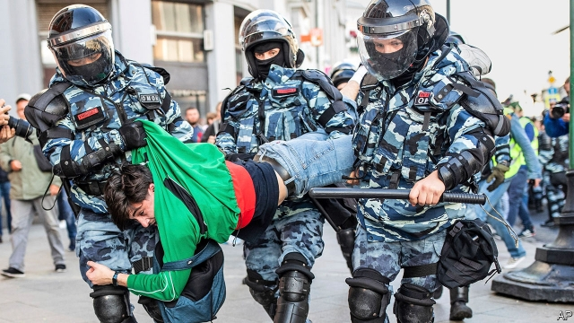

###### Unbowed

# Protests in Moscow show that Putin’s critics are getting stronger 

 

> print-edition iconPrint edition | Europe | Aug 17th 2019 

IT IS 20 years this month since then-President Boris Yeltsin appointed a shadowy security chief called Vladimir Putin as Russia’s prime minister. The next New Year’s Eve, the ailing Mr Yeltsin would install the ex-KGB man as his successor. On the anniversary of his ascent to power, Mr Putin has little reason to celebrate. 

On August 10th, as they have for the past five weekends, Russians took to the streets of Moscow to demand that opposition politicians unfairly barred from next month’s city-council polls should be allowed to run after all. Waving white, red and blue Russian flags, an estimated 50,000-60,000 protesters flooded a broad avenue. “Russia will be free!” they chanted. It was the biggest opposition rally since 2012—after Mr Putin’s pals again bamboozled a ballot. 

The city council has little power. But the blatant interference has transformed what should have been mundane elections into a political crisis for the Kremlin. Although often derided as fringe figures, many of the aspiring opposition candidates were poised to win seats. Mr Putin seems determined to deny his critics even a foothold on Russia’s electoral ladder. 

The mounting protests come at a dangerous time for Mr Putin, whose ratings have been sliding since his government introduced a five-year increase in the national pension age last summer. An invigorated opposition movement is focused squarely on the city-council election. But the protests are rapidly turning into a broader expression of anger over high-level corruption and widespread poverty. The government’s own statistics agency, Rosstat, admitted this month that over a quarter of Russian children are poor. 

The opposition movement is being endorsed by a growing number of music stars and celebrities. Yevgeny Kafelnikov, a former world-number-one tennis player, is backing the protests, as is Yury Dud, a YouTube blogger with millions of followers. Ivan Dremin, a popular rapper better known by his stage name, Face, performed at Saturday’s rally. “Taking to the streets has become prestigious,” writes Abbas Gallyamov, a former Kremlin speechwriter turned political analyst. 

The opposition’s show of strength came after a crackdown aimed at stifling dissent—a tactic that worked in 2011-12. Since the protests began on July 14th, baton-wielding riot police have arrested more than 2,500 people, often violently. Although many of the protesters were quickly released, 14 people are facing up to eight years in prison on dubious charges of “mass unrest”. Among them is a man who is accused of throwing an empty plastic bottle at police. 

The protests are also providing the opposition with new figureheads. Most prominent is Lyubov Sobol, a 31-year-old lawyer who works with the anti-corruption organisation run by Alexei Navalny, a prominent critic of the Kremlin. Ms Sobol, who went on hunger strike in a bid to force her way onto the city-council ballot, was dragged out of her office and arrested by police ahead of last weekend’s rally. 

The danger for Mr Putin now is that the protests will trigger a chain reaction throughout Russia. At a state-organised forum in southern Russia this weekend, participants, including members of the ruling party’s own youth wing, voiced grievances over corruption and inequality that would not have sounded out of place at a Moscow opposition rally. “We have only one solution—revolution,” said one young woman. “We are like an explosive cocktail. We are ready to go off.” ■ 

