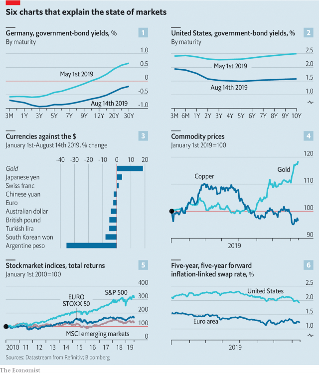

###### The new commonplace

# Six charts that explain the state of markets 

> print-edition iconPrint edition | Finance and economics | Aug 17th 2019 

IN THE AUTUMN of 2008, strange and novel things happened in financial markets, such as the emergence of negative yields on Treasury bills. In times of fear, the safest assets are at a premium. 

What was once strange is now ordinary. Negative yields are a familiar feature of European bond markets. But such is the anxiety about the world economy that they are spreading. In Germany, interest rates are negative all the way from cash to 30-year bonds (chart 1). In America yields are still positive. But the curve is inverted: interest rates on ten-year bonds are below those on three-month bills (chart 2). The last seven recessions in America have been preceded by an inverted yield curve. 

 

Nervous investors are reaching for the safety of the dollar. The yen and Swiss franc, habitual sanctuaries, are among the few currencies that have risen against it (chart 3). The price of gold, another haven, is at a six-year high. That of copper, a barometer of global industry, is down from its recent peak (chart 4). 

Faced with uncertainty, the go-to market for equity investors is America’s. It has left others in the dust (chart 5). MSCI’s emerging-market share index leans heavily towards “Factory Asia” (China, South Korea and Taiwan), which is in the eye of the trade-war storm. Europe’s markets lean towards banks and carmakers, which suffer in downturns. 

Investors fret that the rich world is slowly becoming Japanese, with economies that are too feeble to generate inflation. Forecasts of inflation in the swaps market have fallen sharply (chart 6). A fear in 2008 was that deflation might take root. The fear remains. 

