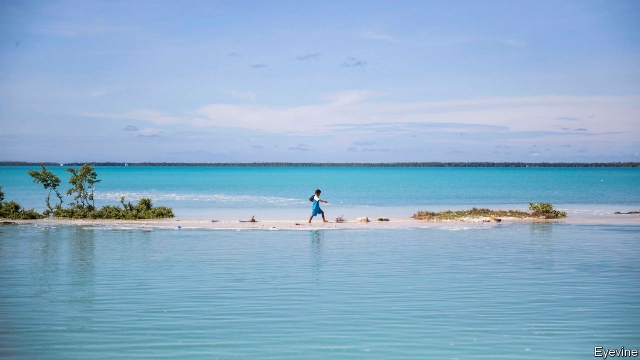
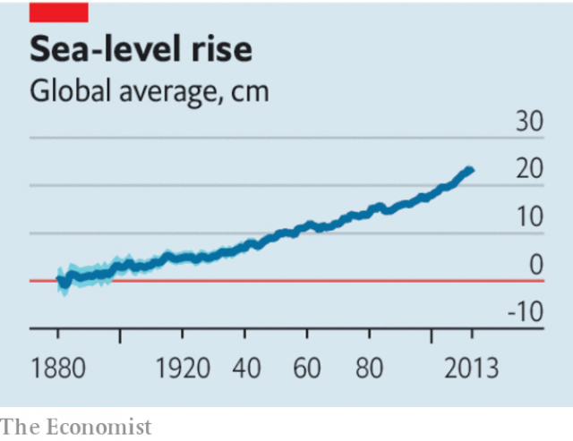

###### A world without beaches

# One way or another the deluge is coming 

 

> print-edition iconPrint edition | Leaders | Aug 17th 2019 

THE OCEAN covers 70.8% of the Earth’s surface. That share is creeping up. Averaged across the globe, sea levels are 20cm higher today than they were before people began suffusing the atmosphere with greenhouse gases in the late 1800s. They are expected to rise by a further half-metre or so in the next 80 years; in some places, they could go up by twice as much—and more when amplified by storm surges like the one that Hurricane Sandy propelled into New York in 2012. Coastal flood plains are expected to grow by 12-20%, or 70,000-100,000 square kilometres, this century. That area, roughly the size of Austria or Maine, is home to masses of people and capital in booming sea-facing metropolises. One in seven of Earth’s 7.5bn people already lives less than ten metres above sea level; by 2050, 1.4bn will. Low-lying atolls like Kiribati may be permanently submerged. Assets worth trillions of dollars—including China’s vast manufacturing cluster in the Pearl river delta and innumerable military bases—have been built in places that could often find themselves underwater. 

The physics of the sea level is not mysterious. Seawater expands when heated and rises more when topped up by meltwater from sweating glaciers and ice caps. True, scientists debate just how high the seas can rise and how quickly (see Briefing) and politicians and economists are at odds over how best to deal with the consequences—flooding, erosion, the poisoning of farmland by brine. Yet argument is no excuse for inaction. The need to adapt to higher seas is now a fact of life. 

Owing to the inexorable nature of sea-swelling, its effects will be felt even if carbon emissions fall. In 30 years the damage to coastal cities could reach $1trn a year. By 2100, if the Paris agreement’s preferred target to keep warming below 1.5°C relative to preindustrial levels were met, sea levels would rise by 50cm from today, causing worldwide damage to property equivalent to 1.8% of global GDP a year. Failure to enact meaningful emissions reductions would push the seas up by another 30-40cm, and cause extra damage worth 2.5% of GDP. 

 

In theory minimising the damage should be simple: construct the hardware (floodwalls), install the software (governance and public awareness) and, when all else fails, retreat out of harm’s way. This does not happen. The menace falls beyond most people’s time horizons. For investors and the firms they finance, whose physical assets seldom last longer than 20 years, that is probably inevitable—though even businesses should acquaint themselves with their holdings’ nearer-term risks (which few in fact do). For local and national governments, inaction is a dereliction of duty to future generations. When they do recognise the problem, they tend to favour multibillion-dollar structures that take years to plan, longer to erect, and often prove inadequate because the science and warming have moved on. 

As with all climate-related risks, governments and businesses have little incentive to work out how susceptible they are. Some highly exposed firms are worried that, if they disclose their vulnerabilities, they will be punished by investors. Governments, notably America’s, make things worse by encouraging vulnerable households to stay in harm’s way by offering cheap flood insurance. More foolish still, some only reimburse rebuilding to old standards, not new flood-proof ones. 

However, there are ways to hold back the deluge. Simple things include building codes that reserve ground levels of flood-prone buildings for car parks and encourage “wet-proofing” of walls and floors with tiles so as to limit the clean-up once floodwaters recede. Mains water, which is desirable in its own right, may stop people without access to it from draining aquifers, which causes land to subside; parts of Jakarta are sinking by 25cm a year, much faster than its sea is swelling. If more ambitious projects are needed to protect dense urban centres, they ought to be built not for the likeliest scenario but for the worst case, and engineered to be capable of being scaled up as needed. The New York region has funnelled $1bn out of a reconstruction budget of $60bn to such experiments in Sandy’s wake. 

Authorities must also stop pretending that entire coastlines can be defended. Unless you are Monaco or Singapore, they cannot. Elsewhere, people may need to move to higher ground. Bangladesh, for instance, is displacing 250,000 households. 

All this requires co-ordination between different levels of government, individuals and companies, not least to prevent one man’s levee from diverting water to a defenceless neighbour. Market signals need strengthening. Credit-raters, lenders and insurers are only beginning to take stock of climate risks. Making the disclosure of risks mandatory would hasten the process. And poor, vulnerable places need support. Just $70bn a year of the $100bn in pledged climate aid to help them tackle the causes and impact of global warming has materialised. Less than one-tenth of it goes to adaptation. This must change. 

Actuaries calculate that governments investing $1 in climate resilience today will save $5 in losses tomorrow. That is a good return on public investment. Rich countries would be foolhardy to forgo it, but can probably afford to. Many developing countries, by contrast, cannot. All the while, the water is coming. ■ 
<<<<<<< HEAD

-- 

 单词注释:

1.deluge['delju:dʒ]:n. 大洪水, 泛滥 vt. 使泛滥 

2.Aug[]:abbr. 八月（August） 

3.suffuse[sә'fju:z]:vt. 遍布, 弥漫, 充满 

4.surge[sә:dʒ]:n. 巨涌, 汹涌, 澎湃 vi. 汹涌, 澎湃, 颠簸, 猛冲, 突然放松 vt. 使汹涌奔腾, 急放 [计] 电压尖峰 

5.propel[prәu'pel]:vt. 推进, 驱使 [机] 推进 

6.york[jɔ:k]:n. 约克郡；约克王朝 

7.coastal['kәustәl]:a. 海岸的, 沿海的, 沿岸的 [法] 海岸的, 沿海的 

8.Austria['ɒstriә]:n. 奥地利 

9.Maine[mein]:n. 缅因州 

10.metropolis[mi'trɒpәlis]:n. 大都市, 重要中心, 首府 [医] 产地, 生地 

11.les[lei]:abbr. 发射脱离系统（Launch Escape System） 

12.atoll['ætɒl]:n. 环状珊瑚岛, 环礁 

13.Kiribati['kiribæs]:n. 基里巴斯(西太平洋上一共和国) 

14.asset['æset]:n. 资产, 有益的东西 

15.trillion['triljәn]:n. 大量 [经] 兆 

16.manufacturing[.mænju'fæktʃәriŋ]:n. 制造业 a. 制造业的 

17.cluster['klʌstә]:n. 串, 丛, 群, 簇 vi. 成串, 丛生 vt. 使聚集 [计] 簇 

18.delta['deltә]:n. 三角洲, 希腊字母的第四个字 [医] δ(希腊文的第四个字母), 丁种, 三角, 三角形区 

19.innumerable[i'nju:mәrәbl]:a. 无数的, 数不清的 

20.underwater['ʌndә'wɒ:tә]:a. 在水中的 adv. 在水下 

21.physic['fizik]:n. 药品, 泻药, 医学 vt. 给...服药, 治愈, 使通便 

22.seawater['si:.wɒtә]:n. 海水 [化] 海水 

23.meltwater['melt,wɔ:tә]:n. 冰雪融化成的水,冰河融化后的水 

24.glacier['gleiʃә]:n. 冰川 

25.quickly['kwikli]:adv. 很快地 

26.economist[i:'kɒnәmist]:n. 经济学者, 经济家 [经] 经济学家 

27.odds[ɒdz]:n. 可能性, 几率, 机会, 胜算, 不平等 

28.erosion[i'rәuʒәn]:n. 腐蚀, 冲蚀, 侵蚀 [化] 磨耗; 侵蚀 

29.farmland['fɑ:mlænd]:n. 农田 

30.brine[brain]:n. 盐水, 海水, 海 vt. 用浓盐水处理 

31.inaction[in'ækʃәn]:n. 不活动, 无为, 怠惰, 迟钝 [医] 无作用 

32.inexorable[in'eksәrәbl]:a. 无情的, 冷酷的 

33.emission[i'miʃәn]:n. 发射, 射出, 发行 [医] 发射, 遗精 

34.coastal['kәustәl]:a. 海岸的, 沿海的, 沿岸的 [法] 海岸的, 沿海的 

35.preindustrial[,pri:in'dʌstriәl]:a. 未工业化的, 工业化前的 

36.enact[i'nækt]:vt. 制定法律, 扮演, 颁布 [法] 法令, 法规, 条例 

37.meaningful['mi:niŋful]:a. 意味深长的 

38.minimise[]:vt. 使减到最少/最小, 使降到最低限度, 使缩到最小, 极度轻视 

39.floodwall['flʌdwɔ:l]:n. 防洪石堤,防洪岸壁 

40.governance['gʌvәnәns]:n. 统治, 统辖, 管理 [法] 统治, 管理, 支配 

41.awareness[ә'weәnis]:n. 意识, 认识 [计] 识别, 议定, 明白 

42.menace['menis]:n. 威胁, 胁迫 v. 威吓, 胁迫 

43.investor[in'vestә]:n. 投资者 [经] 投资者 

44.acquaint[ә'kweint]:vt. 使认识, 介绍 

45.dereliction[.deri'likʃәn]:n. 玩忽职守, 抛弃物 [法] 抛弃, 遗弃, 放弃 

46.inadequate[in'ædikwәt]:a. 不充分的, 不适当的 [法] 不充分的, 不适当的 

47.incentive[in'sentiv]:n. 动机 a. 激励的 

48.susceptible[sә'septәbl]:a. 易受影响的, 易感动的, 容许...的 [法] 易感的, 易受影响的, 容许 

49.vulnerability[.vʌlnәrә'biliti]:n. 易受伤, 易受责难, 易受伤部位 [医] 易损性 

50.notably['nәjtbәli]:adv. 显著地, 著名地, 尤其, 特别 

51.vulnerable['vʌlnәrәbl]:a. 易受伤害的, 有弱点的, 易受影响的, 脆弱的, 成局的 [医] 易损的 

52.reimburse[.ri:im'bә:s]:vt. 付还, 偿还, 赔偿 [经] 偿付, 赔还, 付还; 偿还 

53.tile[tail]:n. 砖瓦, 瓷砖, 瓦片 vt. 铺以瓦, 铺以瓷砖 [计] 平铺 

54.floodwater['flʌdwɒ:tә]:n. 洪水 

55.recede[ri'si:d]:vi. 向后退, 退却, 收回, 降低, 减弱 [医] 退缩 

56.aquifer['ækwifә]:[化] 含水层 

57.subside[sәb'said]:vi. 沉淀, 沉降, 平息 

58.jakarta[dʒә'kɑ:tә]:n. 雅加达（印尼首都, 等于Djakarta） 

59.ambitious[æm'biʃәs]:a. 有野心的, 抱负不凡的, 雄心勃勃的 

60.scenario[si'nɑ:riәu]:n. 剧本提纲, 情节, 剧本, 方案, 事态 [计] 方案 

61.funnel['fʌnl]:n. 漏斗, 漏斗状的东西, 烟囱 [化] 漏斗 

62.reconstruction[.ri:kәn'strʌkʃәn]:n. 改造, 再建 [医] 改建, 改造, 翻造 

63.coastline['kәustlain]:n. 海岸线 

64.Monaco['mɒnәkәu]:n. 摩纳哥 

65.Singapore[.siŋgә'pɒ:]:n. 新加坡 

66.cannot['kænɒt]:aux. 无法, 不能 

67.Bangladesh[,bɑ:ŋ^lә'deʃ]:n. 孟加拉国 [经] 孟加拉共和国 

68.displace[dis'pleis]:vt. 移置, 替换, 转移 

69.levee['levi]:n. 早朝, 大堤 vt. 为...筑堤 

70.divert[dai'vә:t]:vt. 转移, 使欢娱 vi. 转移 

71.defenceless[di'fenslis]:a. 无防御的, 没有保护的, 无助的, 无防备的 

72.lender['lendә]:n. 出借人, 贷方 [经] 出借者, 贷方, 贷款人 

73.insurer[in'ʃuәrә]:n. 保险公司 [法] 保险人, 承保人, 保险公司 

74.disclosure[dis'klәuʒә]:n. 揭发, 泄露, 揭发(或暴露)的事实 [经] 揭示, 披露 

75.mandatory['mændәtәri]:a. 命令的, 托管的 [经] 受托者, 命令者 

76.pledge[pledʒ]:n. 诺言, 保证, 誓言, 抵押, 信物, 保人, 祝愿 vt. 许诺, 保证, 使发誓, 抵押, 典当, 举杯祝...健康 

77.tackle['tækl]:n. 工具, 复滑车, 滑车, 装备, 扭倒 vt. 固定, 处理, 抓住 vi. 扭倒 

78.materialise[mә'tiәriәlaiz]:vi.vt. (使)物质化, (使)具体化, (使)追求物质利益, (使)显形, 成为事实, 实现 vi. 突然出现 

79.actuary['æktjuәri]:n. 保险计算员 [医] 保险统计员 

80.resilience[ri'ziliәns]:n. 弹回, 有弹力, 恢复力 [化] 回弹; 弹性; 弹回性; 回能; 弹能 

81.foolhardy['fu:lhɑ:di]:a. 愚勇的, 有勇无谋的 

82.forgo[fɒ:'gәu]:vt. 摒绝, 放弃 
=======
>>>>>>> 50f1fbac684ef65c788c2c3b1cb359dd2a904378

