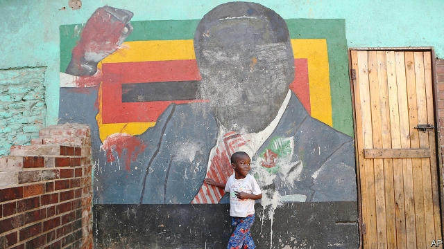

###### Land of hope and worry

# Zimbabwe’s economy is crashing and its people are hungry 

 

> print-edition iconPrint edition | Leaders | Aug 17th 2019 

AFTER DECADES of mismanagement and corruption, Zimbabwe is a wreck. Its people are poor and hungry (see article). By early next year about half of them will need help to get enough food, says the UN’s World Food Programme. In a country that was once among Africa’s most industrialised, electricity flickers for only a few hours a day, often at night. Factories and bakeries stand idle while the sun shines. Workers arrive after dark, hoping that if they are patient they will be able to switch on their machines or ovens. In homes people wake up in the middle of the night to cook or iron their shirts. Freshwater taps work for a few hours once a week. Tendai Biti, an opposition MP and former finance minister, complains that life has gone back to colonial times: “I’m washing in a bucket, my friend, as if it is Southern Rhodesia in 1923.” 

The crisis is Zimbabwe’s worst since the bad days of 2008-09, when President Robert Mugabe’s money-printing sparked hyperinflation so intense that prices doubled several times a week. That crisis was tamed only when Zimbabwe ditched its own currency and started using American dollars. This time, the government blames drought for the nation’s woes. Rains have, indeed, been poor. But the real problem is bad government. The same ruling party, ZANU-PF, has been in charge since 1980. Mr Mugabe’s successor, Emmerson Mnangagwa, who seized power from his mentor in 2017, is equally thuggish. His regime has kept grabbing dollars from people’s bank accounts and replacing them with electronic funny money, which has now lost most of its value. In June, without enough hard cash to pay the soldiers who defend it, the government decreed that shops must accept only funny money. Annual inflation has reached 500%. 

Zimbabweans have learned to expect only trouble from the people in charge. They hustle creatively to get by. Salaried workers have side gigs. Families subsist on remittances from relatives working abroad. However, they do not see why they should endure oppression and dysfunction indefinitely. 

Zimbabwe is poor because its rulers are predatory. But some blame must be shared by neighbouring governments, donors and lenders who, time and again, have looked the other way as the ruling party has rigged elections, tortured dissidents and looted the nation’s wealth. In 1987, when Mr Mugabe tried to create a de facto one-party state, Western diplomats crooned that a firm hand was probably what the country needed. In 2000, when Mr Mugabe sent thugs to seize white-owned commercial farms, some African leaders cheered the righting of a colonial wrong, ignoring the fact that much of the land was redistributed to cabinet ministers who barely bothered to farm it. After Mr Mugabe’s kleptocracy crashed the economy, the IMF handed over $510m in 2009, saying it welcomed his promises of reform. They proved empty. 

Now Mr Mnangagwa wants another bail-out from the IMF and loans from the World Bank. To secure it, he is making grand pledges to repeal oppressive laws and compensate farmers whose land was stolen. Yet after 21 months in power, he has shown few signs of doing either. Until he proves through actions that he is sincere, his regime should not get a cent. Provide food and medical aid to the hungry; but do not prop up the government that made them so.■ 

