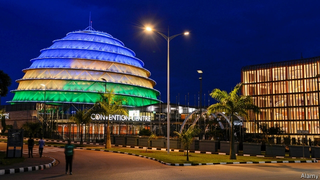

###### The devil in the details

# Has Rwanda been fiddling its numbers? 

 

> print-edition iconPrint edition | Middle East and Africa | Aug 17th 2019 

AT THE HEART of Rwanda’s capital sits the Kigali Convention Centre, a $300m monument that lights up the night with the national colours of blue, yellow and green. It symbolises modernity and prosperity in a country that has bounced back from a genocide in 1994 when perhaps 500,000 people, mostly Tutsis, were killed. 

As impressive as the skyline are Rwanda’s economic statistics. In the past decade the economy has expanded by 8% a year. The share of people classified as poor has fallen by seven percentage points since 2011, to 38% in 2017. 

Numbers such as these impress investors, donors and other African leaders. Many see Paul Kagame, the former general who ended the genocide and has called the shots in Rwanda ever since, as providing a model of development: that of an authoritarian who gets things done and helps the poor, even if he also tramples human rights. But what if the numbers are wrong? 

Questions have hung over Rwanda’s statistics since the government claimed in 2014 that poverty had declined to 39% from 45% in 2011. A closer examination of the data by Filip Reyntjens of the University of Antwerp found that the fall was largely due to a change in how it calculates the numbers. In 2011 Rwanda’s poverty line reflected the cost of consuming a basket of the foods that poor Rwandans were buying. For its 2014 calculation the agency replaced some low-calorie items the poor tend to buy with higher-calorie foods they could have bought instead. By changing the basket the agency reduced the income level that defines poverty by 19%. 

Had Rwanda used the same basket in both periods, the academics argued, the poverty rate would have increased by five to seven percentage points (depending on the basket). Rwanda’s statistics agency denies this, saying that poverty declined even if comparable poverty lines are used. 

But its rebuttal relied on an estimate of inflation that has invited new questions. One academic who has dissected the price figures is Sam Desiere of the University of Leuven in Belgium. He thought the official rate of food inflation was curiously low at 5.3% a year. After recalculating the figure using the statistics agency’s own survey data on how much households were spending, Mr Desiere found that food prices had increased by 9.4% a year. Other academics looking at the same data reckon that rising prices alone may have increased poverty by seven percentage points. 

These jumps in poverty, if indeed they took place, are surprising, given Rwanda’s rapid GDP growth of 8% a year. But some academics are questioning whether growth has been overstated, too. As evidence they point to a sharp divergence between two different official measures of consumption per person. In the national accounts, consumption is totted up across the economy and divided by the population. Then there are household surveys, in which people are asked how much they spend and consume. Both measures usually move together. In Rwanda they did until 2005. But since then the national accounts have shown consumption rising even as survey data showed it stagnating. By 2013 the gap between the two had widened to 50%, according to some economists. 

One reason for this could be that the benefits of economic growth went to a small elite, whose spending is poorly captured by household surveys. Other countries, such as India, have also seen a widening gap between the two measures. Another explanation is that robust economic growth in the national accounts has been overstated. 

The latter does not seem far-fetched if one looks at farming, which accounts for about 30% of GDP. It has been an important contributor to economic growth. Yet when Mr Deseire looked at the official figures claiming a 55% increase in crop yields between 2006 and 2013, he concluded that they were probably inflated. Other data sources suggest that the increase may have been only 20% or so. 

Questioning Rwanda’s statistics may seem to be no more than quibbling over numbers. But at stake is Mr Kagame’s reputation, and that of the developmental model he embodies. ■ 
<<<<<<< HEAD

-- 

 单词注释:

1.rwanda[rj'ændә]:n. 卢旺达（东非国家）；卢旺达语 

2.fiddle['fidl]:n. 小提琴, 提琴类乐器 vt. 虚度时光, 拉小提琴 vi. 拉小提琴, (无目的地)拨弄, 瞎搞 

3.Aug[]:abbr. 八月（August） 

4.kigali[ki'ɡɑ:li]:n. 基加利（卢旺达的首都） 

5.symbolise['simbәlaiz]:vt. 象征, 代表, 作为...的象征 vt.vi. 用符号表示, 使用符号 

6.modernity[mɒ'dә:nәti]:n. 现代性, 现代状态, 现代东西 

7.genocide['dʒenәu,said]:n. 种族灭绝, 灭绝整个种族的大屠杀 [医] 种族灭绝(侵略军队加害居民的罪行) 

8.Tutsi['tjtsi]:n. 图西人(卢旺达与布隆迪境内的少数民族人) 

9.skyline['skailain]:n. 天涯, 地平线, 空中轮廓线 

10.statistic[stә'tistik]:n. 统计量 a. 统计的, 统计学的 

11.investor[in'vestә]:n. 投资者 [经] 投资者 

12.donor['dәunә]:n. 捐赠人 [化] 给体; 供体 

13.paul[pɔ:l]:n. 保罗（男子名） 

14.kagame[]:[网络] 卡加梅；卡加梅总统；卡根 

15.authoritarian[ɒ:.θɒri'tєәriәn]:a. 独裁的, 独裁主义的 

16.trample['træmpl]:n. 践踏(声), 蹂躏 v. 践踏, 无视 

17.datum['deitәm]:n. 论据, 材料, 资料, 已知数 [医] 材料, 资料, 论据 

18.filip[]:n. (Filip)人名；(捷、法、塞、匈、西、保、罗)菲利普 

19.Antwerp['æntwә:p]:n. 安特卫普(比利时港口) 

20.Rwandan[rj'ɑ:ndәn, -'æn-]:a. 卢旺达的 

21.rebuttal[ri'bʌtәl]:n. 辩驳, 驳回, 反驳, 反驳的证据, 反证 [法] 辩驳, 反驳, 驳回 

22.inflation[in'fleiʃәn]:n. 胀大, 夸张, 通货膨胀 [化] 充气吹胀; 膨胀 

23.dissect[di'sekt]:v. 解剖, 切开 

24.SAM[sæm]:[计] 安全性帐户管理器 

25.Leuven[]:n. 勒芬（比利时一城市名） 

26.curiously['kjuәriәsli]:adv. 好奇地 

27.recalculate[ri:'kælkjuleit]:vt. 重新计算, 重新估计 

28.reckon['rekәn]:vt. 计算, 总计, 估计, 认为, 猜想 vi. 数, 计算, 估计, 依赖, 料想 

29.overstate[.әuvә'steit]:vt. 夸大的叙述, 夸张, 过分强调 [经] 多计, 高估 

30.divergence[dai'vә:dʒәns]:n. 分歧 [计] 分散度 

31.tot[tɒt]:n. 小孩, 少量, 合计 vi. 合计, 总计为 vt. 加 [计] 全体, 总数, 传送开销时间 

32.stagnate['stægneit]:v. (使)淤塞, (使)停滞, (使)变萧条 

33.economist[i:'kɒnәmist]:n. 经济学者, 经济家 [经] 经济学家 

34.elite[ei'li:t]:n. 精华, 精锐, 中坚分子 

35.poorly['puәli]:adv. 贫穷地, 不充分地, 贫乏地 a. 身体不舒服的 

36.robust[rәu'bʌst]:a. 健康的, 强健的, 要用力气的, 坚定的, 粗野的 [计] 健壮性 

37.contributor[kәn'tribjutә]:n. 贡献者, 捐助者, 赠送者, 投稿者 [法] 捐助人, 捐赠人, 投搞人 

38.inflate[in'fleit]:vt. 使膨胀, 使得意, 使通货膨胀, 使充气 vi. 充气, 膨胀 

39.quibble['kwibl]:n. 遁词, 双关语 vi. 吹毛求疵, 争吵, 说模棱两可的话 vt. 对...诡辩 

40.developmental[di.velәp'mentәl]:a. 发展的, 进化的, 启发的 [医] 发育的 

41.embody[im'bɒdi]:vt. 具体表达, 使具体化 [经] 合并, 具体化, 具体表现 
=======
>>>>>>> 50f1fbac684ef65c788c2c3b1cb359dd2a904378

