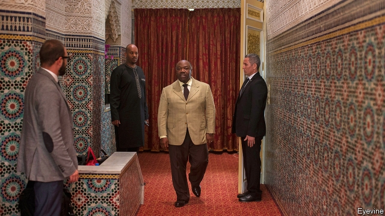

###### A scam too far

# Why many foreign companies are on the verge of leaving Gabon 

 

> print-edition iconPrint edition | Middle East and Africa | Aug 17th 2019 

IT IS OFTEN said of countries that their real wealth lies in their people. Few say this about Gabon. With 2m people and twice the land mass of England, it is among Africa’s richest countries, with a GDP per person of $8,300. Almost all of this comes from natural resources. Gabon exports oil, timber and palm oil. It is also the world’s third biggest producer of manganese, a metal used in producing stainless steel. 

The wealth masks the fact that Gabon is one of Africa’s worst-run countries. It has had only two presidents since 1967. The first, Omar Bongo, was a flamboyant despot. He kept a pet tiger, hobnobbed with French presidents and turned the country into a one-party state. After he died in 2009 his son, Ali, took over. He won an election in 2016 that many believe was rigged (turnout in his home province was 99.93%, with 95% voting for the president). 

Last year Ali (pictured) suffered a stroke and spent months in Morocco recovering. In January a few junior army officers tried, unsuccessfully, to mount a coup. Since then the state has shut down most news outlets and repeatedly blocked the internet. The economy is stagnant, largely thanks to growing corruption. 

A big new scam has targeted foreign businesses in Libreville, the capital. It relies on a law inherited from France, the former colonial power, that allows courts to order companies to pay their debts. That might make sense when the debts are genuine. But oil companies, banks and supermarkets have been targeted by firms that appear from nowhere, demanding payment of fictitious debts. Some businessmen think the courts are in on the scam: they make it difficult for companies to pay their debts, then hit them with large penalties when they do not. 

“It is a complete farce,” says Johanna Houdrouge of Mercure International, a firm based in Monaco that runs shopping malls in Gabon. The authorities seized 164m CFA francs ($280,000) from a subsidiary of Mercure based on the complaint of a company with an address, but little else. Ms Houdrouge says the court ordered the subsidiary to provide proof that it did not owe anything to the complainant—which was difficult, as firms tend not to keep records of non-existent debts. 

Other firms have been hit harder. An international oil company says it is being targeted at least four times a week, with seizures of as much as $10m. 

Gabon was never free of corruption, but it has reached levels that threaten the viability of foreign businesses. Some say they will leave soon. The deterioration seems linked to Mr Bongo’s stroke. Many Gabonese suspect that the president, who is 60 years old, will never be well enough to resume full-time work. Officials are trying to extort cash while they can, out of fear that they may eventually lose their jobs. 

Gabon’s neighbours, Congo-Brazzaville and Cameroon, are also former French colonies with plenty of oil. And both have ageing leaders who are rarely seen in public. Paul Biya, Cameroon’s 86-year-old president, spends much of his time in a suite at the InterContinental Hotel in Geneva. In his absence, protests in the English-speaking north of the country have turned into a civil war. Denis Sassou Nguesso, 76, has ruled Congo-Brazzaville for all but five of the past 40 years. On August 6th his son was accused by Global Witness, a watchdog, of stealing $50m of state funds. 

Since independence in 1960, Gabon has avoided civil war and coups. It maintains close relations with France. Yet it is becoming inhospitable for foreign businesses. Mr Bongo, for all his flaws, knew not to kill the golden goose. Some of his officials seem not to have learned the lesson. ■ 

