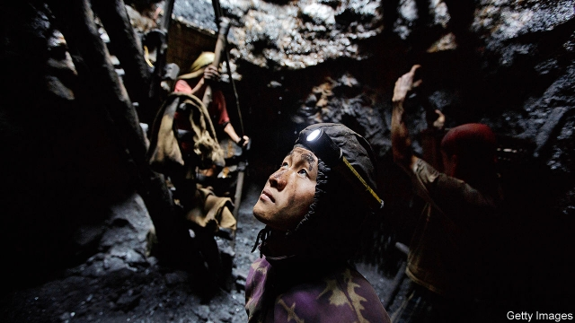
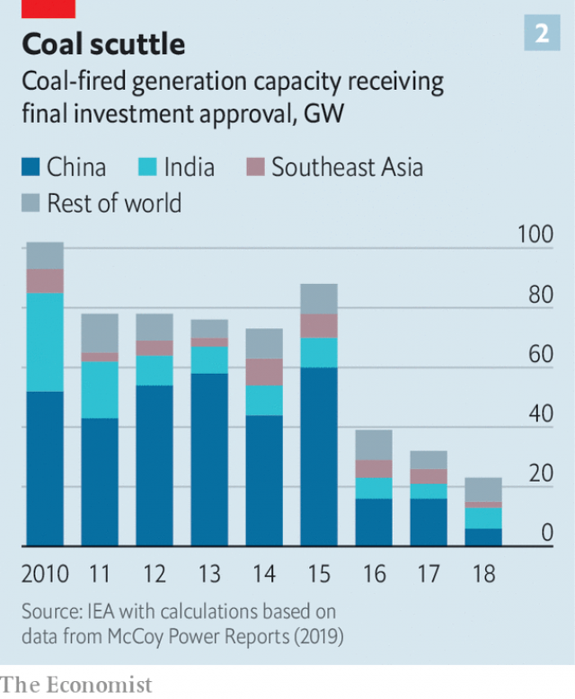

###### Down and dirty

# Asia digs up and burns three-quarters of the world’s coal 

 

> print-edition iconPrint edition | Asia | Aug 22nd 2019 

A LARGE SIGN in the city hall of San Carlos, on the island of Negros in the Philippines, lays out the local government’s ambitions. It wants San Carlos to be “a model green city”, “a renewable energy hub for Asia” and “a sustainable tourism destination”. But the local officials sitting directly beneath the sign are keen to talk about something else: why a plan to build a coal-fired power plant nearby is an excellent idea. 

Coal drives Asia. Between 2006 and 2016 the continent’s consumption of it grew by 3.1% a year. Asia now accounts for fully 75% of global demand for the stuff (see chart 1). China is the world’s largest producer and consumer of coal. Largely as a result, it also emits more carbon dioxide than any other country. India is the second-biggest consumer. Japan and South Korea are also big consumers, while Australia and Indonesia are big producers. South-East Asia was the only region in the world in which coal’s share of power generation grew last year, according to the International Energy Agency (IEA), a research body. And four of the five countries that shell out the most in subsidies for the fuel are Asian. 

Asia’s passion for coal, in turn, threatens the health of the planet. The Paris agreement on climate change (which every country in Asia, from Afghanistan to New Zealand, has signed) aims to limit the increase in global temperatures above pre-industrial averages to “well below” 2°C. To avoid 1.5°C of global warming, virtually all of the planet’s coal-fired plants need to close by 2050, climatologists say, given the vast quantity of greenhouse gases produced by mining, transporting and burning coal. No new coal-fired plants should be built from next year on, the secretary-general of the UN says. But UBS, a Swiss bank, reckons that Indonesia and Vietnam may still be building coal-fired power stations in 2035. Asia’s last coal plant, it projects, will close only in 2079. Curbing global warming depends on convincing Asian governments to take a different path. 

 

China accounts for about half the coal the world consumes each year—far more than any other country. Happily, its appetite seems to be waning. Although it burned through almost 4bn tonnes last year, a slight increase on the year before, that is still below the peak of 4.24bn tonnes in 2013. Coal’s share of China’s energy mix has fallen by about ten percentage points over the past decade, to 59%. 

This is the result of a sustained and multifaceted official campaign to clean up China’s energy generation. There has been huge investment in renewables, leaving China with a third of the world’s wind turbines and a quarter of its solar panels, according to the IEA. In 2013 a national plan on air pollution gave Beijing, the capital, five years to reduce its coal consumption by half, among other measures. And in 2017 the government introduced a national carbon-trading scheme. In the Paris agreement it pledged that its carbon-dioxide emissions would stop growing by 2030. 

China’s efforts to clean up have left India as the world’s most enthusiastic builder of coal-fired plants. In its submissions for the Paris accord, India predicted that its demand for electricity would triple between 2012 and 2030. About 48 gigawatts of coal-fired capacity are under construction in the country. Coal consumption increased by 9% last year, according to BP, a big oil firm. 

That is partly because India lacks obvious alternatives, at least for back-up generation when the wind is not blowing and the sun is not shining. It cannot afford to import cleaner but more expensive liquefied natural gas, as Japan, South Korea and, increasingly, China do. Partly, however, India’s addiction to coal stems from government bias. The government owns more than 70% of Coal India, the giant mining firm that produces most of the country’s coal. India’s state-owned railways depend on the cash generated by transporting coal to subsidise passenger tickets (coal provides 44% of freight revenues). Coal generates hundreds of thousands of jobs, many in the poorest states. The government has an enormous vested interest in seeing the industry prosper. 

Nevertheless, even in India, the outlook for coal is becoming hazier. For one thing, growth in energy demand has slowed thanks to improved energy efficiency and the growing importance of services to the economy. Demand has also been curbed by a failure to invest in transmission capacity and by the inefficiencies of unprofitable power-distribution companies. This means that the increase in coal-fired generation has outstripped the increase in demand for energy in recent years. Coal plants are already operating far below their potential capacity. At the same time, levies and transport costs have risen more quickly than Coal India’s prices, according to research by Rahul Tongia and Samantha Gross for the Brookings Institution, an American think-tank. 

These difficulties are mounting just as greener power sources are beginning to spread. Shortly after Narendra Modi became prime minister five years ago, his government announced a plan to quadruple India’s renewable-energy capacity to 175 gigawatts by 2022. The scheme supports one of India’s promises under the Paris accord. If it is successful, the share of renewables in the generation mix could rise from 7.8% to 19%. Steep cost falls help. Indian renewables now cost less than three rupees ($0.04) per kilowatt-hour, well below domestic coal at four rupees per kilowatt-hour, according to Tim Buckley of the Institute for Energy Economics and Financial Analysis, a green think-tank. 

South-East Asia has seen a similar shift in prices. The government of Vietnam projects that demand for coal will more than double by 2030. But Matt Gray of Carbon Tracker, a British think-tank, argues that, if the cost of building solar- and wind-farms keeps falling (reductions of 50% and 30% respectively have been seen in Vietnam in recent years), they should be cheaper than new coal plants as soon as next year. “The economics are there and this is what I think Asia is going to wake up to,” says an investor in Vietnamese wind farms. 

Renewables offer other advantages over coal as well. Given the difficulty of getting power to South-East Asia’s most remote areas—Indonesia has more than 13,000 islands and the Philippines another 7,000 or so—solar and wind installations can offer electrification without costly extensions of the grid. The region also has manufacturers who would benefit from a stronger push for renewables. Malaysia, for example, is the third-largest manufacturer of solar cells in the world. 

Coal is coming in for more public criticism. A recent documentary in Indonesia portrayed the harm caused by the fuel to farmers, fishermen and the natural resources upon which they depend. In the Philippines the Catholic church is wading in. Gerardo Alminaza, a bishop, is a leading figure in a campaign against the proposed coal plant in San Carlos, for example. He has given talks at banks on the need to divest from coal. Rodrigo Duterte, the president of the Philippines, recently instructed his government to hasten the shift from fossil fuels to renewable energy. 

Some investors are growing leery of coal. A new report from the Centre for Financial Accountability, an Indian think-tank, reveals that private lending to coal-fired power plants in India declined by 90% last year. One of the largest banks in South-East Asia, DBS of Singapore, announced in April that it will stop funding new coal plants after its existing slate of projects is completed. Last year Marubeni, a huge Japanese trading house, said it will no longer invest in coal plants; it intends to halve its own coal-fired capacity by 2030. And the energy arm of Ayala Corporation, a Filipino conglomerate, announced plans last year to sell up to half its coal assets and to invest more in renewables. 

The shifting sentiment is reflected in the recent sharp decline in investment approvals for new coal-fired plants (see chart 2). But even if the private sector were to wash its hands of coal altogether, that would not guarantee its demise. In both China and India, the biggest banks are state-owned, and their lending decisions are as much a function of government policy as of expected returns. The Chinese government, in turn, although pursuing cleaner energy at home, does not seem particularly keen to encourage it abroad. The Belt and Road Initiative, a big Chinese infrastructure-development scheme, will see billions spent to build coal-fired plants in Bangladesh, Indonesia, Pakistan and Vietnam, among other countries. Chinese financial institutions are helping to fund more than a quarter of coal-fired power stations under development around the world. 

 

Finance for the coal business in India, meanwhile, comes mainly from the state. Between 2005 and 2015 state-owned banks provided 82% of the funding for coal-fired power plants, according to the Centre for Financial Accountability. If the governments of China and India continue to pump money into coal via state-owned banks, the fate of the climate will be sealed, whatever encouragement they give to other forms of generation. ■ 

