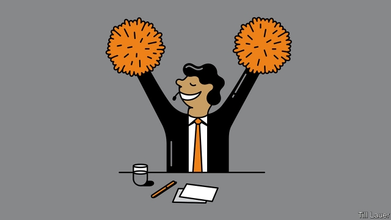

###### Banyan

# When India’s government abuses power, the media cheer 

 

> print-edition iconPrint edition | Asia | Aug 22nd 2019 

IT IS NEARLY three weeks since the government of Narendra Modi, in one swoop, scrapped Jammu & Kashmir’s constitutional autonomy, ended its status as a state and divided it into two parts, both to be ruled from Delhi. It carried this out not by consulting the region’s 12m-odd inhabitants on whose behalf it claims to be acting, nor after a national discussion or even the semblance of a proper parliamentary debate. 

Rather, it achieved its ends by cutting phone lines and access to the internet, arresting nearly the whole political leadership and imposing, in effect, a curfew. As Pratap Bhanu Mehta, a public intellectual, puts it, the act of supposedly integrating the former state more fully into India has begun by casting the mostly Muslim inhabitants of the Kashmir valley “under a pall of suspicion”. Kashmiris’ first experience of Indian law as a union territory, he notes, is of untrammelled executive power. 

The best that can be said is that it is not a constitutional putsch on the scale of Indira Gandhi’s “Emergency” of 1975, when democracy was suspended across the country. Soon after it was restored, Lal Krishna Advani—a co-founder of Mr Modi’s very own Bharatiya Janata Party, who had been at the sharp end of the Emergency, having been imprisoned for 19 months—castigated India’s press. “You were asked only to bend,” he told journalists, “yet you crawled.” 

Today, far from crawling, India’s press and television channels are jumping up and down and cheering. Talking heads vie to outdo one another in celebration. Few match the bombast of Arnab Goswami, whose brand of shriek show has launched a new network, Republic TV. He labelled the BBC’s reporting of both a huge protest in Kashmir and shots fired by Indian security forces to disperse it “a dirty and a motivated lie”. He seemed little bothered that video footage confirmed the BBC’s account. 

Ending Kashmir’s special status, and (as a subtext) humiliating its Muslim population, has long been a goal of India’s Hindu nationalists, whom Mr Modi leads. Yet when, on August 8th, the prime minister appeared on television to explain why India should celebrate while Kashmir lay incarcerated, gone was the jaw-jutting nationalist. Instead, as Arundhati Roy put it in the New York Times, he spoke with “the tenderness of a young mother…his most chilling avatar to date”. Even former critics of Mr Modi filled the next day’s column-inches with gushing praise. 

Kashmiris are demonised, the Indian authorities praised. This week CNN News18 polled viewers on whether Shehla Rashid Shora, the co-founder of a recently launched mainstream party in Jammu & Kashmir and a leader of the main student union at Jawaharlal Nehru University (boo!), should be arrested. Her crime? She claimed that the army had tortured detainees in Kashmir, relaying the screams by loudspeaker to intimidate locals. 

Reporting on what is really going on in Kashmir is hard. Foreign journalists are hindered from going there. The Kashmiri press is stymied from getting its story out. This month Delhi’s Press Club of India succumbed to pressure not to show a documentary, “Kashmir Caged”, that carried testimony of Kashmiris’ treatment at the hands of the security forces. It is only thanks to brave Kashmiri and other Indian journalists filing for foreign news outlets that any picture at all of the benighted region is possible. 

In truth, the press’s current sycophancy rises from a hinterland of intimidation, trimming and currying favour dating back to Mr Modi’s rise to national power in 2014. Government ads are pulled in retaliation against newspapers that have been critical of the BJP, such as the Hindu and the Telegraph. Meanwhile, businessmen are shyer of voicing criticism in public. Ramachandra Guha, a historian, talks of the “silence of the successful”. Back in 1992 several industrialists put their name to a full-page ad decrying the destruction by a Hindu mob of the Babri Masjid mosque. Today’s generation of businessmen, Mr Guha says, would be too scared to sign a similar ad over Kashmir. Meanwhile, lack of scruple rules: Mr Goswami’s original backer, one of a new breed of Modi-supporting industrialists and a member of the upper house of parliament, profits through arms sales from the militarism Mr Goswami extols on air. 

Back in 2015 Mr Advani, no fan of Mr Modi, said that he wouldn’t be surprised if, sooner rather than later, another emergency was declared. That remains wild conjecture. But one thing is for sure: the press will be ready. 

