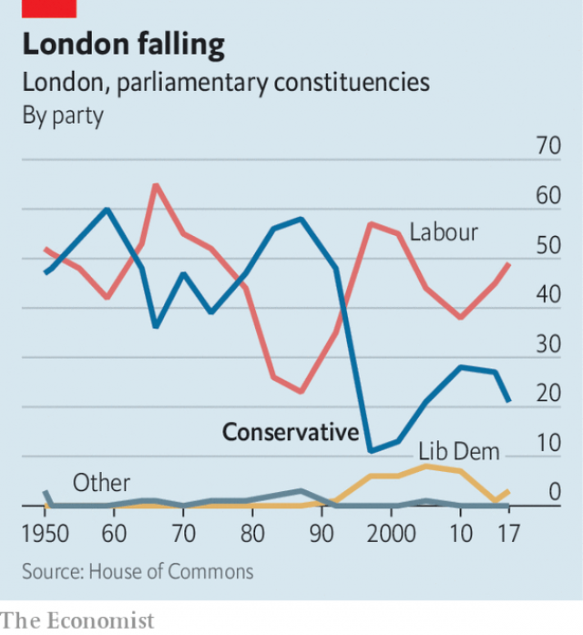

###### Capital fright

# London’s mayoral race shows Tory disregard for the capital 

 

> print-edition iconPrint edition | Britain | Aug 22nd 2019 

“IT’S BEEN an uphill struggle,” admits Shaun Bailey, the Conservative candidate for mayor of London. A poll in May put Mr Bailey 20 points behind the Labour incumbent, Sadiq Khan, who is up for re-election next May. Mr Bailey, a 48-year-old member of the London Assembly who could pass for two decades younger, has the task of turning the contest around. If the polls are right, by the end of the campaign he may start to look his age. 

Although Mr Khan enjoys an imposing lead, he is beatable. Londoners like his punchy opposition to Brexit and Donald Trump. But when it comes to policy the mayor’s record is threadbare. Mr Khan has won lots of funding for house-building, but this will take years to have an effect. Big transport projects such as Crossrail have fallen behind on his watch. Crime is unignorable, following a rise in stabbings. In July Mr Khan’s approval rating fell to -3, its lowest-ever level. A Tory candidate could have had a puncher’s chance. 

Yet big hitters from the party sat the race out. Former cabinet ministers such as Justine Greening declined to stand. Instead, a few local politicians battled it out. Mr Bailey, a born-and-bred Londoner whose electoral experience extends largely to two general-election defeats, won. The mayoralty was once a jewel in the Tory crown, when Boris Johnson served two terms in 2008-16. Today it is an afterthought. 

Unlike cities such as Liverpool and Manchester, which have long been Tory-free zones, London has historically been fairly balanced (see chart). Election results in the capital used to tally with the rest of the country, says Tony Travers of the London School of Economics. That changed under Tony Blair’s government as Labour started to cement control, snatching inner-London seats from the Conservatives and colouring the capital red from the inside out. In 1987 the Tories had 58 MPs in London. In 2017 they won just 21. 

 

An attitude that London is lost permeates the Conservatives. The dominant idea is that the party’s future lurks in places such as Bishop Auckland, a market town in County Durham, rather than Battersea, a London suburb stuffed with well-off young parents. London does not loom large in Mr Johnson’s strategy of trying to scoop up votes from disaffected Labour voters in towns that supported Brexit. 

This creates a strong headwind for Mr Bailey. Building an independent London-Conservative brand that appeals to the capital’s liberal population will not be easy—particularly given some of his past comments, including that multiculturalism could turn Britain into a “crime-riddled cesspool”. Scottish Tories have managed to distinguish themselves from the Westminster lot under their star leader, Ruth Davidson. Mr Bailey’s lower profile makes that harder. The Greens and Liberal Democrats, the latter of whom came top in the recent European elections in London, are better placed to woo liberals fed up with Mr Khan. 

There is another way of looking at London. Four in ten people there voted Leave, like Mr Bailey. The city backed a Tory mayor as recently as 2012. And there are plenty of voters in the capital for whom Mr Khan’s “London is open” message grates. Whether they are enough for an election-winning coalition is another matter. ■ 

