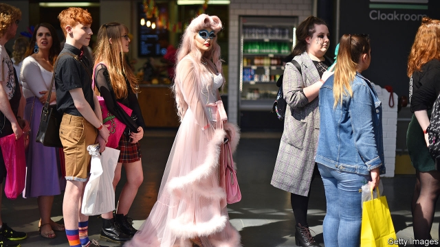

###### Lip-stick it to the man

# The drag queens of England are booming, thanks to unexpected new fans 

 

> print-edition iconPrint edition | Britain | Aug 22nd 2019 

IF TO BE British is to cherish understatement, DragWorld is the most treasonous gathering since the Gunpowder Plot. Tread the pink carpet at London’s Olympia convention hall and your eyes are drawn to either a 10ft-tall silver stiletto or a well-chiselled man in nothing but multicoloured pants and striped socks. Donna Trump, Poppycock and Rococo Chanel work the crowd. Punters hunt for gold among stalls hawking fake eyelashes, fishnet tights and wigs in outrageous shades of yellow, purple and pink. 

There is, of course, nothing new about men in tights. In his book “Queer City: Gay London from the Romans to the present day”, Peter Ackroyd likens 18th-century “mollies” to present-day drag queens. For much of the 20th century, drag acts were a mainstay of gay bars and clubs. But the crowds flocking to DragWorld demonstrate how an underground pastime has broken into the cultural mainstream. This year more than 10,000 people showed up to the two-day event, now in its third year. The BBC will broadcast a British version of “RuPaul’s Drag Race”, an American talent contest, in October. And a judge from the American show will compete in the latest series of “Strictly Come Dancing”, one of the corporation’s biggest hits. 

Many of the new fans are straight women. Nathan Stone of the MJR Group, which organises the event as well as tours for drag acts, reckons a little under two-thirds of audiences are women aged 16-21. “It is not just for old gay queens anymore,” says a stallholder, who says he flogs as many of his glittery dresses to women as men. “We’ve just had someone buy one as a wedding dress.” 

Perhaps surprisingly, women seem keen to take make-up tips from the queens. One such fan, queuing for a £17 ($21) meet-and-greet session, confesses to copying some of their looks, albeit in a toned-down way. The beauty industry was quick to spot the market’s potential. Pretty Polly, a tights brand, and Lush, a cosmetics firm, have stands at the show. “If you look at the queens, we could learn something from them,” says Joanne Etherson of Sally Beauty, which sells hair products and sponsors the show. “The hair colour, the flamboyance. It’s the extreme of everything we celebrate.” 

Others are attracted by the broad array of body sizes and fashion styles on show. The convention presents a less restrictive idea of what it means to be a woman than do glossy fashion magazines, argues Mr Stone. A barrister’s clerk, who has donned silver sequined trousers and a bright pink top for the day, says she appreciates the freedom to wear whatever she likes without judgment. 

Gay men largely welcome drag’s newfound popularity. One, who is collecting queens’ autographs in a notepad that booms “OMG u ok hun?”, reckons it shows society has moved from tolerating gay culture to embracing it. Brad Williams, who sells fake eyelashes with his business and romantic partner, agrees. “Before it was: ‘Here’s a cookie cutter. Fit in’,” he says. “Now to fit in you almost have to be different.”■ 

