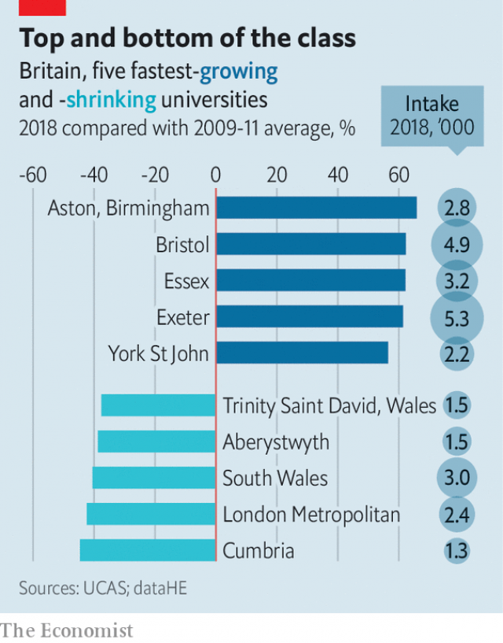

###### Searching for students

# The winners and losers of England’s great university free-for-all 

 

> print-edition iconPrint edition | Britain | Aug 22nd 2019 

IT IS A-LEVEL results day and the phones are ringing at the University of Exeter. The university is much bigger than it was half a decade ago, so there is lots to do. Some 120 staff and students advise applicants making a late bid, as well as ones who have missed the grades they need to get in. Scribbled posters count the remaining spots, and remind those on the phones to check for an English-language qualification. Most important, one concludes, is to “have fun…we are making (some) dreams come true! :)” 

At Exeter, the mood is calm. But at other universities, it will be closer to panic. Each institution’s future depends on securing enough students. This reflects a change in government policy. Admissions used to be managed, with limits set on the number of students each university could take. But beginning in 2012 restrictions began to be lifted, before disappearing entirely in 2015, since when universities have been free to take as many as they want. The result, says Sir Steve Smith, vice-chancellor at Exeter, is “the market, red in tooth and claw”. 

There is lots of variation, but in general elite institutions have been the biggest growers. Some, including Oxford and Cambridge, have chosen not to expand. But most prestigious universities have sucked up students, grateful for their fees, which subsidise research. The intake of British students at members of the Russell Group of older, research-focused universities has grown by 16% since restrictions were lifted. Some have ballooned. Bristol’s intake has shot up by 62%, Exeter’s by 61% and Newcastle’s by 43%. 

 

Universities lower down the pecking order have fared less well. The intake of British students at institutions in the post-1992 group of universities, former polytechnics which offered vocational qualifications, is flat. London Metropolitan’s intake is down by 42%, Kingston’s by 33% and Southampton Solent’s by 28%. Some have diversified by offering more qualifications sponsored by companies, postgraduate degrees or apprenticeships. Others are getting into financial difficulty. 

Universities are keenly aware that they are mostly competing with a handful of rivals for students, and that geography plays a big role in determining who those rivals are. Exeter, in south-west England, has commissioned research which shows it attracts students who live near the M5 motorway that runs into town, and struggles to recruit from anywhere north of Birmingham, in the Midlands. The university therefore keeps a close eye on Bath and Bristol, nearby institutions held in similar regard. Mark Corver of dataHE, a consultancy, notes that many larger London universities, which take students with weaker grades, have struggled as the capital’s secondary schools have got better, providing youngsters with the qualifications to aim higher. So too have universities in remote parts of the country, including Cumbria and Aberystwyth. 

Students seem to prefer close-knit, campus universities. Exeter is one example. Others include Aston, which takes 66% more British students than it did before the cap was lifted; East Anglia, which takes 34% more; and Bath, which takes 24% more. It tends to be easier to build on a campus than in a city centre, says Mike Nicholson, head of admissions at Bath. And for a generation of students who party less, study more and are often influenced by cautious parents, campus universities are a nice half-way point between school and adulthood. 

Universities not attracting enough students have to adapt. Since the new system was introduced, almost all have charged the maximum allowed—now £9,250 ($11,250) a year. Since students are entitled to government loans, which they don’t have to repay until they earn more than £25,725 a year, they are relatively unfussed by upfront costs. But price competition has begun to emerge in the form of hefty scholarships. A more common way to appeal to students is to lower the grades for entry. At its most devious, this takes the form of offers which do not require the applicant to achieve any grades at all, provided they make the university their first choice. Recruiting students will at least get easier as the number of 18-year-olds rises in 2021. 

Improving a university’s appeal through more reputable means is hard, but not impossible. Coventry has shot up the rankings, and has a 50% bigger intake than a decade ago. In 2010 a “shocking” low score in its student-satisfaction survey prompted a rethink, says Ian Dunn, the university’s provost. Now feedback is requested midway through a course and students are informed of changes made as a result within five days. The university has set up a college which offers degrees from £6,350. It has also cut back joint courses, like accounting and finance, which students enjoyed less. Before the rules changed, Exeter had gone further still, getting rid of weak departments, including chemistry. But nationwide, student satisfaction is yet to rise, indicating these universities are in a minority (the measure is, though, a lagging indicator, as students fill in forms only after finishing their degree). 

Growth is no guarantee of financial stability, as can be seen at Cardiff and Surrey, which have taken in lots more students but not enough to match their spending. That is little consolation for the small number of universities, struggling to attract applicants, which are said to be near bankruptcy. Changes in policy have caused a great deal of flux in higher education. But the growing number of students at elite universities would probably regard the flux as a price worth paying. ■ 

