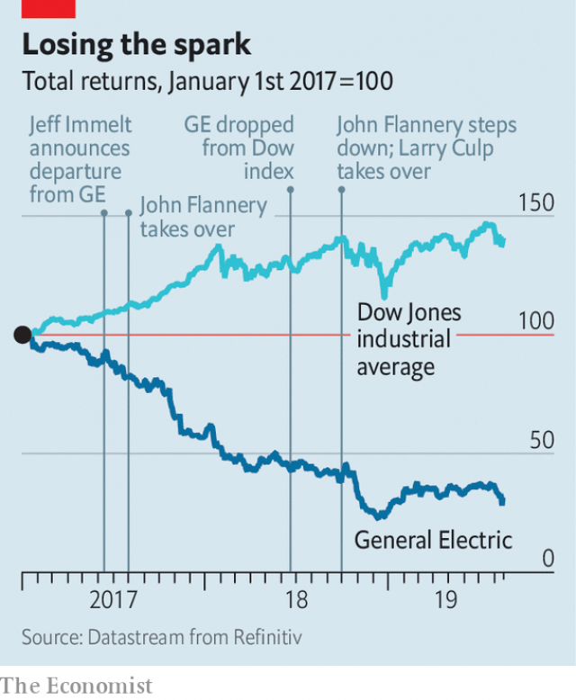

###### Back on the Street

# GE finds friends on Wall Street 

 

> print-edition iconPrint edition | Business | Aug 22nd 2019 

ON AUGUST 20th credit-raters at Fitch warned of insufficient financial reserves against the costs of long-term care for buyers of insurance products at General Electric. Days earlier Harry Markopolos, an accounting investigator, alleged inadequate provisioning of reserves in GE’s insurance division and improper accounting of its Baker Hughes petroleum holdings. This, claimed the corporate sleuth, who shot to fame by uncovering Bernard Madoff’s Ponzi scheme, may dig a $38bn hole in the industrial conglomerate’s books. Its share price fell by 11% in response. 

So far, so familiar. Management missteps and other stumbles have erased 70%, or $200bn, of GE’s market capitalisation since 2016. Nor did the full-throated defence of GE by its executives come as a surprise, though it took a particularly macho form when Larry Culp, its third boss in as many years, bought $3m in GE shares to show his confidence in the company. What was really surprising was the chorus of support for the struggling giant from experts, investors and analysts. 

Harvey Pitt, a former chairman of America’s Securities and Exchange Commission (SEC), criticised Mr Markopolos for going public without giving his target the chance to respond to his concerns. Stanley Druckenmiller, a respected billionaire investor, praised Mr Culp’s efforts to turn around the firm and added to his GE holdings. Goldman Sachs, which does not rate GE’s shares, sent clients a private analysis which concluded that its long-term-care reserve levels “compare favourably to peers”. 

 

Even some short-sellers backed GE—and chastised Mr Markopolos for giving them a bad name by writing his report for an investor in exchange for a cut of any profits made if GE’s share price declined. One prominent short-seller called Mr Markopolos “reckless, dishonest, and most importantly secretive”. 

This sudden flurry of support does not mean that GE is in the clear. Joshua Ronen, an accounting professor at New York University’s Stern School of Business, has reviewed GE’s official filings about its holdings in Baker Hughes and found them “confusing”. The SEC and the Justice Department are investigating it for accounting irregularities at its insurance and power-generation divisions. GE vehemently denies any wrongdoing. As for the risks embedded in its long-term-care portfolio, the diverging opinions from Goldman Sachs and Fitch suggest that reasonable people can disagree about the size of the liabilities. But they are large. 

And Mr Markopolos, too, has his defenders. Carson Block of Muddy Waters, a prominent short-seller, points out the investigator’s fee is not improper as long as he disclosed his economic interest, which he did. “Nobody does research for charity,” Mr Block says. Still, the fact that so many people jumped to GE’s defence betrays a renewed optimism about America Inc’s erstwhile darling. With Mr Culp, recruited after a successful stint running Danaher, a smaller conglomerate, at the helm, GE may at last be finding friends on Wall Street. ■ 
<<<<<<< HEAD

-- 

 单词注释:

1.Aug[]:abbr. 八月（August） 

2.fitch[fitʃ]:n. 艾鼬, 艾鼬毛皮 

3.buyer['baiә]:n. 买主, 买方 [经] 买主, 买方, 买手 

4.harry['hæri]:vt. 掠夺, 使苦恼, 强使前行, 折磨, 骚扰 

5.markopolos[]:[网络] 马科波洛斯 

6.investigator[in'vestigeitә]:n. 调查者, 审查者 [法] 审查员, 侦查员, 调查员 

7.allege[ә'ledʒ]:vt. 宣称, 主张, 提出, 断言 [法] 断言, 指称, 指证 

8.inadequate[in'ædikwәt]:a. 不充分的, 不适当的 [法] 不充分的, 不适当的 

9.provisioning[]:[经] 物质供应 

10.improper[im'prɒpә]:a. 不合适的, 错误的, 不成体统的, 不道德的 [法] 不适当的, 不合适的, 不正确的 

11.baker['beikә]:n. 面包师 [医] 烤箱(骨科用) 

12.hughe[]:[网络] 休斯 

13.holding['hәuldiŋ]:n. 把持, 支持, 保持 [法] 租借地, 占有物, 拥有的财产 

14.corporate['kɒ:pәrit]:a. 社团的, 合伙的, 公司的 [经] 团体的, 法人的, 社团的 

15.sleuth[slu:θ]:n. 警犬, 侦探 vi. 做侦探 

16.bernard[bә:'nɑ:d, 'bә:nәd]:n. 伯纳德（男子名） 

17.ponzi[]:[网络] 庞氏；庞兹；旁氏 

18.misstep[.mis'step]:n. 踏错, 错误, 失策 [法] 失足, 过失, 失策 

19.erase[i'reis]:vt. 抹去, 擦掉 [计] 清洗; 擦除; 抹除; DOS内部命令:从磁盘上删除一个或多个文件 

20.capitalisation[,kæpitәlai'zeiʃən;-li'z-]:n. <主英>=capitalization 

21.macho['mɑ:tʃәu]:[医] 结节型皮肤利什曼病 

22.Larry['læri]:n. 拉里（男子名） 

23.culp[]:abbr. California Union List of Periodicals 加利福尼亚期刊联盟; computer usage list processor 计算机应用表处理机 

24.investor[in'vestә]:n. 投资者 [经] 投资者 

25.analyst['ænәlist]:n. 分析者, 精神分析学家 [化] 分析员; 化验员 

26.harvey['hɑ:vi]:n. 哈维（男子名） 

27.pitt[pit]:n. 皮特钻石（品牌名）；皮特（姓氏, 特指英国政治家父子威廉姆斯皮特） 

28.SEC[sek]:[计] 秒, 辅助 [化] 尺寸排阻色谱法 

29.criticise['kritisaiz]:v. 批评, 吹毛求疵, 非难 

30.stanley['stænli]:n. 斯坦利（男子名） 

31.druckenmiller[]: [人名] 德鲁肯米勒 

32.billionaire[.biljә'nєә]:n. 亿万富翁 

33.goldman[]:n. 高曼（姓氏） 

34.Sachs[zaks]:n. 萨克斯（汽车零配件生产厂商） 

35.client['klaiәnt]:n. 客户, 顾客, 委托人 [计] 客户, 客户机, 客户机程序 

36.favourably[]:adv. 顺利地；有利地；好意地（等于favorably） 

37.peer[piә]:n. 同等的人, 匹敌, 贵族 vi. 凝视, 窥视, 费力地看, 隐现 vt. 与...同等, 封为贵族 

38.chastise[tʃæ'staiz]:vt. 责骂, 惩罚 [法] 责罚, 惩戒, 严惩 

39.reckless['reklis]:a. 不介意的, 大意的, 鲁莽的, 不顾后果的 [法] 不注意的, 粗心大意的, 鲁莽的 

40.dishonest[dis'ɒnist]:a. 不诚实的 [法] 不忠实的, 不诚实的, 欺诈的 

41.importantly[]:adv. 重要地；大量地；有名望地；自命不凡地 

42.secretive[si'kri:tiv]:a. 秘密的, 偷偷摸摸的, 分泌的, 促进分泌的 

43.flurry['flә:ri]:n. 疾风, 飓风, 慌张 vt. 使恐慌, 使激动 vi. 慌张 

44.Joshua['dʒɒʃuә]:n. 约书亚(<<圣经>>人物), <<约书亚记>> 

45.ronen[]:[网络] 罗恩；罗能；吐个舌头给你看 

46.york[jɔ:k]:n. 约克郡；约克王朝 

47.filing['failiŋ]:n. 锉, 琢磨, 锉屑 [计] 编档; 文件编排 

48.irregularity[i.regju'læriti]:n. 不规则, 例外, 违反规则的行为 [化] 不匀度 

49.vehemently['vi:əməntlɪ]:adv. 激烈地; 暴烈地; 强烈地; 热烈地 

50.wrongdoing['rɒŋ'du:iŋ]:n. 干坏事, 坏事 

51.embed[im'bed]:vt. 使插入, 使嵌入, 使深留脑中 [计] 嵌入 

52.portfolio[pɒ:t'fәuliәu]:n. 皮包, 公文包, 部长职务, 有价证券财产目录, 艺术代表作选辑 [法] 公文包, 文件夹, 阁员职务 

53.diverge[dai'vә:dʒ]:vi. 分歧, 岔开 vt. 使岔开 

54.liability[laiә'biliti]:n. 责任, 债务, 倾向 [经] 责任, 义务, 负债 

55.defender[di'fendә]:n. 防卫者, 防护者, 辩护者 [法] 辩护人, 保护人 

56.carson['kɑ:sn]:n. 卡尔森（姓氏, 男子名） 

57.optimism['ɒptimizm]:n. 乐观主义, 乐观, 乐天 [医] 乐观主义, 乐观 

58.erstwhile['ә:stwail]:adv. 以前, 往昔地 a. 以前的, 往昔的 

59.stint[stint]:vt. 节省, 限制, 停止 vi. 节约 n. 吝惜, 节约, 限额 

60.danaher[]:达纳赫（人名） 

61.conglomerate[kәn'glɒmәrit]:a. 聚成球形的, 砾岩性的 n. 集成物, 混合体, 砾岩 v. (使)凝聚成团 

62.helm[helm]:n. 舵, 驾驶盘, 枢机, 头盔 vt. 给...掌舵, 指挥, 给...戴头盔 
=======
>>>>>>> 50f1fbac684ef65c788c2c3b1cb359dd2a904378

