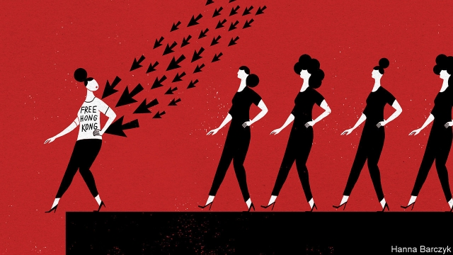

###### Chaguan

# China’s thin-skinned online nationalists want to be both loved and feared by the West 

 

> print-edition iconPrint edition | China | Aug 22nd 2019 

ON AUGUST 10TH a Chinese fashion blogger, “Stylist Zoe”, invited her 7.4m followers to take an online poll, asking whether they would wear freshly cooked shrimp as earrings. A mere 1,300 voted. Two days later, however, Zoe hit the jackpot. Over a million netizens responded to her poll, posted on Weibo, the country’s largest microblog platform, asking what followers think of foreign brands that “insult China”. Her timing was impeccable. Her survey surfed waves of patriotic indignation crashing over the Chinese internet, heightened by puffs of windy outrage in the state media. 

This tempest involves a charge new to the annals of great power competition: that Western brands have been subverting China’s sovereignty by means of overpriced T-shirts. Specifically, Versace, Coach and Givenchy were denounced for selling T-shirts that variously bore the place-names Hong Kong, Macau or Taiwan, without adding wording making it clear that the first two cities are not in fact sovereign states, but Special Administrative Regions of the People’s Republic of China, and without specifying that—at least in the view of the Communist mainland—the democratic, self-governing island of Taiwan is a province of China. 

Not content with going after designer-shirt peddlers, state-run news outlets have denounced Amazon for selling “Free Hong Kong” T-shirts, though the online giant does not operate inside China. Other well-known brands have been taken to task for drop-down location menus on company websites that could be interpreted as suggesting that Hong Kong and Taiwan are countries. 

To outsiders, these alleged offences may seem footling. But luxury brands—whose largest single market is often China—offered grovelling apologies. Expressions of contrition from foreign designers and CEOs were paraded across social-media sites, joined by resignation letters from Chinese celebrities, noisily quitting as envoys for errant brands and stressing their love for the motherland. 

One possible take on this dispiriting saga is that China’s hair-trigger patriots are themselves victims. In this telling, if young Chinese netizens are easily offended, it is because they have spent their formative years cut off from the world behind a Great Firewall of digital censorship, and pounded by a drumbeat of nationalism. 

A closer look at those online nationalists is more troubling. It is true that government propagandists have worked hard to whip up this latest storm. Communist Party social-media accounts have gleefully asserted that foreign firms must work harder to uphold China’s sacred territorial unity, or feel the “cold, cold” wrath of 1.4bn patriotic consumers. 

But a sad truth about nationalist anger is that it can be manipulated and sincere at the same time. No party commissar told Stylist Zoe’s followers to choose the most extreme response in her poll, vowing that they would rather go naked than wear clothes from an anti-China brand, yet 770,000 of them did so. More sobering still, by definition those attacking foreign brands are unusually worldly, whether they hail from the aspiring middle classes or are members of China’s globe-trotting elites. Those advocating boycotts know their Versace from their Valentino. Their ringleaders also clearly have access to the internet beyond the Great Firewall. Brands have been attacked, in recent days, over the precise wording of English-language apologies posted on platforms that are banned in China, such as Twitter, Facebook or Instagram. That means either overseas Chinese are involved, or netizens with access to online tools that allow them to vault the firewall. 

Some unhappy patriots hold plum jobs at the foreign companies under attack. Chaguan spoke this week to a Chinese staffer employed by one of the firms accused of insulting China. The staffer described Chinese colleagues debating their firm’s actions on WeChat, a social media app ubiquitous in China, adding that Western colleagues “either didn’t dare or didn’t want to talk about it with Chinese staff”. The firm did not set out to offend China, the employee believes. But China’s market power deserves more deference: “If you make a profit from us, you also need to respect us.” 

If recent mistakes by luxury brands seem small to foreigners, they are missing the larger causes of Chinese anger, says “FashionModels”, a blogger with 9m followers on Weibo, speaking via social media while on a trip to Japan. America and Europe remain “culturally more powerful” than China and have yet to change “their very condescending attitude”, he says. 

History offers insights into today’s online Chinese nationalism, with its complicated blend of assertiveness and insecurity. Arguably China’s first modern consumer boycott began in 1905, targeting American goods. It was launched by Shanghai merchants in protest at the (very real) mistreatment of Chinese immigrants in America. The first law against Chinese immigration was passed in 1882. But as Wong Sin Kiong of the National University of Singapore has documented, the boycott took off only after American immigration officers began humiliating educated Chinese as well as labourers. America, in effect, provoked a test of national dignity involving many social classes. Newfangled technology also helped. The telegraph, the WeChat of its day, allowed far-flung Chinese to share tales of outrage and to organise. 

One more parallel is important. Patriotic pride back in 1905 was mingled with shame, and soul-searching questions about why the Chinese were too dazzled by foreign goods to resist them for very long. Jump to 2019 and not much has changed. A popular comment on Stylist Zoe’s poll laments that Chinese fashion-lovers are too quick to forgive brands that insult the country. 

A big difference is that the boycott in 1905 had a moral argument at its core, and hurt Chinese merchants as much as American ones. Today’s campaigns often turn on trivialities and are painless or even profitable for their promoters. Propagandists have done their work well. They have made indignation an industry.■ 

