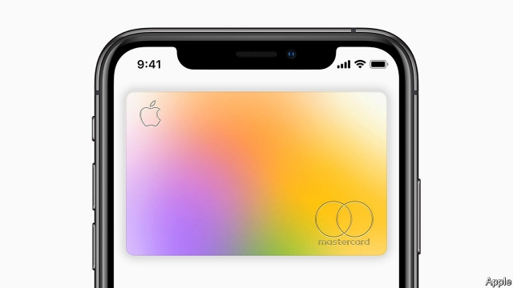

###### Love at first byte

# Apple and Goldman Sachs launch their credit card 

 

> print-edition iconPrint edition | Finance and economics | Aug 22nd 2019 

FINDING THE One is never easy. Plenty of candidates are attractive at first, but their charms are deceptive, or simply fade. Others for whom you pine spurn you. As with love, so it is with credit cards. Bonus offers are tempting, but also fleeting. Reward points pile up, yet linger unused. Unexpected fees sting. 

But now there is a sexy new stranger for Americans to eye up. On August 20th Apple launched its long-awaited credit card, in partnership with Goldman Sachs, a Wall Street firm pushing into digital consumer banking. Signing up takes about a minute. Approval (or rejection) is often instant. The card, delivered to the iPhone’s wallet app, may be used at once. (A physical titanium version will arrive in the post.) There are no fees for using the card, or even for missed payments. Instead of making you wait until the end of the month for rewards, Apple pays cash daily. 

The allure goes on. What starts off as a blank white oblong in the app is slowly shaded in rainbow colours as you spend: blue for transport; orange for food; pink for entertainment. Bills are paid by sliding a circular dial, which turns a friendly green if you pay in full, an uneasy yellow for less and an alarming red for the bare minimum. Any interest you will owe, shown in the centre of the dial, changes with the payment. When you clear your bill, the card wipes itself white again. 

This is all lovely. But the card’s financial attractions may not match its technological beauty. The lack of fees for missed payments and the transparency of its billing and interest due should appeal to people on lower incomes, who are most likely to carry credit-card debt. (Half of Americans fail to pay their credit-card bills in full each month.) Goldman is willing to approve subprime borrowers. But such folk are less likely than richer people to own an iPhone—and without an iPhone, you cannot get the card. 

At the same time, the card may not appeal to the better off as much as established competitors. It pays 2% in daily cash on all purchases made using Apple Pay, a contactless mobile payment made through the wallet app, and just 1% when using the titanium card. These rebates are hardly market-leading. Citibank, for instance, offers 2% cash back on all purchases. And only two-thirds of merchants accept Apple Pay. 

The card does pay 3% cash when used to buy Apple products, but compared with other retail store cards this is a little stingy. Amazon, another technology titan, offers 5% back on its store card (including purchases at Whole Foods, its trendy supermarket chain), which is issued by JPMorgan Chase. Other retailers, such as Crate and Barrel, a homewares store, offer as much as 10%. 

These perks may improve. On launch day Apple announced that spending on Uber, a ride-hailing app, and Uber Eats, its food-delivery service, would also qualify for 3% cash. More may be added, the tech company has said. But the Apple card has some catching-up to do. 

For Apple fans, this may not matter much. But it may be that Apple, by trying to please everyone, will end up pleasing too few Americans to break into the fiercely competitive credit-card market, in which there are already 1bn active cards. The gorgeous design, and the cachet of Apple and Goldman, will surely seduce many customers into trying the card. But when it comes to cold cash calculations, the geeks and the Wall Streeters may not have done enough to secure their lasting devotion.■ 

