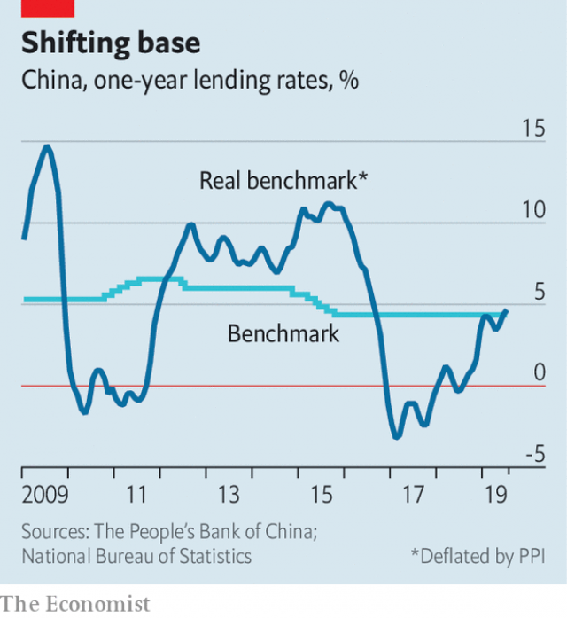

###### At any rate

# China’s interest-rate revamp highlights the slow march of reform 

 

> print-edition iconPrint edition | Finance and economics | Aug 22nd 2019 

FOR A CASE study in the complexity of transitions from central planning, consider the knotty mess that is China’s interest-rate system. More than 40 years after Mao Zedong died, the country is an economic superpower, yet it still struggles to manage bank lending using interest rates, rather than through heavy-handed interventions such as credit quotas. To make this shift, the central bank has created a dizzying array of instruments. S&P Global, a rating agency, counts 20 separate monetary-policy tools in China, from newfangled liquidity-injection facilities to old-fashioned instructions to banks; America, by contrast, has just six main instruments. 

Now China has modernised its arsenal with a new benchmark interest rate, unveiled on August 16th. The Loan Prime Rate (LPR), as it is known, will become the reference rate for banks pricing corporate loans. Announced monthly, it will be the average of what 18 designated commercial banks charge their best corporate clients, expressed as a spread over the banks’ own cost of borrowing from the central bank. 

In theory this should make Chinese lending rates more responsive to financial conditions. Under the previous system, banks priced loans from a one-year lending rate set by the central bank. It has refrained from changing that rate since 2015, concerned, in part, that investors would over-react. It does, however, regularly tweak liquidity levels, and has bemoaned the fact that its cautious easing in recent months has not translated into lower borrowing costs in the private sector. 

For industrial firms real (ie, inflation-adjusted) interest rates have instead climbed from an average of less than 1% last year to more than 4% this year (see chart). Officials say the LPR will lessen the strain on companies. On August 20th, the day it went into effect, the rate was set a tenth of a percentage point below the previous benchmark, a marginal cut. 

 

Nevertheless, it would be a mistake to view the LPR as a silver bullet, either for monetary easing or for China’s longer-term project of interest-rate reform. When banks are concerned about the economic outlook, as many increasingly are, they can simply demand higher risk premiums over the benchmark from their borrowers. 

There is no getting round the fact that China must do more if it wants to embolden its lenders. The central bank would need to cut their funding costs sharply, but it is reluctant to do so, worried about whipping investors into a speculative frenzy. The government would need to expand its fiscal stimulus, but it is worried about adding fuel to China’s debt problem. 

As for the redesign of Chinese monetary policy, there is still much to do. The central bank formally answers to the State Council. Any big changes in interest rates are thus political decisions, not purely economic ones (although a cynic might say the same is true in America, Yi Gang, governor of the People’s Bank of China, faces umpteen more constraints than Jerome Powell of the Federal Reserve). Moreover, the LPR makes China’s monetary-policy toolkit more cluttered. Banks have been told that for the time being the new benchmark will not apply to mortgages. It will thus be possible for China to cut rates for companies but not for homebuyers. After all these years, Chinese planners remain reluctant to cede too much power to the market.■ 

