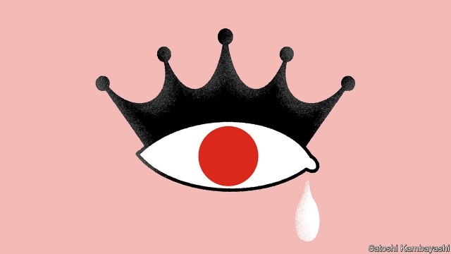

###### Buttonwood

# The Japanification of bond markets 

 

> print-edition iconPrint edition | Finance and economics | Aug 22nd 2019 

IN THE 1920S E.M. Forster, an English novelist, set out the difference between a story and a plot. “The king died and then the queen died” is a story, he wrote. But a sense of causality is needed to make a plot more than just a sequence of events. “The king died and then the queen died of grief” is a plot. 

Investors like stories as much as anyone. They like plots even more. A durable narrative, and one that is on everybody’s lips once again, is “Japanification”. A Forsterian summary might read: “The bubble burst, people became cautious and the economy got stuck in too low a gear to stop prices and interest rates from falling.” In its strongest form Japanification is a pure tragedy, in which rich, debt-ridden economies are destined to follow the path set by Japan. In another, softer version only countries with rapidly ageing workforces, such as Germany, are thus fated. 

Germany’s bond market is now priced for endless stagnation. Its interest rates are negative on everything from overnight deposits to 30-year bonds. But it is striking how depressed bond yields are in countries with only a passing resemblance to Japan. A 30-year American Treasury yields just 2%, for instance. As currently scripted, Japanification is narrowly defined but broadly applied. It is the fear that policymakers have lost for good their ability to gin up the economy. A big question is whether the current situation is just one act in an unfolding drama, or where the story ends. 

Japan’s experience was the trailer for all this. When its ten-year bond yields fell below 2% in 1998, there was a lot of head-scratching, says Peter Tasker, a seasoned analyst of Japan’s economy. At the time, Japan’s government had a huge budget deficit. For its long-term interest rates to fall made little sense. Hedge funds began to short Japanese government bonds (a lossmaking trade that became known as the “widowmaker”). But the country’s consumer prices kept drifting lower. And so did its interest rates. 

Ever since, Japanification has been a fear that is alternately raised and dismissed. In November 2002 Ben Bernanke, then a governor of the Federal Reserve, gave a famous it-can’t-happen-here speech about Japan. The lessons drawn from Japan’s failures were: own up to bad debts; fix the banks; use policy tools to spur the economy; don’t let asset prices collapse. After the 2008 crisis, some of these lessons were applied, if unevenly. A decade on, Japanification is back. People continue to be astonished by how far long-term interest rates can fall, just as they were earlier in Japan. And the declines have been broadly felt. In Australia, which has a young population and has not suffered a recession in a quarter-century, ten-year bond yields are below 1%. 

The cause of all this is renewed concern about global stagnation. A synchronised pickup in the world economy in 2017 has turned to synchronised slowdown. Central banks, including the Fed, are cutting interest rates. But there is more to it than that. With short-term interest rates already so low, there are grave doubts that central banks have the power to get the economy back on track. You see this pessimism in forecasts of medium-term inflation derived from the swaps market, which are markedly lower than they were earlier this year. “The problem with being Japan is that if you get an economic shock, monetary policy has nowhere to go,” says Steve Englander of Standard Chartered, a bank. Europe has already reached this point. 

There is an alternative script. In this version today’s Japanification spurs a response that leads to its defeat. If monetary policy has run out of road, there is always fiscal policy. If the economy lacks demand, governments can help to fill it by borrowing cheaply to cut taxes and raise spending. The politics are not there yet, but the Japanification of bond markets will move things along. “Before there is a consensus on a shift in policy, you need to see the downside risks [to the economy] clearly,” says Mr Englander. Once that shift takes place, the fear of stagnation recedes. 

The political response to the threat of stagnation is likely to be more radical than it was in Japan, says Mr Tasker. The tricky part for bond investors is guessing how long this takes. There are already stirrings of a rethink in Germany, a country hostile to fiscal stimulus. For now, these are only stirrings. Bond yields may languish for a while, before they rise in anticipation of fiscal stimulus. But the queen need not die of grief. After a period of mourning, she may find happiness again. The plot thickens.■ 

