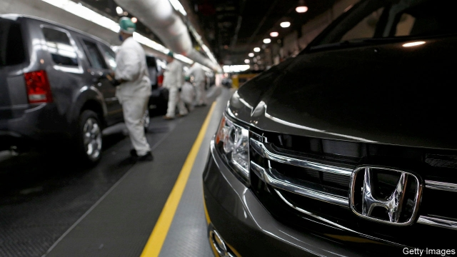

###### Multinational companies

# Who wins from foreign investment? 

 

> print-edition iconPrint edition | Finance and economics | Aug 22nd 2019 

SHAWNEA ROSSER earned upwards of $29 an hour when she worked for General Motors in Dayton, Ohio. But in 2008 the factory closed. Years later the building was bought by Fuyao Group, a Chinese multinational company that makes glass. The new American managers promised that the “historic” project would “give people jobs, and give a future to your kids and my kids”. Sounds great. But Ms Rosser’s new job paid just $12.84. 

The plight of Ms Rosser and her coworkers is captured in “American Factory”, a documentary released on August 21st by Netflix that explores the tensions that arise from the factory’s foreign ownership. There is discontent among American workers, but the source is unclear. Could it simply reflect the post-crisis reality of American manufacturing work? Or are the different Chinese employment practices to blame? 

A new study offers part of an answer, by asking who benefits when foreign investors open up shop. On average, foreign companies in fact pay workers around 25% more than American ones. But that could be because they employ relatively skilled workers. Bradley Setzler and Felix Tintelnot of the University of Chicago match anonymised employee and company tax records to estimate the true wage premium. 

The economists look to see what happens when American workers move between companies. They find that when someone hops between two American-owned firms, their wages barely budge. But when they skip from a domestically owned one to a foreign one, their wages go up by around 7%. And when they jump from a foreign-owned firm to a domestic one, their wages sag. 

 

Messrs Setzler and Tintelnot also find that the boost to wages from working at a foreign-owned firm is skewed in favour of the highly skilled. They derive a measure of skills by adjusting pay for age, firm, industry and location. Based on that measure, people in the bottom 10% of the skills distribution saw no pay premium at all for working at a foreign-owned company. 

The researchers also ask whether a firm’s country of origin might matter for the wage premium on offer. Unsurprisingly, richer home countries tend to mean fatter American pay packets. Companies from Norway and New Zealand pay best; those from Mexico and Taiwan give barely any premium. Only one country seems to offer a pay penalty (see chart). On average, they calculate that between 2010 and 2015, Chinese-owned firms paid around 4% less than American ones for similar jobs. That is not a huge gap—certainly compared with the drop in Ms Rosser’s hourly pay between GM and Fuyao Group. But when you are not paid a lot, it is big enough to hurt.■ 

