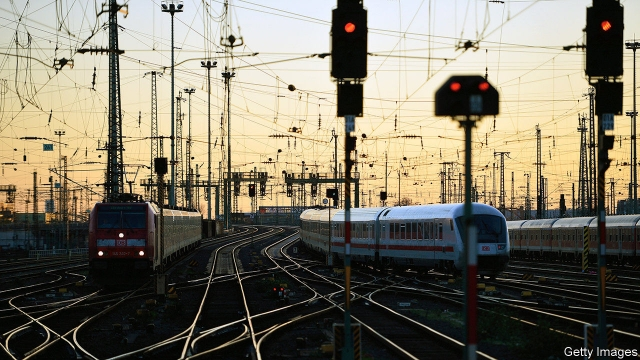
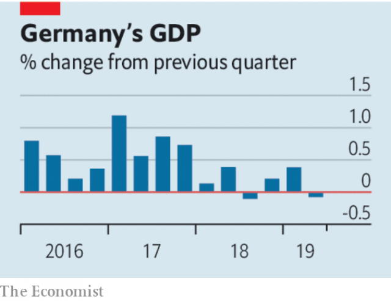

###### Take aim

# Germany needs fiscal stimulus. Here’s how to do it 

 

> print-edition iconPrint edition | Leaders | Aug 22nd 2019 

ON AUGUST 19TH the Bundesbank warned that Germany could soon be in recession. The economy shrank in the second quarter of the year; two consecutive quarterly contractions are often taken to define a downturn. In June industrial production was 5.2% lower than a year earlier, the biggest fall in a decade. Some investors hope that the run of bad news will persuade Germany to overcome its deep-rooted suspicion of fiscal stimulus. Sure enough, a day before the central bank’s warning, Olaf Scholz, the finance minister, said the government could afford a hit to its finances of €50bn ($56bn)—about 1.4% of GDP. 

Unfortunately Mr Scholz has shown little desire to use that money now. Chancellor Angela Merkel has said she sees no need. That is lamentable. The case for using fiscal stimulus to fight the downturn has recently become overwhelming. 

There are arguments to be made against higher deficits when economies weaken and inflation is low. Spending can be unaffordable because the government is already too indebted. Some critics argue that it is up to central bankers, not finance ministers, to cope with the economic cycle. A worry is that more borrowing will drive up interest rates, deterring private-sector investment. 

None of these applies to Germany. Stimulus is patently affordable. The government can borrow for 30 years at negative interest rates. As a result, it could probably spend double what Mr Scholz suggests for years and still keep its debt-to-GDP ratio steady at around a prudent 60%. Central bankers are hamstrung. Short-term interest rates cannot fall much further. The European Central Bank is likely to start buying more assets in September, which will help but may not be enough. And crowding out investment is not a concern. Negative rates are a sign that Europe is awash with savings and bereft of plans to put them to use (see article). If Germany deployed them to improve its decaying infrastructure, its firms would probably invest more, not less. 

 

The country needs looser fiscal policy in both the long term and the short term. It has neglected infrastructure in pursuit of needlessly restrictive fiscal targets, most recently its “black zero” ban on deficits. This has, for example, left 11% of its bridges in poor condition and its railways plagued by delays. Germany should replace the deficit ban with a rule allowing borrowing for investment spending. It should use tax breaks to encourage its private firms, innovation laggards, to invest more too, including in research and development. 

In the short term Germany needs demand. This necessity has grown in strength this year as the economy has deteriorated. Although unemployment is just 3.1%, the Bundesbank has warned that joblessness could soon rise. The domestic economy cannot endure brutal global trading conditions for ever. 

It would be better to use fiscal policy to prevent a deep downturn than to wait for recession to bring about a bigger deficit of its own accord. If a preventive stimulus turned out to be premature, the worst that could happen is slightly higher inflation than today’s 1.1%—which would in any case help the ECB hit its inflation target of close to 2%. A little more inflation would also even out imbalances in competitiveness between Germany and the rest of the euro zone. 

Unfortunately infrastructure projects take time to get going. They face planning hurdles and bottlenecks in the construction industry. The federal government has already struggled to spend all of its existing meagre infrastructure budget. 

The best thing, therefore, would be to supplement a long-term programme of infrastructure investment with an immediate, temporary boost, such as payroll-tax cuts, designed to forestall a downturn. Germany stands to benefit from both prongs of this strategy. Continuing to reject them is fiscal folly. ■ 

