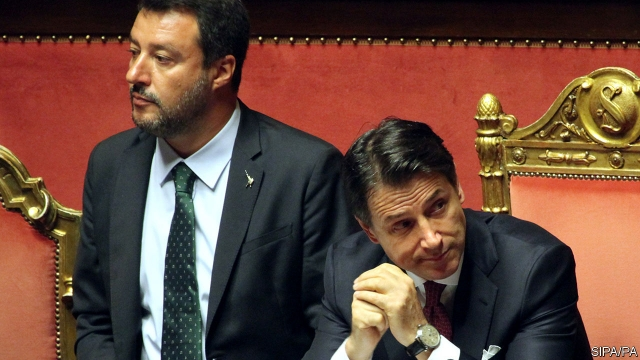

###### Budget before ballot

# Now is not the time for an election in Italy 

 

> print-edition iconPrint edition | Leaders | Aug 22nd 2019 

THE REMARKABLE thing about the fall of the Italian government this week was that it did not happen sooner. Parties that depict themselves as outsiders, such as the Northern League and the Five Star Movement (M5S), typically find their first stint in office a fiasco. A coalition of two such outfits, one a hard-right nativist group and the other an eclectic set of economic populists, greens and internet utopians, was bound to come unglued. Moreover, whereas the M5S finished first in last year’s election, the League has since far surpassed it, polling at 37% to the M5S’s 17%. The League’s leader, Matteo Salvini, has proved more astute than the M5S’s Luigi di Maio. It is not surprising that he pulled his support from Giuseppe Conte, the prime minister, in a bid to trigger an election and win the job for himself. Just now, however, an election would be a grave mistake for Italy and Europe. 

That might seem unfair. After all, the composition of parliament does not reflect public opinion. But this is a precarious moment for Italy (see article). Its economy is feeble, with growth this year expected to be just 0.1%. Its immense government debt, of more than 130% of GDP, is the greatest single threat to the euro zone. An election would take months, threatening Italy’s efforts to pass a budget by the end of the year. That could upset markets at a time when much of Europe is already on the edge of recession. 

Should the pro-Kremlin, anti-immigrant Mr Salvini win a vote, he would seek clashes with the European Union over refugee settlement and foreign policy—a distraction when the public finances are at stake. Worse, the European Commission must review Italy’s budget to ensure that it deals with the country’s debt. A proposal is due on October 15th. When the previous government’s initial draft of last year’s budget was rejected by Brussels, it led to months of haggling. Mr Salvini’s promises of tax cuts suggest that any government he leads will face similar problems. 

A second reason to delay lies in Rome. Mr Salvini has spent the past year relentlessly undercutting and upstaging the M5S. On some issues, such as the conflict over a high-speed-rail tunnel that precipitated the fall of the government, the M5S and the League are diametrically opposed. Mr di Maio deserves a chance to show whether his party can govern. 

Rather than stage an election, the M5S should form a new coalition with the centre-left Democratic Party (PD) and independent lawmakers. A temporary, less rivalrous coalition with the PD could give voters time to get a better sense of the M5S’s abilities before they pass judgment. More important, such a government could pass a compromise budget, and then hold elections early next year. A coalition would face the daunting task of finding spending cuts of €23bn, equivalent to 1.3% of GDP, to avert steep value-added-tax rises. It may well exceed deficit rules, as Mr Salvini surely would. But, by putting off the election for later, it would gain time to talk to the EU. 

It will not be easy for the M5S and PD to work together. Mr di Maio will have to overcome his party’s reluctance to join one of the traditional parties it has vowed to supplant. The PD is even more divided. Matteo Renzi, its former leader, favours a coalition. Nicola Zingaretti, the current one, is sceptical. The party has set out five reasonable conditions for collaboration, such as the M5S renouncing anti-EU rhetoric. But Mr Zingaretti has also insisted on a clear-cut break with the past, which could be a veiled attempt to exclude Mr di Maio from the next cabinet. If such demands force new elections, it would be a mistake. This is not the time for Italy to play political games. ■ 

-- 

 单词注释:

1.ballot['bælәt]:n. 投票, 投票用纸, 抽签 vi. 投票, 抽签 vt. 投票选出, 拉选票 

2.Aug[]:abbr. 八月（August） 

3.depict[di'pikt]:vt. 描述, 描写 

4.outsider[' aut'saidә]:n. 外人, 局外人, 非会员, 外行, 门外汉, 比赛中获胜可能性不大的选手 [经] 外船公司 

5.typically['tipikәli]:adv. 代表性地；作为特色地 

6.stint[stint]:vt. 节省, 限制, 停止 vi. 节约 n. 吝惜, 节约, 限额 

7.fiasco[fi'æskәu]:n. 惨败, 大失败 

8.coalition[.kәuә'liʃәn]:n. 结合体, 结合, 联合 [经] 联合, 联盟 

9.outfit['autfit]:n. 用具, 配备, 机构 vt. 配备, 供应 vi. 得到装备 

10.nativist['neitivist]:n. 先天论者, 乡土主义者, 本土主义者 

11.eclectic[ek'lektik]:n. 折衷主义者 a. 选择的, 折衷的 

12.Populist['pɔpjulist]:n. 民粹派的成员 

13.Utopian[ju:'tәupiәn]:a. 乌托邦的, 空想社会主义的 n. 理想社会主义者 

14.unglued['ʌn'^lu:d]:脱粘的, 揭开的, 拆开的 

15.surpass[sә'pɑ:s]:vt. 超越, 凌驾, 胜过 

16.matteo[]:马泰奥（人名） 

17.salvini[]:[网络] 索氏丽体鱼；萨尔维尼 

18.astute[ә'stju:t]:a. 敏锐的, 狡猾的 

19.luigi[]:n. （意）路易吉（男子名） 

20.DI[]:[计] 数据输入, 数据项, 设备独立性, 双整数 

21.maio[]:abbr. mobile allocation index offset 移动台划分系数偏置 

22.giuseppe[]:n. 朱塞佩（男子名） 

23.conte[kuŋt]:n. 短篇小说 

24.trigger['trigә]:n. 触发器, 扳机 vt. 触发, 发射, 引起 vi. 松开扳柄 [计] 切换开关 

25.precarious[pri'kєәriәs]:a. 不稳定的, 不安的, 危险的 

26.euro['juәrәu]:n. 欧元（欧盟的统一货币单位） 

27.recession[ri'seʃәn]:n. 后退, 凹处, 衰退, 归还 [医] 退缩 

28.clash[klæʃ]:n. 冲突, 撞击声, 抵触 vi. 冲突, 抵触 vt. 使发出撞击声 [计] 对撞 

29.refugee[.refju'dʒi:]:n. 难民, 流亡者 [法] 避难者, 流亡者, 难民 

30.distraction[dis'trækʃәn]:n. 娱乐, 分心的事物, 分心 [医] 注意力分散, 内脱位, 牙弓过宽 

31.Brussel[]:n. 布鲁塞尔（比利时首都） 

32.haggle[hægl]:vi. 争论, 杀价 vt. 乱砍, 乱劈 n. 杀价, 讨论, 争论 

33.Rome[rәum]:n. 罗马 

34.relentlessly[]:adv. 不仁慈, 严酷, 无情, 坚韧, 不懈, 不屈不挠 

35.undercut['ʌndәkʌt]:n. 底切, 牛腰部下侧嫩肉, 下口, 下旋削球 vt. 廉价出售, 底切, 雕出, 下旋削球 vi. 切除底部 

36.upstage['ʌp'steidʒ]:a. 在舞台后部的, 傲慢的, 自负的 adv. 在舞台后方 vt. 抢戏 

37.precipitate[pri'sipiteit]:n. 沉淀物, 凝结物, 结果 vt. 猛抛, 使陷入, 促成, 使沉淀 vi. 猛地落下 a. 突然的, 猛地落下的, 轻率的 

38.diametrically[,daiә'metrikәli]:adv. 完全地, 直径方面, 正好相反地, 截然地 

39.Pd[]:[医] 钯(46号元素) 

40.lawmaker[lɒ:'meikә]:n. 立法者 

41.les[lei]:abbr. 发射脱离系统（Launch Escape System） 

42.rivalrous['raivәlrәs]:a. 有竞争性的, 敌对性的 

43.voter['vәutә]:n. 选民, 投票人 [法] 选民, 选举人, 投票人 

44.judgment['dʒʌdʒmәnt]:n. 裁判, 宣告, 判决书 [医] 判断 

45.daunt[dɒ:nt]:vt. 威吓, 难倒, 使气馁 

46.avert[ә'vә:t]:vt. 转开, 避免, 防止 

47.deficit['defisit]:n. 赤字, 不足额 [医] 短缺 

48.EU[]:[化] 富集铀; 浓缩铀 [医] 铕(63号元素) 

49.reluctance[ri'lʌktәns]:n. 不情愿, 勉强 [电] 磁阻 

50.vow[vau]:n. 誓约, 誓言, 许愿 vi. 起誓, 发誓, 郑重宣言 vt. 立誓, 起誓要, 郑重地宣布 

51.supplant[sә'plɑ:nt]:vt. 排挤掉, 代替 

52.renzi[]:[网络] 黎恩济 

53.nicola[]:n. 尼古拉（男子名） 

54.collaboration[kә.læbә'ræʃәn]:n. 合作, 勾结 [法] 通敌卖国者, 奸细 

55.renounce[ri'nauns]:vt. 拒绝, 放弃, 否认, 垫牌 vi. 垫牌, 声明放弃权利 n. 垫牌 

56.rhetoric['retәrik]:n. 修辞, 修辞学, 雄辩(术) 

