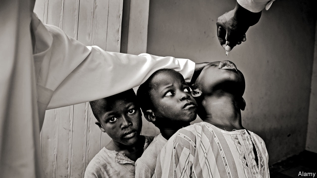

###### Vanquishing the virus

# Africa is on the verge of being declared polio-free 

 

> print-edition iconPrint edition | Middle East and Africa | Aug 22nd 2019 

ERADICATING POLIO is hard. It is even harder when politicians and imams fan the conspiracy theory that the polio vaccine is part of a Western plot to sterilise Muslims, as happened for several years in northern Nigeria. So in 2015 Nigeria’s president, Muhammadu Buhari, decided to set an example. He gave the vaccine to one of his grandchildren on television, before rallying politicians and tribal leaders to join the campaign. 

His efforts, and those of hundreds of thousands of volunteers, have paid off. On August 21st Nigeria marked three years since its last documented case of wild polio. That means the country is set to be declared polio-free by the World Health Organisation-backed Global Polio Eradication Initiative. If that happens, probably next year, all of Africa will be officially free of the virus. Polio will remain in only Afghanistan and Pakistan; and one day it will be completely eradicated, like smallpox was in 1980. 

Mass vaccination in Nigeria, Africa’s most populous country, was a logistical challenge. Health workers went village to village in round after round of campaigns. They were stationed in markets and at border crossings. To reach remote spots, they got creative. Satellite imaging was used to map the islands around Lake Chad. Then health workers went by canoe to deliver the vaccine. 

Violence was a big problem. Polio was last found in a child in Borno, a north-eastern state ravaged by Boko Haram. The jihadist group prefers kidnapping children to vaccinating them. It helped spread the myth about sterilisation. So brave health workers have been rushing into areas from which it retreats (even temporarily). An improving security situation has helped. In 2015 about 600,000 children were not accessible. Now that number is under 100,000. 

Volunteers trained to spot the virus have been crucial in preventing outbreaks—not just of polio. In 2014 they helped trace nearly 900 people who may have been exposed to Ebola after an infected man from Liberia arrived in Lagos. Nigeria quickly contained the virus, which killed eight in the country. 

The big worry now is that polio from Afghanistan and Pakistan may be brought to Africa and lead to new outbreaks. In the past polio from India made its way to Angola and Congo after they were declared polio-free. The strain from Pakistan is already travelling: it was recently found in sewage in Iran. That is one reason why it is important to maintain high vaccination rates in Africa. 

This week’s anniversary is good news, but risks remain. Mutations of the weakened virus in the vaccine are circulating in several African countries, including Nigeria. Higher vaccination rates will solve that problem, too. More work is still needed.■ 

