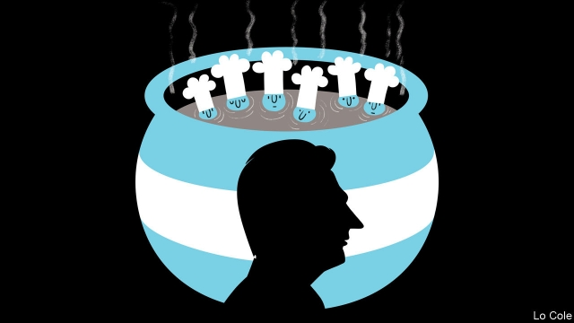

###### Bello

# Argentina’s crisis shows the limits of technocracy 

 

> print-edition iconPrint edition | The Americas | Aug 22nd 2019 

IF YOU CAN’T beat them, join them. That seems to be Mauricio Macri’s response to his crushing defeat in presidential primary elections on August 11th. He won 32% of the vote against the 48% secured by the Peronist slate of Alberto Fernández and Cristina Fernández (no relation), a populist former president. At first Mr Macri blamed the outcome on the voters for “believing that returning to the past is an alternative”, a scolding for which he later apologised. Then the blame shifted to his finance minister, Nicolás Dujovne, who had been slashing the budget as demanded by the $57bn agreement the government negotiated with the IMF last year. Mr Dujovne resigned on August 17th after Mr Macri scrapped VAT on staple foods, increased hand-outs and temporarily froze petrol prices in a desperate effort to placate Argentines. These are the kind of measures typically associated with his Peronist opponents, and they are contrary to the IMF agreement. 

Mr Macri is not quite beaten yet. The presidential election is not until October 27th. But in Argentina’s peculiar system, the primaries are a dress rehearsal. Few think he can overturn a 16-point deficit in nine weeks. The fact that the peso crashed after the primary result will add to inflation of 50% a year and makes his task even harder. 

This drubbing came as a shock, but it probably should not have done. Mr Macri’s search for a second term always looked quixotic after the economy ran into trouble last year. Argentines are worse off than they were four years ago. The economy is forecast to have shrunk by around 4% over this period; prices have increased by more than 250%; the peso has gone from 15 to the dollar to almost 60, while real wages have fallen by 10% in the past 15 months. 

Many had high hopes for Mr Macri, a former businessman turned successful mayor of Buenos Aires. After years of economic debauchery under Ms Fernández, he promised that Argentina would rejoin the world as a normal country. He appointed a team of brilliant technocrats. So what went wrong? 

One hypothesis is that he erred in trying to stabilise the economy gradually. That decision was political: the hope was that growth would cushion the blow of cuts and big rises in the cost of electricity and transport as Ms Fernández’s huge subsidies were withdrawn. It meant that the government had to finance a still-large deficit, mainly through debt. In 2018 investors became alarmed about Argentina, forcing the government into the arms of the IMF and the economy into recession. 

That alarm was partly because of the rise in interest rates in the United States. A severe drought also cut Argentina’s farm exports, driving up its current account-deficit. But the main blow was self-inflicted: the government’s decision in December 2017 to loosen its own inflation targets, which undermined the credibility of the central bank. According to Federico Sturzenegger, the bank’s then-president, who opposed the decision, it did so because (other) officials worried about the bank’s relatively tight monetary policy; some did not want inflation to fall so swiftly because of the fiscal cost. Tax revenues would rise less in nominal terms but much spending (such as on pensions) would keep rising fast, because it was indexed to past inflation. 

As this highlights, the government had too many economic cooks following different recipes. They wanted, variously, to slash inflation, increase economic growth and tighten the budget. Some wanted a weaker peso (for growth) and others a stronger one (to fight inflation). They should have accepted that the price of fiscal gradualism was tighter money. 

Populist politicians are often skilled at explaining away economic reverses and persuading voters that they feel their pain. Technocrats find that harder. Mr Macri’s re-election campaign was based on fear, that the return of Ms Fernández would turn Argentina into Venezuela. She deftly defused that. By opting to run for vice-president behind Mr Fernández, a more moderate Peronist, she turned the election into a referendum on Mr Macri’s economic record. 

Mr Macri’s advisers trusted in social media and marketing, and failed to see the strength of sentiment on the Argentine street. “What happened was that the government ended up with no politics and couldn’t explain anything,” Mr Fernández told Clarín, a newspaper. Everything suggests Argentina will end up with him. Many fear the worst. But Argentina’s current circumstances leave little room for populist excess. And Mr Fernández is not his namesake.■ 

