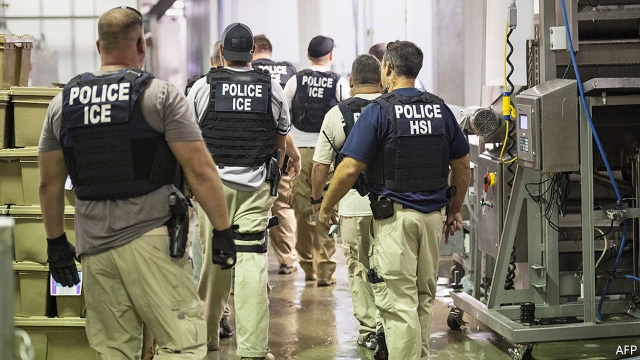

###### Immigration policy

# What do Donald Trump’s immigration raids accomplish? 

 

> print-edition iconPrint edition | United States | Aug 22nd 2019 

THE SCHOOL day on August 7th was just beginning when a counsellor pulled 16-year-old José out of class. Immigration and Customs Enforcement (ICE) agents were raiding seven poultry-processing plants; did he know anyone who worked at one of them? He did. José worked afternoon shifts. His parents worked days, were then at the plant and, like him, were undocumented. They brought José (not his real name) and his family to America four years ago. His thoughts ran to his four brothers and sisters. If his parents were detained and deported, who would feed and care for them? How would they pay rent? 

José’s parents ended up among the 303 people released after being arrested that day. Another 377 remain in ICE facilities in Louisiana and Mississippi. Father Roberto Mena, parish priest of St Michael’s Church in nearby Forest, says his parishioners are frightened. Mark Bowman, a pastor in neighbouring Carthage, says that when his parishioners showed up to donate boxes of food to families of the detained, some “wouldn’t come to the door, because they thought we might be ICE”. 

Barack Obama’s administration deported large swathes of undocumented immigrants. But his directives to ICE were to avoid sweeping raids. President Donald Trump has revived them and has moved to change the way detained migrants are treated. On August 21st his administration unveiled plans that could allow for the indefinite detention of undocumented families—including children—who cross the border illegally. The new rules would replace a decades-old agreement on levels of care for migrant children and the length of time the government can detain them. 

In 2017 Tom Homan, who then headed ICE, ordered workplace enforcement to be increased “four or five times” over then-current levels. The Mississippi raids comprised the seventh workplace raid since April 2018 in which more than 100 people have been arrested. It was the biggest since a raid on a slaughterhouse and meatpacker in Pottsville, Iowa yielded nearly 400 arrests on May 12th 2008, near the end of George W. Bush’s presidency. 

That raid occurred in a different political world. Muzaffar Chishti, a lawyer and policy analyst with the Migration Policy Institute, a think-tank, contends that the Pottsville raid was intended to nudge congressional Republicans into supporting immigration reform by showing them how inhumane enforcement would be without an agreement. The current raids, says Mr Chishti, are “the signal of an anti-immigration president to his base”. 

Bryan Cox, an ICE spokesman, insists that ICE is “equally focused...on those who unlawfully seek employment [and] the employers who knowingly hire them”. But between March 2018 and March 2019 just 11 employers were charged for hiring undocumented workers. None has yet been charged after the raids in Mississippi. Koch Foods, one of the raided processors, noted in a statement that employers cannot demand more documents when employees present authentic-looking papers, and that E-Verify, an online system that is supposed to confirm employees’ legality, does not catch workers using the stolen or borrowed identity of a legal migrant. 

As a show of force, such raids are impressive. As a matter of policy, they are inefficient, requiring large resource expenditures to arrest a few hundred workers. It may sound tough to say that every undocumented immigrant is an equal priority, but from a public-safety perspective it makes no sense. A workplace raid absorbs time that then cannot be spent on more dangerous undocumented immigrants. 

There are signs that this shift in priorities is having consequences. The number of deported people convicted of a crime fell to its lowest level in 2017 since 2008, the year before Mr Obama became president. That figure has started to climb, but remains below the average from Mr Obama’s time in office. 

Nor is it just immigrants whom these raids make nervous. Poultry is Mississippi’s biggest agricultural industry, but cutting chickens is a dangerous job and processors were already struggling to find workers. Allison Crittenden, the congressional-relations director at the American Farm Bureau Federation, an agricultural lobbying group, says her members worry about raids causing “a potential disruption to farming operations”. 

So what do these raids accomplish? For one thing, they help Mr Trump keep his deportation numbers up now that local police are less co-operative than they used to be. Between Mr Bush’s inauguration and the start of Mr Obama’s second term, deportations rose markedly—from 189,000 in 2001 to 432,000 in 2013 (see chart). 

 

Much of that increase stemmed from local police assistance. Metro areas that offer sanctuary to illegal immigrants—as more than three-quarters of those housing most of America’s undocumented population do—limit such co-operation. ICE agents cannot simply wander through immigrant neighbourhoods at random demanding proof of citizenship. Workplaces provide large numbers of undocumented people at a single, predictable site. 

Mr Trump may believe that raids deter would-be migrants, but no evidence backs him up. It is difficult to imagine that someone whose children have been targeted by gangs in Honduras will factor the prospect of being caught in a raid in Mississippi or Ohio into their decision to flee. Raids dominate a couple of news cycles, scare immigrants and let Mr Trump project toughness. 

On a recent afternoon, José’s neighbourhood was deserted. Yet if the administration had set itself against José and his family, his neighbours had not. Pastor Bowman says his parishioners tend to be politically conservative, but also believe that “God tells us explicitly to feed the hungry, to clothe those in need of clothes, to provide shelter to those who are homeless and to care for the immigrant population within the boundaries of our country.”■ 

