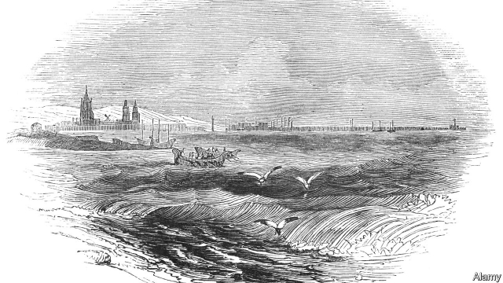

###### Road trip

# Love in the time of the Black Death 

 

> print-edition iconPrint edition | Books and arts | Aug 31st 2019 

To Calais, In Ordinary Time. By James Meek. Canongate; 400 pages; £18.99. 

IN A TALK she gave to the Royal Society of Literature in 2010, Hilary Mantel offered some advice to would-be authors of historical fiction. “Learn to tolerate strange world views,” she said: 

In his sixth novel, “To Calais, In Ordinary Time”, James Meek seems to have taken Ms Mantel’s interdiction as a challenge. This is a book that seeks to compress the distance between past and present, seeking out reflections of contemporary concerns in the medieval world. 

“To Calais…” is the story of three very different protagonists, each setting out for English-held Calais in the summer of 1348. Will Quate, a farm boy from Outen Green (a fictional Cotswold village), joins up with a group of archers heading to fight in the Hundred Years War. Lady Bernadine Corbet, an aristocratic young woman, is bewitched by “Le Roman de La Rose”, a courtly poem, and fleeing a controlling father. Thomas Pitkerro, a Scottish proctor, has come to England from the papal court at Avignon to carry out a survey of the abbey at Malmesbury. The different plot lines overlap and interweave as the three characters move haltingly to Calais, while, just out of sight in France, lurks the greatest catastrophe ever to hit Western civilisation: the Black Death. 

Mr Meek throws ropes from the present to the past. His noblewoman is headstrong and emancipated—almost a millennial—who dreams of a storybook lover and self-harms in secret. Will is pursued by a besotted friend who plays provocatively with binary conceptions of gender. Thomas, the proctor, may live in the 14th century, but his musings carry a powerful message for stratified Brexit-era Britain: 

This is a book about the power of perspective and the importance of broadening horizons. The Black Death is a kind of hold-all catastrophic metaphor: for climate change, political meltdown and moral decay. 

Like all fiction, but perhaps more so, historical novels live or die by their use of language. Few attempt an accurate representation of the speech of a bygone era, seeking rather to forge their own idiom to give the reader the impression of that time. Mr Meek goes further: each protagonist speaks in a different register. Will’s tale is related in a kind of Chaucer-lite; in accordance with her reading, Bernadine’s narrative is French-inflected; Thomas is resolutely Latinate. This tapestry makes for a compelling story that, like all great historical fiction, is not only about the past, but says profound things about the present. ■ 

