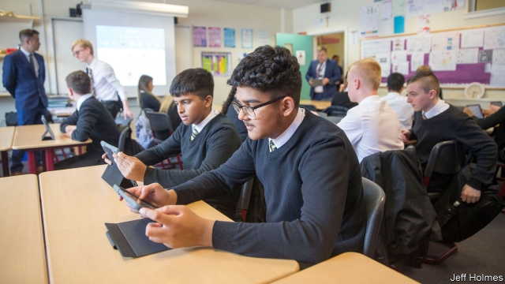

###### Prescribing tablets

# Free iPads for Scottish pupils 

 

> print-edition iconPrint edition | Britain | Aug 31st 2019 

FOR PUPILS at St Thomas Aquinas, a state secondary in Glasgow’s suburbs, the post-summer return to school was leavened with the promise of a gift: an iPad for every child. The tablets cannot download apps, are tracked by the school and come with a firewall to block off-limits parts of the internet, but the pupils can take the devices home. Not all year groups have so far received them, leaving the rest jealous, says Barry Quinn, the deputy head. “They can’t wait for theirs to be deployed.” 

The giveaway is part of a £300m ($370m) contract signed by Glasgow City Council with CGI, a Canadian IT firm, under which iPads will be handed out to nearly 50,000 pupils aged nine to 17 by 2021. More will be sent to nurseries. The deal also covers other services, including Wi-Fi links and data analysis in hospitals, leaving the council unable to say exactly how much has been spent on the iPads. But they are not the only ones to splash cash on gadgets. The city joins Edinburgh, which has 27,000 iPads in its schools, and the Borders, which plans to give them to all children in the same age range as Glasgow. 

According to Glasgow council, tablets will improve digital literacy, preparing pupils for workplaces where tech is ubiquitous. They can be used to share information, set homework and replace textbooks. Teachers have had a year to get up to speed with how to use the things. The project “will result in raising attainment and achievement in every one of our schools and nurseries,” promises Chris Cunningham, Glasgow’s head of education. 

If so, that would make it different from similar past experiments. Philip Oreopoulos of the University of Toronto, co-author of a forthcoming review of randomised control trials on education technology, notes that results show academic consensus: although handing out laptops increases computer use, it has no impact or even (in one study) a negative one on attainment. There is not as much rigorous research on tablets, but little reason to think results would differ. The worry is that they end up distracting pupils more than they help them study. 

Some programmes that use computers for personalised tuition have, though, produced promising results. With the right software and careful management of how they are used, tablets could help, says Mr Oreopoulos. Yet so far their use in Scotland seems to be less well defined. At St Thomas Aquinas, they have been used for catch-up quizzes at the start of maths lessons and to film gymnastics to check on technique. Teachers have been told to use them in every lesson, but left to decide how. 

Another argument for the handout is that it levels the playing field for children who do not have access to the latest technology at home, and does so in a way that does not stigmatise those who most need the help. Critics respond that buying expensive gadgets for all is a poor way to help these pupils, especially when there are cheaper programmes that have shown better results. Giving out iPads may allow politicians to say they are dragging schools into the 21st century, but that does not mean they are a sensible investment. ■ 

-- 

 单词注释:

1.ipads[]:[网络] 平板电脑；改进的处理器和显示器系统；改进型定位与方位确定系统 

2.Aug[]:abbr. 八月（August） 

3.ST[]:[计] 段表, 状态, 系统测试, 直端连接器 [化] 磺胺噻唑 

4.thoma[]:n. (Thoma)人名；(阿尔巴、阿拉伯)索玛；(英、德、罗、匈、捷、塞、瑞典)托马 

5.aquina[]:[网络] 那 

6.leaven['levn]:n. 酵母, 促使渐变的因素 vt. 使发酵, 渐变 

7.ipad[]:n. 苹果平板电脑 

8.cannot['kænɒt]:aux. 无法, 不能 

9.APP[]:[计] 应用, 应用程序; 相联并行处理器 

10.firewall[]:[计] 放火墙, 隔离 

11.Barry['bæri]:n. 巴里（男子名） 

12.Quinn[]:n. 奎恩（姓氏） 

13.deploy[di'plɒi]:v. 展开, 配置 

14.giveaway['givә.wei]:n. 泄漏, 免费赠品 

15.glasgow['^lɑ:s^әu]:n. 格拉斯哥（英国城市名） 

16.CGI[]:[计] 计算机生成图象, 计算机图象接口 

17.datum['deitәm]:n. 论据, 材料, 资料, 已知数 [医] 材料, 资料, 论据 

18.gadget['gædʒit]:n. 小配件, 小玩意, 诡计 

19.Edinburgh['edinbәrә]:n. 爱丁堡 

20.literacy['litәrәsi]:n. 读写能力, 识字, 精通文学 

21.tech[tek]:n. 技术学院或学校 

22.ubiquitous[ju:'bikwitәs]:a. 无所不在的, 到处存在的, 普遍存在的 

23.attainment[ә'teinmәnt]:n. 达到 

24.chris[kris]:n. 克里斯（男子名）；克莉丝（女子名） 

25.cunningham['kʌniәm]:n. 坎宁安（姓氏） 

26.philip['filip]:n. 菲利普（男子名） 

27.toronto[tә'rɔntәu]:n. 多伦多（加拿大城市） 

28.forthcoming['fɒ:θ'kʌmɑŋ]:a. 即将来临的 n. 来临 

29.randomise['rændəmaiz]:vt. [主英国英语]＝randomize 

30.laptop[]:[计] 膝上型的 

31.rigorous['rigәrәs]:a. 严厉的, 严酷的, 严格的, 苛刻的, 严密的, 精确的 

32.distract[dis'trækt]:vt. 转移, 分心, 使发狂 

33.personalise['p\\:sәnәlaiz]:vt. (贬)使个人化, 体现, 使人格化, 在(物品)上标明姓名/标出地址/标出记号 

34.les[lei]:abbr. 发射脱离系统（Launch Escape System） 

35.gymnastic[dʒim'næstik]:a. 体操的, 体育的 

36.handout['hændaut]:n. 施舍物, 救济品, 分发的印刷品资料, 广告物品 

37.stigmatise['stɪgmətaɪz]:vt. 使受耻辱, 指责, 污辱 

