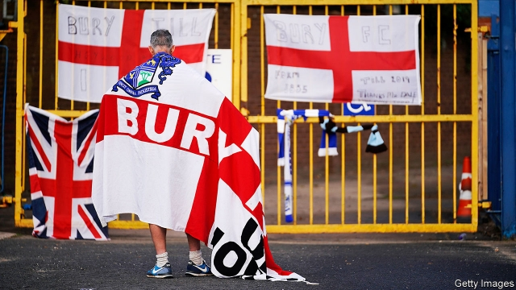

###### Bury, buried

# The end of a 134-year-old English football club 

 

> print-edition iconPrint edition | Britain | Aug 31st 2019 

ON A COOL evening in April, Bury Football Club celebrated. A 1-1 draw against Tranmere Rovers was enough to win promotion from the fourth to the third tier of English football. Four months later, the 134-year-old club is no more. Dire financial circumstances led to it being kicked out of the English Football League (EFL) on August 27th, after a rescue bid collapsed. 

Life is not easy in the lower leagues of English football. The future of Bolton Wanderers, whose stadium is just a 30-minute drive from Bury’s ground and who play in the same league, was also in doubt until a last-minute deal was reached on August 28th. If the club had not found a buyer within a fortnight, it too would have been expelled. Bolton competed at European level as recently as 2008. In its latest matches, the team has been forced to field teenagers against the often brutish journeymen who dominate this tier. 

Bury and Bolton have both suffered mismanagement. Bury’s tangled web of finances—which included a complicated mortgage on the club’s ground and a scheme by a former chairman that involved selling the club’s car-parking spaces for £10,000 ($12,200) each—caused a potential buyer to balk at the last moment. Last week Steve Dale, the businessman who acquired the club for £1 in December, admitted that he “didn’t even know there was a football team called Bury” before he bought it. Bolton had been looking for a buyer since falling into administration in May. The deal almost collapsed this weekend with the club’s administrator blaming Ken Anderson, its previous owner, for scuppering it at the last moment (Mr Anderson denies this). “Over the years some quite strange people have taken over and run football clubs,” summed up Greg Dyke, a former chairman of the Football Association, delicately. 

Strange people are common in football. This is mainly because, as a rule, buying a club is a bad idea if you plan on making money. In the Championship, the second tier of English football, wages swallow 106% of turnover, according to Deloitte, a consultancy. It is little better in League One (confusingly, the third tier), where wages make up 94% of turnover. In 2017, the last year accounts are publicly available, Bury reported a loss of £2.8m from revenues of £4.7m. (By contrast Manchester United, whose ground is a 55-minute hop on a tram from Bury, had a turnover of £590m last year and operating profit of £44m.) 

Unsurprisingly, dire financial straits are common at the bottom of the football pyramid, where there are smaller crowds and less money is to be made from sponsorship and broadcasting rights. Bury was one of ten sides to become insolvent in 2002, when a TV deal for lower-league clubs fell apart. Since then, English football clubs have entered insolvency proceedings another 27 times. Yet outright collapse is rare. Before Bury, the last club to be kicked out of the league was Maidstone United in 1992. 

Comebacks are possible. A resurrected Maidstone is clawing its way back up the footballing ladder. Groups of Bury fans have already discussed setting up a “phoenix” club. Bury has a famous history. Until last season it held the record for the biggest FA Cup final victory, with its 6-0 thrashing of Derby County in 1903. If the fans have their way, it may still have a future.■ 

