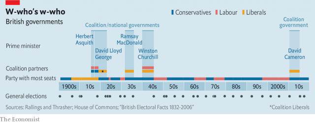

###### All you need to k-know about gnus

# Why governments of national unity are so hard to form 

 

> print-edition iconPrint edition | Britain | Aug 29th 2019 

ALL PARTIES agree their first choice of route to try to stop a no-deal Brexit should be legislation. Yet after Boris Johnson’s decision to suspend Parliament for almost five weeks, some MPs want to have in reserve a vote of no confidence. Such a vote could lead to a government of national unity (gnu) backed by a cross-party majority of MPs. This “letter-writing government”, under a caretaker prime minister, might invite the EU to extend the Brexit deadline of October 31st to allow time for a general election or another referendum. 

Yet the obstacles to a gnu are large. Proposing a vote of no confidence is not the same as winning one. Even winning one is complicated by the 2011 Fixed-term Parliaments Act, which allows 14 days for another government to secure confidence before an election must be called. Mr Johnson would remain prime minister during this period, and might fix the date for an election after October 31st, allowing no-deal by default. 

But the biggest roadblock is who should lead a gnu. As opposition leader, Labour’s Jeremy Corbyn insists he should be prime minister. Yet as he learnt this week, he will not easily win the support of other opposition parties, let alone Tory rebels. Jo Swinson, the Liberal Democrat leader, argues that any gnu should be led by a neutral grandee, such as the Conservatives’ Ken Clarke or Labour’s Harriet Harman. But Labour will not back this idea if Mr Corbyn is not on board. 

 

Andrew Blick of King’s College, London, says history shows that Mr Corbyn is wrong to claim that only the leader of the opposition can become prime minister. In 1916 David Lloyd George ousted Herbert Asquith to form a national government that lasted until 1922, only to see Labour later displace his party. In 1931 the Tories joined a national government under the Labour prime minister, Ramsay MacDonald, but he was then disowned by his own party. In 1940 the Labour opposition told Neville Chamberlain, the Tory prime minister, that it would join a national government only if it was led by Winston Churchill, who won the war but lost the 1945 election. 

Gnus are common beasts in other European countries. But as Benjamin Disraeli said, “England does not love coalitions”, an aphorism confirmed by the recent one under David Cameron. And there is a big flaw in all talk of governments of national unity. What Brexit reveals is a total lack of national unity. ■ 

