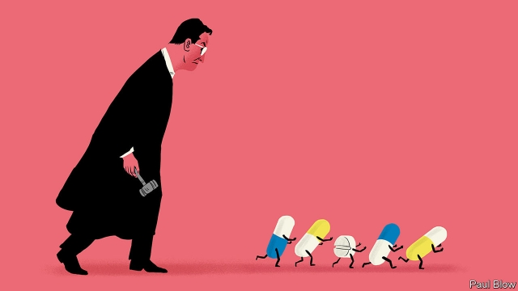

###### Opioids Inc in the dock

# Johnson & Johnson, Purdue and other opioid-peddlers face a reckoning 

 

> print-edition iconPrint edition | Business | Aug 29th 2019 

IN 2015 RICHARD SACKLER, from the billionaire family that controls Purdue Pharma, was deposed in a case related to his company’s alleged use—which it stoutly denies—of deceptive marketing to understate the addictive potential of OxyContin, its powerful opioid painkiller. The transcript of that testimony was unearthed this February, fuelling outrage over Purdue’s role in America’s growing opioid epidemic. On August 27th the video of Dr Sackler defending his firm’s flogging of OxyContin and other opioids finally emerged. This time, though, public fury was soothed by events of the previous day in Oklahoma. Judge Thad Balkman found Johnson & Johnson (J&J) guilty of creating a “temporary public nuisance” by contributing to the opioid epidemic which has claimed the lives of some 6,000 Oklahomans since 2000. He ordered it to pay $572m towards a plan to abate the crisis. 

Critics of the opioid-pushers cheered. As long ago as 2004, Purdue settled a case alleging inappropriate marketing of OxyContin with regulators in West Virginia for $10m, without admitting guilt. Since then, observes Elizabeth Burch of the University of Georgia Law School, nearly all such cases have been settled, with details of the litigation remaining under seal. The landmark trial in Oklahoma, which began in May, has already revealed the industry’s unsavoury practices. The prosecutors’ victory throws open the floodgates to strong legal action and potentially massive financial penalties. It could do to Opioids Inc what lawsuits over cigarettes did to Big Tobacco. And the pain may extend beyond drugmakers to distributors and retailers involved in the opioid trade. 

Oklahoma’s attorney-general spent months locked in a fierce battle with J&J in a state court over its responsibility for the local opioid crisis. Yet victory for the prosecutors seemed unlikely—which is why J&J punted on a trial instead of settling with the state like Purdue and Teva, an Israeli generic-drug manufacturer, which paid out $270m and $85m, respectively. Some scholars were sceptical of the prosecution’s novel interpretation of what counts as a public nuisance, a misdeed typically associated with polluters or owners of brothels. Moreover, J&J accounted for only a tiny share of opioid sales in the state. 

 

Judge Balkman’s verdict therefore came as a surprise to many. It may discourage other companies accused of complicity in the crisis from taking a chance in the courtroom, predicts David Maris of Wells Fargo, a bank. The first test of this hypothesis will be a federal case in Ohio, which is due to go to trial in October. It brings together claims from around 2,000 local governments and Native-American tribes. They are gunning for manufacturers such as J&J and Purdue, as well as lesser-known but much bigger opioid producers such as SpecGx and Actavis Pharma (see chart). But they are also going after big distributors and retailers, including upstanding household names like Walmart and Walgreens. All the companies deny wrongdoing. 

Mr Maris’s theory was bolstered a day after the Oklahoma verdict, when news reports surfaced of a dramatic deal in the works involving Purdue, the federal judge supervising the case in Ohio, and the plaintiffs in that case, as well as various state attorneys-general. The company appears willing to cough up between $10bn and $12bn, with $3bn or more coming from the Sackler family, as part of a bankruptcy transaction that would see the firm reconstituted as a public trust. If the reports are correct, the new trust would continue to produce both opioids and (perversely) drugs to counter their addictive effects. The Sacklers would lose control of their company; any future profits would go to the plaintiffs. 

All this should alarm the peddlers of the pills. Analysts differ on just how worried they ought to be. Tom Claps, a legal expert at Susquehanna Financial Group, an investment firm, calculates that the industry faces a legal risk of perhaps $37bn from ongoing cases. Patrick Trucchio of Berenberg, a German investment bank, thinks that distributors alone could face legal liabilities of $40bn. Across the entire opioid supply chain, Mr Trucchio reckons, the bill could run to a whopping $150bn. 

That is the worst-case scenario. For the time being, investors seem calm. J&J’s share price ticked up on news of the award, a fraction of the $17bn the prosecutors had demanded. It could pay the $572m penalty nine times over from its latest quarterly net profit alone. Its high-powered lawyers, who groused that the state prosecutors’ legal theory was a “radical departure” from long-standing case law, vowed to appeal against the ruling, all the way up to the Supreme Court if necessary. Even if upheld, it may carry no weight beyond Oklahoma’s borders. Most states espouse a common-law understanding of public nuisance that is much narrower than the relevant statute in Oklahoma, notes Richard Ausness of the University of Kentucky Law School. There may be echoes of this argument in future legal cases, says Ms Burch. But nothing about the Oklahoma decision predetermines outcomes elsewhere. 

Other legal theories against drugmakers and distributors have yet to be tested in court. After this week’s development, they may not get a chance. Andrew Pollis of Case Western Reserve University School of Law thinks the rest of the firms may fall in line behind Purdue. “Settlement feels impossible,” he says. “But trial is unthinkable.” ■ 

