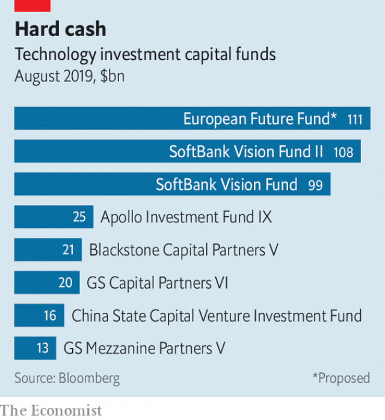

###### Softly, softly

# The Europeans want their own Vision Fund to invest in tech 

 

> print-edition iconPrint edition | Business | Aug 31st 2019 

HOW MUCH does it cost to bend the future to one’s will? Give or take $100bn, reckons Masayoshi Son, boss of SoftBank. That is the size of the Japanese conglomerate’s Vision Fund, which holds stakes in modish technology companies including WeWork and Uber. Mr Son is raising a new, similarly gargantuan pot. Now the EU wants one, too. On August 22nd news filtered out of a proposal to create a €100bn ($111bn) fund to back European firms in “strategically important” industries. 

Its proposed name and high-tech focus notwithstanding, the European Future Fund would hark back to decades past. Politicians across the old continent once believed themselves blessed with the gift of picking corporate winners. That 1970s experiment did not end well: “national champions” backed with taxpayers’ money were kept on life support with yet more of it. 

Concerns about Europe falling behind in technology, too, are old hat. In the early 2000s France and Germany were so worried about Google that they lavishly funded Quaero, a made-in-Europe search engine. A few years and tens of millions of euros later, the project was quietly deleted. 

 

But frustration among politicians about the dearth of a European Google, Amazon or Alibaba lives on. So they are minded to try again—this time seeking to create “European champions”, not national ones. Industries now deemed in need of politicians’ wisdom to thrive—one plausible reading of “strategic”—include batteries and anything related to artificial intelligence (though the French in particular apply the term loosely, once blocking the takeover of Danone, a yogurt-maker, over ill-defined strategic concerns). 

The Brussels machinery could once be trusted to dampen fervour for such industrial policy. In February the European Commission, the EU’s executive arm, blocked a merger of the rail arms of Siemens, a German engineering giant, and Alstom of France on competition grounds, putting paid to Franco-German dreams of a continental titan. 

Now the mood among Eurocrats is shifting. Margrethe Vestager, the bloc’s respected competition chief, who repeatedly kiboshed political efforts to mollycoddle favoured industries, is probably on her way out (of her current job; she will almost certainly stay in Brussels). Historically a French hobby-horse, dirigisme has found favour with German policymakers. Ursula von der Leyen, a German who will take over as commission president on November 1st, has spoken in the past of the need for Europe to “update our industrial policy”. Politicians of most stripes want to erect a Fortress Europe to defend companies from bullying by Trumpian America and assault by state-backed Chinese groups. 

The mooted fund is far from investing its first euro. Ms von der Leyen has distanced herself from the idea. Soon after Politico, a news outlet, reported the proposal, the commission described it as “draft internal brainstorming”. Maybe. It seems pretty thorough in some respects, like how it might be funded (public money bolstered by private-sector investors) and ways it could “support” companies by taking direct stakes in them. In others, less so. Most notably missing is a list of promising high-tech candidates for the pot’s largesse. To bend the arc of progress European politicians need to grab onto something.■ 

