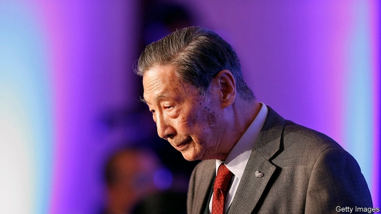

###### Ghost at the feast

# China bans an independent think-tank critical of its policies 

 

> print-edition iconPrint edition | China | Aug 31st 2019 

FOR RESEARCHERS devoted to the rule of law, the end was fitting. Drawing on patchwork regulations that appear to violate the Chinese constitution, local authorities in Beijing at last found a pretext to ban the Unirule Institute of Economics, that rarest of things in China, an independent think-tank known for criticising the government. For years Unirule had faced pressure, including evictions from multiple offices, to quiet down, and yet had managed to go on functioning. But it saw no way around the ban, issued last month, and so on August 26th announced that it would stop all activities. 

Founded in 1993, Unirule always resided on the fringes of Chinese policy discussions, bringing together a collection of liberal economists who were strong believers in free markets. It published a series of books about institutional reform, including on how to slim down state-owned firms. It delved into topics such as the design of China’s health-care system and land-ownership rules. It also convened forums every two weeks; its last, the 600th, was a theoretical discussion about network effects in economics. A steady stream of eminent economists and senior officials came through Unirule’s doors over the years, eager to hear its perspectives, so different from those propagated by right-thinking state-affiliated institutions. 

Unirule’s scholars tried to avoid landmines. For instance, they refrained from criticising Xi Jinping, China’s president, by name. But their dislike of China’s state model always made them vulnerable. As far back as 2004 Unirule lost the support of a government agency that had sponsored it, forcing it to reorganise as the research unit of a consultancy. One of its founders, Mao Yushi, earned admirers abroad: the Cato Institute, an American think-tank, awarded him a prize in 2012 for his advocacy of a more open political system in China. At home, though, he faced attacks. Some bloggers branded him a traitor. 

Over the past few years, as Mr Xi has tightened his grip, Unirule has been increasingly boxed in. Its website was shut down, although it later reopened, hosted abroad. In the past its members could publish articles in more liberal newspapers such as Southern Weekly; these days their submissions are rejected. Their accounts on Chinese social-media platforms such as WeChat are frequently blocked. The authorities have also stepped up harassment of the institute. Last year its landlord briefly welded steel bars across the door to its office, a cramped converted apartment, while staff were inside. 

Sheng Hong, Unirule’s director, maintained his stubborn belief in rules-based governance even as his think-tank met its end. The ban, he says, is a violation of article 35 of China’s constitution, which promises freedom of speech and assembly. But he is under no illusion about what truly lies behind Unirule’s woes. “Leaders today don’t believe that different voices are good for society and good for government,” he says. “That will really come to hurt China.” 

Tellingly, though, he was still more guarded than scholars outside China. “Xi’s tolerance for independent voices and criticism is absolutely zero. It’s non-existent,” laments Minxin Pei of Claremont McKenna College in California. “Forty years after the Cultural Revolution, this is absolutely the worst period.” It is a wonder that Unirule survived as long as it did.■ 

-- 

 单词注释:

1.Aug[]:abbr. 八月（August） 

2.patchwork['pætʃwә:k]:n. 拼缝物, 拼凑物 

3.pretext['pri:tekst]:n. 借口, 托词 v. 以...为借口 

4.criticise['kritisaiz]:v. 批评, 吹毛求疵, 非难 

5.eviction[i'vikʃәn]:n. 逐出, 赶出 [法] 收回财产, 收回租地, 没收 

6.alway['ɔ:lwei]:adv. 永远；总是（等于always） 

7.reside[ri'zaid]:vi. 住, 居留, 属于 [法] 居住 

8.fringe[frindʒ]:n. 边缘, 端, 流苏, 穗, 初步 vt. 加穗于, 加饰边于 a. 边缘的, 附加的 

9.economist[i:'kɒnәmist]:n. 经济学者, 经济家 [经] 经济学家 

10.believer[bi'li:vә]:n. 信徒 

11.sery[]:n. (Sery)人名；(俄)谢雷；(科特)塞里 

12.institutional[.insti'tju:ʃәnәl]:a. 制度的, 公共机构的, 学会的 [法] 组织机构的, 制度的, 公共机构的 

13.delve[delv]:v. 探究, 查考 n. 坑, 穴 

14.convene[kәn'vi:n]:vt. 集合, 召集, 召唤 vi. 聚集, 集合 

15.forum['fɒ:rәm]:n. 论坛, 公开讨论的广场, 法庭, 讨论会 [法] 讨论会, 专题讨论, 公共论坛 

16.eminent['eminәnt]:a. 显赫的, 杰出的, 有名的 

17.propagate['prɒpәgeit]:vt. 繁殖, 传播, 传送 vi. 繁殖, 蔓延 

18.landmine[ˈlændmaɪn]:n. 地雷, 投伞水雷 

19.refrain[ri'frein]:n. 重复的话, 叠句, 副歌 vi. 节制, 避免, 克制 

20.vulnerable['vʌlnәrәbl]:a. 易受伤害的, 有弱点的, 易受影响的, 脆弱的, 成局的 [医] 易损的 

21.reorganise[]:vi.vt. 改组, 改革, 整顿, 整编, 改编 

22.consultancy[]:n. 商量, 协商, 磋商, 会诊, 与...商量, 咨询, 请教, 找(医生)看病, 查阅, 考虑 [经] 咨询业务, 咨询服务 

23.founder['faundә]:n. 创立者, 建立者 vt. 使沉没, 使摔倒, 弄跛, 浸水, 破坏 vi. 沉没, 摔到, 变跛, 倒塌, 失败 

24.admirer[әd'maiәrә]:n. 钦佩者, 仰慕者, 求爱者 

25.Cato['keitәu]:加图(①姓氏 ②Marcus Porcius, 前234-前149, 罗马政治家, 将军, 称为“老加图” ③Marcus Porcius, 前95-前46, 罗马斯多噶派 哲学家, 政治家, 老加图的曾孙, 称为“小加图”) 

26.advocacy['ædvәkәsi]:n. 拥护, 支持, 鼓吹, 辩护, 辩护术 [法] 辩护, 拥护, 提倡 

27.blogger[]:n. 写博客的人；博客使用者 

28.tighten['taitn]:vt. 勒紧, 使变紧 vi. 变紧, 绷紧 

29.reopen[.ri:'әupәn]:v. 重开, 再开始, 再开 

30.submission[sәb'miʃәn]:n. 屈服, 服从, 谦恭, 呈递, 提交, 意见 [经] 提交, 提出, 提交公断 

31.WeChat[]:[网络] 微信；微讯；腾讯微信 

32.harassment['hærәsmәnt]:n. 困扰, 烦扰, 烦恼 [法] 折磨, 骚扰, 侵扰 

33.briefly['brifli]:adv. 简短地, 扼要地, 简明地, 简单地 

34.cramp[kræmp]:n. 痉挛, 腹部绞痛, 铁夹钳 a. 狭窄的, 难认的 vt. 使抽筋, 以铁箍扣紧, 束缚 

35.sheng[ʃeŋ]:n. 笙（中国的一种民族乐器） 

36.hong[hɔŋ]:n. （中国、日本的）行, 商行 

37.governance['gʌvәnәns]:n. 统治, 统辖, 管理 [法] 统治, 管理, 支配 

38.violation[.vaiә'leiʃәn]:n. 违反, 违背, 妨碍 [法] 违犯, 违背, 违反 

39.woe[wәu]:n. 悲哀, 悲痛, 苦痛 

40.tellingly['teliŋli]:adv. 有效地；显著地 

41.lament[lә'ment]:n. 悲叹, 悔恨, 恸哭, 挽歌, 悼词 vt. 哀悼 vi. 悔恨, 悲叹 

42.minxin[]:[网络] 同此承保公司 

43.pei[]:abbr. 搪瓷研究所（Porcelain Enamel Institute）；初步工程检验（Preliminary Engineering Inspection） 

44.Claremont[]:n. 克莱尔蒙特（美国一城市） 

45.mckenna[mә'kenә]:n. 麦肯纳（姓氏） 

46.California[.kæli'fɒ:njә]:n. 加利福尼亚 

47.cultural['kʌltʃәrәl]:a. 文化的, 教养的, 修养的 [医] 培养的 

