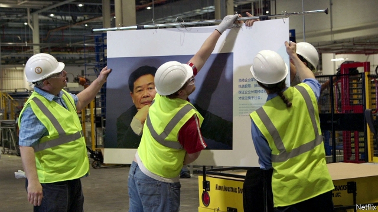

###### Blue-collar workers

# A Netflix documentary provokes reflection in China 

 

> print-edition iconPrint edition | Finance and economics | Aug 31st 2019 

THE COMMENTS came in thick and fast on Douban, a social network popular with film buffs and bookworms. More appeared on Weibo, a microblogging website, where the hashtag #AmericanFactory has gained more than 16m views. The documentary of that name, by a film-making couple from Ohio, was released on August 21st on Netflix. The American firm’s streaming service is not available in China, but pirated copies of the film have proliferated. Strikingly, it has drawn praise—even as the Sino-American trade war stokes nationalist feelings within China. 

That reception is partly a testament to the faultlessly balanced take of “American Factory”, shaped by 1,200 hours of rare footage. Much was shot inside a plant in Dayton, Ohio, which was taken over in 2014 by Fuyao, a Chinese glass-making giant that supplies the global car industry. In 2008 General Motors had closed its complex there, so for jobless local people Fuyao’s arrival was a miracle. Before long, however, Stakhanovite bosses clashed with a restive and outspoken factory floor. The film is a parable of modern manufacturing, showing the strengths and weaknesses of each country. For Chinese viewers, the failings of theirs hit home. 

“It was hard to watch,” wrote a user on Douban. “Who does not know that Chinese efficiency is driven by depriving workers living at the bottom of society of their health, safety and dignity?” Another comment came from the city of Fuqing, Fuyao’s base, to which American managers are taken to be trained in Chinese factory-floor culture (they are alarmed to see workers crouched on mountains of shards, sorting them for recycling, and bewildered by the militaristic morning roll-calls and 12-hour shifts). “The scariest thing is that we have grown used to this,” wrote the native of Fuqing, pondering whether to feel pride or sorrow at management methods like Fuyao’s. 

Young Chinese have begun to resist them. Earlier this year engineers in the cut-throat technology industry led a rare online labour movement to protest against the “996” regime (a de facto work schedule of 9am to 9pm, six days a week, often without extra pay for those extra hours). Last year students and activists joined protests by factory workers at Jasic, a maker of welding machinery in Shenzhen. 

Their gripes were poor working conditions and firings after some had tried to unionise—something that in America Fuyao fought tooth and nail, and successfully, to block. “American Factory” depicts a collision between two working cultures. But worries about the plight of blue-collar workers unite them. 

■ 

-- 

 单词注释:

1.netflix[]:n. 全球十大视频网站中唯一收费站点 

2.documentary[.dɒkju'mentәri]:n. 记录片 a. 文件的 

3.provoke[prә'vәuk]:vt. 激怒, 惹起, 诱导 [法] 刺激, 煽动, 激怒 

4.Aug[]:abbr. 八月（August） 

5.buff[bʌf]:n. 暗黄色, 暗黄色皮革, 人的皮肤 vt. 擦亮, 使柔软 a. 暗黄色的 

6.bookworm['bukwә:m]:n. 书呆子, 蛀书虫 

7.Weibo[]:[网络] 新浪微博；我的微博；个人微博 

8.microblogging[ 'maɪkrəʊblɒgɪŋ]: 微博 

9.hashtag['hæʃtæg]:n. 井号(#)标签（微博twitter中用来标注线索主题的标签） 

10.Ohio[әu'haiәu]:n. 俄亥俄 

11.pirate['paiәrәt]:n. 海盗, 盗印者, 侵犯专利权者 vt. 盗印, 掠夺, 翻印 vi. 做海盗, 从事劫掠 

12.proliferate[prәәu'lifәreit]:vi. 增殖, 激增, 扩散 vt. 使激增 

13.strikingly[]:adv. 显著地, 惊人地, 引人注目地 

14.stoke[stәuk]:v. 司炉, (使)大吃 

15.nationalist['næʃәnәlist]:n. 国家主义者, 民族主义者 

16.testament['testәmәnt]:n. 遗嘱, <<圣约书>> [法] 遗言, 遗嘱, 确实的证明 

17.faultlessly['fɒ:ltlisli]:adv. 完美地, 无缺点地 

18.footage['futidʒ]:n. 英尺长度, 英板尺, (影片的)连续镜头 

19.dayton['deitən]:n. 代顿（美国俄亥俄州西南部城市） 

20.jobless['dʒɔblis]:a. 失职的, 无职业的 [经] 失业的 

21.Stakhanovite[stәkɑ:nәvait]:a. 斯达汉诺夫运动的 

22.clash[klæʃ]:n. 冲突, 撞击声, 抵触 vi. 冲突, 抵触 vt. 使发出撞击声 [计] 对撞 

23.restive['restiv]:a. 不愿向前走的, 倔强的, 难驾御的 

24.parable['pærәbl]:n. 寓言, 隐晦的比较 

25.manufacturing[.mænju'fæktʃәriŋ]:n. 制造业 a. 制造业的 

26.failing['feiliŋ]:n. 失败, 缺点 prep. 如果没有... a. 失败的 

27.deprive[di'praiv]:vt. 剥夺, 使丧失 [法] 剥夺, 剥夺, 夺去 

28.Fuqing[]:福清（中国地名）  

29.crouch['krautʃ]:n. 蹲伏, 蜷缩 vi. 蹲下, 蜷着, 缩着 vt. 低头 

30.shard[ʃɑ:d]:n. 陶瓷碎片, 鞘翅, 薄硬壳 

31.recycling[]:[电] 再循环 

32.bewilder[bi'wildә]:vt. 使迷惑, 使不知所措 

33.militaristic[.militә'ristik]:a. 军国主义的 

34.scary['skєәri]:a. 容易受惊的, 胆小的, 提心吊胆的 

35.ponder['pɒndә]:v. 沉思, 考虑 

36.online[]:[计] 联机 

37.regime[rei'ʒi:m]:n. 政权, 当权期间, 政体, 社会制度, 体制, 情态 [医] 制度, 生活制度 

38.de[di:]:[化] 非对映体过量 [医] 铥(69号元素铥的别名,1916年Eder离得的假想元素) 

39.facto[]:[法] 实际上, 事实上 

40.activist['æktivist]:n. 激进主义分子 

41.maker['meikә]:n. 制造者, 上帝 [经] 制造者, 出票人 

42.machinery[mә'ʃi:nәri]:n. 机器, 机械装置, 机构 [化] 机械 

43.shenzhen['ʃʌn'dʒʌŋ]:n. 深圳 

44.gripe[graip]:n. 紧握, 柄, 把手, 控制 vt. 抓紧, 抱住, 使肠痛, 激怒 vi. 肠绞痛, 抱怨 

45.firing['faiәriŋ]:n. 烧毁, 焚烧, 加热, 添煤 [计] 点火 

46.depict[di'pikt]:vt. 描述, 描写 

47.plight[plait]:n. 困境, 窘境 vt. 宣誓, 保证 

