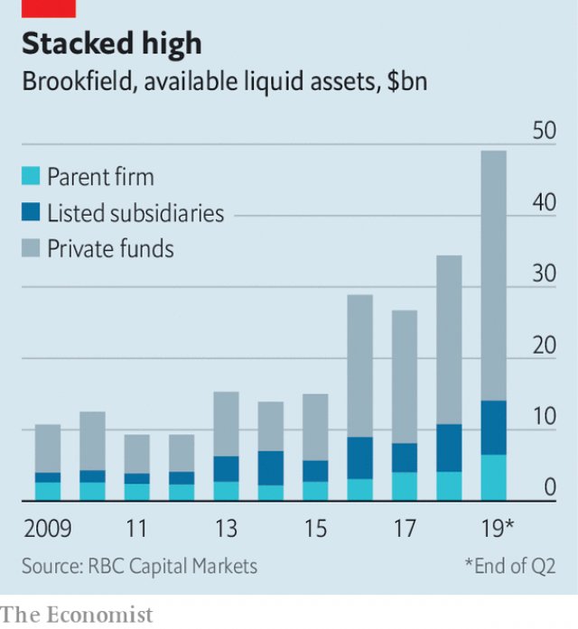

###### Tower grab

# How a Canadian firm has taken on Wall Street’s private-equity titans 

 

> print-edition iconPrint edition | Finance and economics | Aug 31st 2019 

ON THE 67TH floor of One Manhattan West, a new glass tower in the island’s drab south-west, construction managers survey the skyline. They are about to sign off on a feat of engineering. The 303-metre skyscraper is the tallest part of a $5bn office, retail and residential project covering an area the size of 100 football fields. Resting on a huge concrete slab covering active rail tracks, the weight is carried by a column sitting on the sturdiest parts. The first tenants are due to move in within weeks. 

One Manhattan West is the culmination of a decades-long bet by Brookfield Asset Management. The Canadian firm bought the land in 1996 as part of its swoop on Olympia and York, a bankrupt builder. The towers are an apt metaphor for its success in alternative asset management, investing in the likes of property, infrastructure and private equity. With $388bn under management (debt included), it rivals Wall Street giants like Blackstone and Carlyle. Insiders reckon it can grow further. 

Most buy-out giants were founded in recent decades by investment bankers. Brookfield, by contrast, started with São Paulo’s tramway and power lines in 1899 and spent most of its history operating infrastructure and property projects in the Americas. By 1990 it was a conglomerate of “somewhat disparate assets”, says Neil Downey of RBC Capital Markets, a bank, spanning beer, baseball, forests, mines and more. After it struggled during the recession of the early 1990s a team of executives that included Bruce Flatt, now the boss, narrowed the focus. 

A decade later Brookfield started to invest third-party money. In the mid-2000s it began to raise private funds for property, infrastructure, private equity and renewables. It then listed its public funds on the New York Stock Exchange (it is listed in Amsterdam, New York and Toronto). The strategy took time to reap rewards. “Going into the financial crisis, it was a strong company. But it was relatively small,” says David Hodes of Hodes Weill, a firm that helps funds find investors. Some investors were confused by its complex structure, with the parent firm, listed vehicles and private funds all hunting for deals. 

But the crisis proved a boon. After several peers collapsed under debt built up during the boom years, Brookfield could draw on private and public capital to pick up the pieces. Experienced at turnarounds, it snapped up at a discount projects others thought too troubled. It was also lucky with timing, Mr Flatt says. As central banks’ bond-buying sprees hammered returns on the safest assets, the sorts of tangible, cash-generating projects that Brookfield runs became popular with cautious investors like insurers and pension funds. 

Investing other people’s money is now its biggest business. It earns fees on $164bn of third-party capital, four times as much as it invests from its balance-sheet. Sohrab Movahedi of BMO, a bank, reckons that will rise to $276bn by 2021. More than 700 institutions back its private funds. Its investments span more than 30 countries and punctuate skylines in financial capitals including London, Sydney and Toronto. The retail space it owns would fill two New York Midtowns. It runs 37 ports and more than 10,000km of rail tracks. Its renewables plants produce twice as much clean energy as green-minded Denmark. 

 

Another recession could provide another boost. It has ample liquidity (see chart). Completion of its $4.7bn acquisition of Oaktree Capital, a credit-investment firm, is imminent. That will cement its position as a one-stop shop for alternative assets, at a time when investors are seeking to consolidate their holdings. When growth fades it will be able to seek high rewards by buying the debt of ailing businesses, Oaktree’s speciality. “When people panic they sell things too cheap,” says Howard Marks, Oaktree’s co-founder. “And when the environment settles down, prices tend to recover. It’s a good way to make a living.” 

Could Brookfield be getting greedy? Like other buy-out firms, it is raising record amounts, leading some to worry that capital is coming in too fast to be spent without mistakes. And though Mr Flatt argues that Brookfield’s size means it can gobble up assets that many rivals would find indigestible, there is the matter of eventually exiting these mega-projects, says Lincoln Webb of British Columbia Investment Management Corporation, a client of Brookfield’s infrastructure franchise. Just as few can buy mega-projects, there might be limited takers when it comes to sell, should that coincide with poor conditions for initial public offerings. 

Yet by private-equity standards Brookfield’s funds have long durations, and the largest are nowhere near maturity. Its access to public equity also means it can be patient, as it was for the years it held the disused plot that is now home to One Manhattan West. And institutional investors in its funds with long-term liabilities may be keen to team up for the cash-yielding assets it will want to divest. As economic clouds gather, Brookfield’s horizons look enviably clear. ■ 

