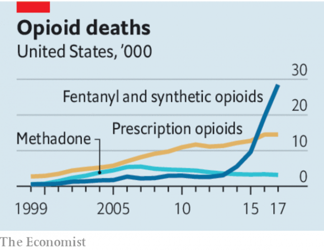

###### Opioids

# Legal settlements alone will not solve America’s opioid crisis 

 

> print-edition iconPrint edition | Leaders | Aug 31st 2019 

THIS WEEK saw a landmark reckoning in court for a drugmaker involved in America’s opioid disaster. A judge in Oklahoma ordered Johnson & Johnson (J&J) to pay $572m to fund a state plan to combat opioid addiction. Whatever the outcome of J&J’s legal appeal, this is a milestone in a public-health calamity that cost 47,600 American lives in 2017 and could well claim a further 500,000 over the next decade (see article). Faced with such devastation, states, counties and municipalities have served firms with roughly 2,500 lawsuits. 

The roots of the epidemic lie in the marketing of prescriptions by pharma firms almost 25 years ago. Opioids have long been known to be highly addictive and easy to overdose on. Almost one in five addicts dies within a decade. Yet newer versions of the drugs were sold as having lower risks. Firms also worked hard to promote the idea that doctors were undertreating chronic pain. 

Drugmakers involved in mis-selling opioids could begin to make amends by shouldering their share of the blame and settling quickly. That way the money will arrive sooner, and less of it will go to lawyers. There are encouraging signs that Purdue Pharma, which lies at the origin of the epidemic, may settle a batch of lawsuits for up to $12bn. Yet it is vital not to lose sight of why the opioid crisis struck America so much harder than anywhere else. The blame lies partly with the incentives woven into its health-care system. 

For a start, many drug distributors and pharmacies, mesmerised by growing sales, failed to take action, as they are obliged to, when signs emerged that opioids were being diverted for illicit use. Doctors and hospitals, eyeing the bottom line, also veered towards incaution when handing out pills. The system put sales and “customer” satisfaction before patients’ well-being. Medical-professional societies were at best supine, and in a few cases complicit in encouraging overuse. Regulators fell short, too. States could have limited prescription volumes, or set rules for how opioids were to be prescribed. The Food and Drug Administration (FDA), the federal regulator, failed to take account of the public-health impact of opioids when it deemed them safe. It has since not done enough to reform its approval regime, and it has still not properly reassessed the opioids already on the market to determine whether they need to be removed from sale. 

 

Keen to signal they mean business, some states have introduced laws to tighten supply. Paradoxically, perhaps, they need to be careful. Prescription opioids are no longer the main cause of death from addiction. Efforts to cut off people who are addicted risk sending them onto the black market for supplies. Regulators need to focus instead on medically assisted treatment for addicts, which has been scandalously neglected. This would save thousands of lives a year. 

The full cost of dealing with the crisis will run to hundreds of billions of dollars, which is why legal redress is needed—and why, unlike in tobacco settlements, the damages from pharma companies should go directly into alleviating the harm from opioids rather than into general government spending. Unfortunately, even then, generous settlements with drug firms and distributors will not foot the entire bill. Large sums will thus have to come from taxpayers. 

All this should be a warning to governments everywhere. In most parts of the world there is a shortage of pain relief. But as governments expand access to drugs, they should heed the lessons from America. Opioids need to be dispensed according to properly enforced rules. Regulators have a role in supervising how they are marketed. Doctors should be vigilant and inform patients of the risks. None of this is to absolve the companies that mis-sold drugs or looked the other way. Patients have a right to expect high ethical standards from those who supply their medicines. But making sure that opioids are a gift to humanity and not a curse is a job for the entire health system. ■ 

-- 

 单词注释:

1.opioid[əʊ'pi:əʊɪd]:a. 类鸦片（引起）的 n. 类鸦片活性肽 

2.Aug[]:abbr. 八月（August） 

3.landmark['lændmɑ:k]:n. 陆标, 划时代的事, 地界标 [医] 界标 

4.reckon['rekәn]:vt. 计算, 总计, 估计, 认为, 猜想 vi. 数, 计算, 估计, 依赖, 料想 

5.drugmaker['drʌ^,meikә(r)]:制药者 

6.Oklahoma[.әuklә'hәumә]:n. 俄克拉何马 

7.johnson['dʒɔnsn]:n. 约翰逊（姓氏） 

8.combat['kɒmbæt]:n. 争斗, 战斗 vi. 战斗, 争斗 vt. 与...战斗, 与...斗争 

9.addiction[ә'dikʃәn]:n. 入迷, 瘾 [医] 瘾, 癖嗜 

10.milestone['mailstәun]:n. 里程碑, 里程石, 里程标 

11.calamity[kә'læmiti]:n. 灾难, 不幸事件 

12.devastation[.devә'steiʃәn]:n. 毁坏 

13.municipality[.mju:nisi'pæliti]:n. 自治区, 市当局, 市民 [法] 市, 自治市, 自治地区 

14.lawsuit['lɒ:sju:t]:n. 诉讼 [法] 诉讼, 诉讼案件 

15.epidemic[.epi'demik]:n. 传染病, 流行病 a. 流行的, 传染性的 

16.marketing['mɑ:kitiŋ]:n. 行销, 买卖 [经] 推销, 在市场买卖, 销售 

17.pharma[]:n. 制药公司 

18.addictive[ә'diktiv]:a. 上瘾的 

19.overdose['әuvәdәus]:n. 配药量过多 vt. 配药过量, 使过分沉溺 

20.addict[ә'dikt]:vt. 使沉溺, 使上瘾 n. 入迷的人, 上瘾者 

21.undertreating[]:不完全热处理 

22.chronic['krɒnik]:a. 慢性的, 习惯性的 n. 慢性病患者 

23.amend[ә'mend]:vt. 修改, 改善, 改良 vi. 改过自新 

24.quickly['kwikli]:adv. 很快地 

25.les[lei]:abbr. 发射脱离系统（Launch Escape System） 

26.purdue[]:n. 普杜大学（美国一所大学） 

27.pharma[]:n. 制药公司 

28.batch[bætʃ]:n. 一次所烘的面包, 一次所制之量, 一组, 批, 成批, 分批 v. 成批, 分批处理 [计] 一批 

29.incentive[in'sentiv]:n. 动机 a. 激励的 

30.distributor[dis'tribjutә]:n. 分发者, 分布者, 散布者, 分配者, 销售者, 分配器, 配电盘, 自动拆版机 [计] 分配器 

31.pharmacy['fɑ:mәsi]:n. 药房, 配药学, 制药业 [医] 药学, 药剂学, 调剂学, 药房 

32.mesmerise['mezmәraiz, 'mes-]:vt. 对...施催眠术, 使目瞪口呆, 使入迷 

33.divert[dai'vә:t]:vt. 转移, 使欢娱 vi. 转移 

34.illicit[i'lisit]:a. 不法的, 不正当的, 禁止的 [法] 违法的, 违禁的, 被禁止的 

35.veer[viә]:vi. 转向 vt. 使转向 n. 转向 

36.incaution[in'kɒ:ʃәn]:n. 不小心, 粗心大意 

37.supine[sju:'pain]:a. 仰卧的, 掌心向上的, 懒散的 [医] 仰卧的, 旋后的 

38.complicit[kәm'plisit]:a. 有同谋关系的,串通一气的[由 complicity 逆构] 

39.overuse[.әuvәr'ju:z]:vt. 使用过度 n. 过度使用, 任意驱使 

40.regulator['regjuleitә]:n. 调整者, 校准者, 校准器, 调整器, 标准钟 [化] 调节剂; 调节器 

41.fda[]:abbr. （美）食品及药物管理局（Food and Drug Administration） 

42.deem[di:m]:v. 认为, 相信 

43.regime[rei'ʒi:m]:n. 政权, 当权期间, 政体, 社会制度, 体制, 情态 [医] 制度, 生活制度 

44.reassess[.ri:ә'ses]:vt. 再评价, 再摊派, 再课税 

45.tighten['taitn]:vt. 勒紧, 使变紧 vi. 变紧, 绷紧 

46.paradoxically[]:adv. 反论, 荒谬, 自相矛盾, 似非而可能是 

47.medically[]:adv. 医学, 医疗, 医术, 内科, 医药 

48.scandalously['skændələsli]:adv. 过分地；诽谤性地；令人愤慨地 

49.redress[ri'dres]:n. 赔偿, 补救, 矫正 vt. 纠正, 赔偿, 救济 

50.alleviate[ә'li:vieit]:vt. 减轻, 使缓和 

51.taxpayer['tækspeiә]:n. 纳税人 [法] 纳税人, 纳税义务人 

52.heed[hi:d]:n. 注意, 留心 v. 注意, 留心 

53.dispense[dis'pens]:vt. 分发, 分配 vi. 特许, 豁免 

54.supervise['sju:pәvaiz]:v. 监督, 管理, 指导 

55.vigilant['vidʒilәnt]:a. 警觉的, 警戒的, 警惕的 [法] 警醒的, 警戒的, 注意的 

56.absolve[әb'zɒlv]:vt. 宣告...无罪, 赦免, 免除 [经] 免偿(债务), 解除 

57.ethical['eθikәl]:a. 伦理的, 民族的, 民族特有的 [医] 伦理的, 道德的 

58.humanity[hju:'mæniti]:n. 人性, 人类, 博爱 

