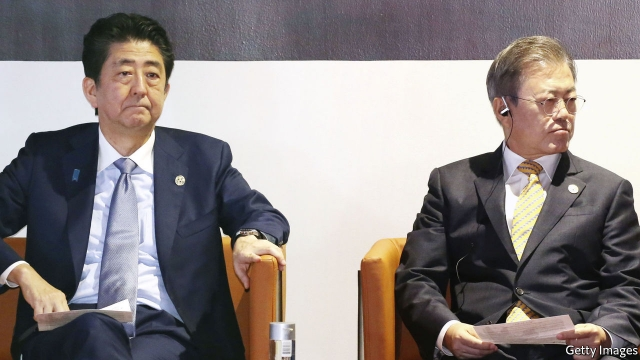

###### Slight club

# South Korea and Japan are taking their historical feud too far 

 

> print-edition iconPrint edition | Leaders | Aug 31st 2019 

NORTH KOREA has spent the past few weeks testing an apparently new missile. It seems to have only a short range, so does not much bother President Donald Trump, who says what matters is stopping North Korea from developing missiles that can reach America. But the governments of South Korea and Japan are naturally alarmed. The missile can manoeuvre in flight, making it harder for anti-missile batteries to shoot it down. And “short range” is relative: the weapon seems to have the capacity to slam a nuclear warhead into Seoul or Tokyo. 

How have South Korea and Japan reacted to this alarming threat? Not, as you might expect, by putting their heads together to work out what North Korea’s device is capable of and how they can best counter it, but the reverse. On August 22nd, two days before the latest missile launch, South Korea said it would let an intelligence-sharing pact with Japan lapse. A few days later it further antagonised Japan by conducting big military exercises in the sea between the two countries, around two rocky islands which Japan claims, but which South Korea controls. 

South Korea’s provocations are just the latest blows in a growing tit-for-tat dispute (see article). They are a petulant reaction to Japan’s abrupt decision to remove South Korea from a list of trusted countries subject to minimal export controls and to impose extra restrictions on shipments of chemicals that are essential to chipmaking. That affront came in response to a ruling from South Korea’s Supreme Court, which found that Japanese companies should pay compensation to South Korean plaintiffs forced to work in Japanese factories during the second world war, even though the two countries had signed a treaty that supposedly resolved all claims. 

Japan and South Korea often fight about the past. Many South Koreans feel, quite rightly, that Japan has not sufficiently acknowledged, let alone properly atoned for, all the horrors of its colonial rule over the Korean peninsula. Many Japanese feel, quite rightly, that South Korean governments often foster fsthis resentment for domestic political purposes and are constantly changing their mind about what they want Japan to do. The result has been decades of bickering. 

The latest outbreak of this row is especially worrying because it is infecting areas that had previously been immune to it. South Korea’s willingness to curb intelligence-sharing is unnerving, given the gravity and immediacy of the threat from North Korea in particular. But equally troubling is the alacrity with which Japan imposed trade sanctions. South Korean chipmakers have not had any trouble getting hold of the chemicals they need so far but, by imposing export restrictions, Japan seems to be signalling that it could at any moment cripple South Korea’s biggest industry—a wildly aggressive, disproportionate threat. 

Japan and South Korea need to wake up to their real interests, but Mr Trump also has a duty to help. He is partly to blame for this mess. His enthusiasm for using tariffs and other trade restrictions to compel governments to bow to his will has established a dangerous pattern of behaviour, which Shinzo Abe seems all too happy to follow. Neither has Mr Trump been prepared to take on the role America used to play in Asian rows, of knocking heads together. “How many things do I have to get involved in?” he moaned, when asked whether he was prepared to mediate. 

The network of alliances that America has built up in Asia to counter not just North Korea, but also China, has been hugely valuable to regional and global stability. Without careful maintenance, it risks disintegrating. If Mr Trump really wants to persuade North Korea and China to behave well, he should start by getting his allies to respect each other. ■ 

