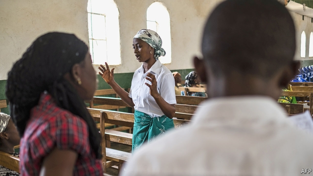

###### Sensing the end

# Kimbanguists believe Congo’s suffering is a sign of the apocalypse 

 

> print-edition iconPrint edition | Middle East and Africa | Aug 31st 2019 

THERE IS A reason that men with machetes keep killing people in Congo and that Ebola has infected close to 3,000 people there. These are signs that the end is nigh, claims Reverend Eddy Kybantu of the Kimbanguist church, a branch of Christianity. Simon Kimbangu, who founded the church in 1921, said Congo would endure pestilence, poverty and war shortly before the end of time—and salvation for believers. “Papa Kimbangu is preparing us, he knows it’s not long,” says Mr Kybantu. 

Such dismal beliefs do not put off Kimbanguists. They make up about 10% of Congo’s 85m-100m people. The church says it has 22m members worldwide. Today it is run by the founder’s grandson, Simon Kimbangu Kiangani, who lives in the hilltop town of Nkamba—or “New Jerusalem”, as Kimbanguists call it. The younger Mr Kimbangu, like his grandfather, is believed to be the human form of the Holy Spirit, able to cure the sick, raise the dead and see the future. 

Kimbanguists adhere to an ascetic lifestyle. Sex before marriage is banned, as are alcohol, tobacco and homosexuality. But this isn’t simple puritanism. Kimbanguists are also forbidden from sleeping naked, in case God calls on them at night. Pork is prohibited because pigs are vessels for evil spirits. Kimbanguists must pray eight times a day, fast twice a week and attend a nine-hour church service every Sunday. 

The elder Kimbangu was sent by God “to save the black man”, says Seros Muyisa, a believer. But the saviour’s timing wasn’t great. When thousands of people flocked to Nkamba to catch a glimpse of Kimbangu performing miracles, the Belgians, who controlled Congo at the time, felt threatened. He was found guilty of undermining public security and died in prison 30 years later. 

At a Kimbanguist service in Goma the congregation sits barefoot, wearing immaculate green and white uniforms. The colours symbolise hope and peace. Your correspondent is handed a green scarf, to cover her hair, and a wraparound skirt, because women are not supposed to wear trousers to church. A pastor stands at a green pulpit, booming out prayers through a microphone. A brass band plays at regular intervals. The apocalypse may be coming, but all seems remarkably calm.■ 

