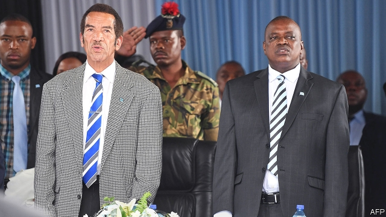

###### A diamond in the rough

# The battle of Botswana’s big men 

 

> print-edition iconPrint edition | Middle East and Africa | Aug 31st 2019 

“ELEPHANTS EXCITE most children,” says Timex Moalosi, the chief of Sankuyo, in northern Botswana. “But not ours.” Since the country’s former president, Ian Khama (pictured, left), suspended game-hunting in 2014, pachyderms have besieged the village, stomping crops and scaring kids. The destruction upset residents, as did the loss of income from selling permits to gun-wielding tourists. So when Mokgweetsi Masisi, Botswana’s current president (right), reversed the ban in May, Sankuyo rejoiced. 

Others were unhappy. For Mr Khama, the decision was seemingly the straw that broke the elephant’s back. The ex-president said he should not have anointed the “immature” Mr Masisi in 2018. In May Mr Khama left the Botswana Democratic Party (BDP), which has ruled since independence in 1966, and endorsed a new party, the Botswana Patriotic Front (BPF). The BPF is loosely allied to the main opposition coalition, the Umbrella for Democratic Change (UDC). Elections are in October. 

At first glance it is a personal feud. Mr Masisi has ditched flagship policies of Mr Khama’s, like the hunting ban. He has cut his predecessor’s privileges, such as flying on official aircraft. He has dismissed Mr Khama’s allies, including Isaac Kgosi, the intelligence chief. It is rumoured that Mr Masisi broke a promise to appoint Mr Khama’s younger brother, Tshekedi, as vice-president. But for all the elements of soap opera, the drama is deeply serious. Botswana, arguably Africa’s most successful state, is in unprecedented flux. 

When it became independent it was one of the world’s poorest countries. The southern African state, almost the size of France, had 7.5 miles of paved roads; 22 citizens had degrees. In the parliament of the outgoing colonial power, Britain, a speaker warned of “the appalling difficulties which will confront this young republic”. 

Botswana proved its doubters wrong. It has held regular elections, avoided civil war and developed into one of the richest countries in sub-Saharan Africa. Its GDP per person is $18,650, higher than South Africa’s ($13,870) and similar to countries such as China, Costa Rica and Serbia. Botswana, writes one historian, “stands out as a unique example” in Africa. 

How to explain its success? Its small population (2.25m) and a shared culture help. But it has more people than Equatorial Guinea, a kleptocratic petro-state, and is more diverse than people assume. Today academics focus on its institutions. If Zimbabwe fascinates economists for all the wrong reasons, Botswana interests political scientists for all the right ones. 

It has largely avoided the “resource curse” that has led mineral-rich African states to corruption and conflict. After diamonds were found in 1967 in Botswana the government enacted laws to share the proceeds and spend them on infrastructure and education. The partnership between the government and De Beers, a diamond company, predates independence; neither has taken the other to court. Botswana’s is a story of “well-managed good luck”, says Keith Jefferis, a consultant. 

Institutions do not, however, emerge from thin air. They reflect political cultures. Botswana drew on fairly pluralistic precolonial institutions, such as the kgotla, or council. It had an elite that subscribed to the rule of law. This was partly out of self-interest: property rights suited the cattle-owning nobility. But there were also unusually enlightened leaders. Sir Seretse Khama, Botswana’s first president and Ian’s father, was the “paramount chief” in the area where diamonds were found. But he passed laws preserving mineral rights for the nation, not his chieftaincy. 

In some eyes Ian Khama’s moves repudiate his father’s legacy. Mr Khama is also the “paramount chief” of the Bangwato, who populate the country’s central district. Unlike his father, who stressed that chiefs and politicians must not mix their roles, the ex-president is using his tribal authority for electoral gain. “He is eroding our norms,” says one businessman. Mr Khama may consider that worth it. One-third of Botswana’s 57 parliamentary seats are in his district. All but one are held by the BDP, which has 37 MPS in total. If Mr Khama gets supporters to ditch the ruling party, he could be kingmaker in a coalition. 

That worries some Batswana. As president, Mr Khama built up the country’s spy agencies and surrounded himself with securocrats, who appointed allies to top jobs, such as head of the main anti-corruption body. Human-rights groups accuse the authorities of intimidating journalists and NGOs. “The space for civil society has shrunk,” says Alice Mogwe, a lawyer. 

Mr Masisi says he was once a “bootlicker”, but is now his own man. So far, that seems to mean making rash populist pledges in order to shore up the BDP’s support. The repeal of the hunting ban has impressed rural voters, but hurt tourism bookings nationwide. A proposal to build electric cars in Botswana is unrealistic. 

The election campaign does not bode well for Botswana’s reputation for sound policy. That matters as the country tries to reduce its dependence on diamonds, which make up roughly the same share of exports today (73%) as they did in 1992 (71%). Botswana still has enviable institutions. But there is a sense among Batswana that what made their country special is at risk. “Botswana’s exceptionalism?” ponders David Sebudubudu of the University of Botswana. “That’s history now.” ■ 

